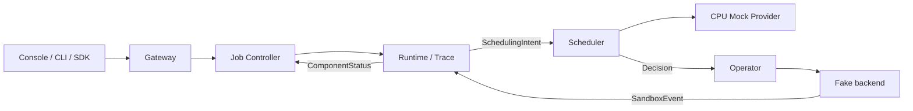

# TGS-RL

[](https://github.com/Blizzard-cyber/TGS-RL/actions/workflows/ci.yaml)

TGS-RL 是面向大语言模型强化学习任务的 Trace 驱动控制与调度系统。它通过统一的
`tgsrl.v1` 契约，把 Job 生命周期、训练语义、确定性资源决策、基础设施调和和真实 worker
进程控制连接起来。

默认本机栈使用 CPU Mock Provider 与 fake Operator backend，但运行的是完整六服务产品链。
从仓库克隆后，只安装 Docker 即可启动后端和中文 Web Console，并执行
`创建 → 准入 → 启动 → 暂停 → 恢复 → 停止`，宿主机不需要 Go、Python、Node.js、CUDA
或 Kubernetes。

> CPU/Mock、Replay 和 Synthetic Trace 只验证控制行为，不代表 GPU 吞吐、CUDA 行为、
> Kubernetes 可用性或模型收敛质量。真实环境边界见[支持范围与限制](docs/reference/current-capabilities.md)。

## 在本机运行完整系统

### 前置条件

- Git
- Docker Engine 与 Docker Compose v2

### 1. 克隆并启动

```bash
git clone https://github.com/Blizzard-cyber/TGS-RL.git
cd TGS-RL
docker compose up -d --build --wait
```

首次构建会下载固定 digest 的 Go、Python 和 Node.js 基础镜像，并安装锁定依赖；后续启动会
复用本机镜像和 named volumes。

### 2. 打开并验证

- Console：<http://127.0.0.1:4173>
- Gateway 健康检查：<http://127.0.0.1:8080/health>
- OpenAPI：<http://127.0.0.1:4173/openapi.json>
- Scheduler 指标：<http://127.0.0.1:9090/metrics>

在 Docker 内运行完整生命周期 smoke；宿主机不需要安装 Python 或 `uv`：

```bash
docker compose --profile tools run --rm --no-deps smoke
```

成功结果会包含 `"status": "ok"`、四次成功生命周期切换、两个终态 Sandbox、Decision
与 Trace，以及零个残留 allocation。Smoke 会创建独立的合成数据 Job，不会删除已有本机数据。

### 3. 停止或重置

```bash
# 停止进程，保留容器和 named-volume 数据。
docker compose stop

# 删除容器与网络，保留 named-volume 数据。
docker compose down

# 破坏性操作：同时删除本机 Job、Runtime、Scheduler 和 Operator 状态。
docker compose down --volumes --remove-orphans
```

对应的 Make 目标是 `make local-up`、`make compose-smoke`、`make local-status`、
`make local-stop` 和 `make local-down`。破坏性 Make 目标必须显式执行
`CONFIRM_RESET=1 make local-reset`。`make doctor` 只检查 Docker 本机运行条件。

同一台机器运行多个独立 clone 时请设置 `COMPOSE_PROJECT_NAME`。默认项目名保持为
`tgsrl-local`，确保升级前后仍能发现原有 named volumes。

## 本机启动了什么

| 服务 | 地址 | 职责 | 本机后端 |
|---|---|---|---|
| Console | `127.0.0.1:4173` | 中文运维界面与同源 API 代理 | Gateway |
| Gateway | `127.0.0.1:8080` | HTTP/OpenAPI、CLI 与 Python SDK 入口 | gRPC 服务 |
| Job Controller | `127.0.0.1:50061` | Job、Run、Operation 和生命周期权威 | 文件状态 |
| Runtime + Experiment | `127.0.0.1:50071` | Manifest、Unit、Sandbox、Trace、Replay、Intent | SQLite WAL |
| Scheduler | `127.0.0.1:50051` | 约束、规划、事务和 Decision | CPU Mock Provider |
| Operator | `127.0.0.1:50081` | 消费 Decision 并观察 workload | Fake backend |

所有宿主机端口只绑定 `127.0.0.1`。四个 named volumes 保存 Scheduler、Job Controller、
Runtime 与 Operator 状态。



## 仓库目录

| 路径 | 内容 |
|---|---|
| `proto/tgsrl/v1/` | 跨语言 wire contract 唯一来源 |
| `gen/go/`、`gen/python/` | 已提交的 Proto 生成代码 |
| `job-controller-go/` | Job、Run、Operation 与生命周期状态 |
| `runtime-python/` | Runtime supervisor、Trace/DAG、Replay 与 Experiment |
| `scheduler-go/` | 约束、候选、Planner、事务和 Provider |
| `operator-go/`、`cmd/operator/` | Bundle 编译、backend 和 observation |
| `cmd/tgsrl-worker-bootstrap/` | 受管理 workload 进程监管器 |
| `adapters/` | Framework、trainer、execution 与 rollout engine 适配 |
| `gateway-python/` | HTTP Gateway、SDK 与 CLI |
| `console/` | React/TypeScript 产品控制台 |
| `configs/`、`compatibility/` | Capability、Policy、Scenario、BOM 与兼容证据 |
| `deploy/` | CRD、Helm Chart 与 Kubernetes 清单 |
| `scripts/`、`tests/` | Smoke、E2E、Gate、治理与回归测试 |

阅读源码时建议先看[系统架构](docs/design/system-design.md)和
[源码导读](docs/maintainers/code-walkthrough.md)。

## 从源码开发

运行本机产品不要求安装开发工具。修改源码时使用
[`compatibility/bom/runtime.yaml`](compatibility/bom/runtime.yaml) 锁定的 Go 1.26.4、
Python 3.12.14、uv 0.12.7、Node.js 24.20.0、Buf 1.72.0 与 Helm 4.2.4。

```bash
make doctor-dev
uv sync --frozen
npm --prefix console ci
make test
```

Kubernetes 集成还需要 Docker、kubectl 和 minikube 1.38.1，使用 `make doctor-kubernetes`
检查。完整工具安装、六终端源码启动、Kubernetes 渲染与排障步骤见
[快速上手](docs/getting-started.md)。

## 哪些文件应当提交

Proto 生成代码、OpenAPI、迁移、锁文件、兼容配置与安全的 example 配置是可复现构建的一部分，
应当提交。依赖目录、缓存、二进制、构建产物、数据库、日志、Gate 证据、真实 kubeconfig、
真实环境配置与凭据必须留在本机。

```bash
make check-repository
make check-public-content
git status --short --ignored
```

完整规则见[仓库卫生与发布内容](docs/maintainers/repository-hygiene.md)。

## 文档

- [文档导航](docs/README.md)
- [快速上手](docs/getting-started.md)
- [系统架构](docs/design/system-design.md)
- [项目设计与代码 Review](docs/project-design-and-code-review.md)
- [API、CLI 与 Console](docs/guides/api-and-console.md)
- [配置、持久化与恢复](docs/guides/configuration-and-recovery.md)
- [支持范围与限制](docs/reference/current-capabilities.md)
- [贡献指南](CONTRIBUTING.md)
- [安全策略](SECURITY.md)

## 当前边界

- NVIDIA Driver v2、DRA、MIG、MPS 与 veRL 集成已有实现或条件支持，但仍需目标环境验证。
- 仓库不会自动安装 Kueue 或 NVIDIA 资源控制器。
- Gateway、gRPC 和 metrics 没有内建 TLS、认证、授权、多租户隔离和限流；请保持本机访问，
  或放在可信安全入口之后。
- 各服务提供独立持久化和调和，不提供跨服务原子事务、自动 HA 或灾备。

仓库当前可以公开阅读，但尚未选择再分发与贡献许可证。在加入 `LICENSE` 前，默认版权限制
仍然生效。
