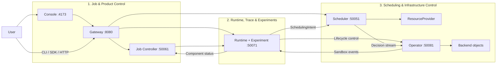

# TGS-RL

[](https://github.com/Blizzard-cyber/TGS-RL/actions/workflows/ci.yaml)

TGS-RL 为大语言模型强化学习任务提供统一的任务控制、运行时语义、Trace/Replay、
确定性资源调度和基础设施调和能力。用户可以通过 Web Console、CLI、Python SDK 或
HTTP API 提交和控制任务，并通过 `tgsrl.v1` Protobuf 契约连接自有运行时与资源后端。

默认单机方案使用 CPU Mock Provider 和 fake Operator backend，不需要 GPU、CUDA 或
Kubernetes，适合体验完整控制链、集成客户端以及评估调度语义。真实 GPU、外部训练框架
和 Kubernetes 需要额外依赖与后端集成，支持条件见[支持范围与限制](docs/reference/current-capabilities.md)。

## 主要功能

- 校验并保存 Job，创建不可变 Run，并执行 `start`、`pause`、`resume`、`stop`、
  `retry` 和 `terminate` 生命周期命令。
- 用统一 `ExecutionContract` 表达 PPO、GRPO，以及同步、部分异步和完全异步 Rollout。
- 管理 Runtime unit、Sandbox、Trace、增量 DAG、等待分类、Checkpoint、Replay 和 Experiment。
- 根据版本化 `SchedulingIntent`、资源快照、执行契约和能力约束，在三档 tick 与
  ActionLevel 授权下生成 admission、动态 share/priority/resize、生命周期和重配置动作，
  并保留有界的候选与 Planner 证据。
- 通过 Provider 执行资源动作，并由 Operator 将成功决策编译为 workload 对象。
- 通过 HTTP/OpenAPI、Python SDK、CLI 和 Web Console 查询任务、拓扑、时间线、Sandbox
  与调度决策。
- 为 Scheduler、Job Controller、Runtime/Experiment 和 Operator 保存单机恢复状态。

## 系统组成

| 系统 | 组件 | 用户可获得的能力 |
|---|---|---|
| **Job & Product Control** | Console、Gateway、Job Controller | 提交和控制 Job/Run，查询 Operation、时间线、拓扑和运行状态 |
| **Runtime, Trace & Experiments** | Runtime service、Adapters、Trace/Replay、Experiment API | 编译运行时单元，维护 desired/observed state，生成 Intent，执行调度预览 Replay |
| **Scheduling & Infrastructure Control** | Scheduler、ResourceProvider、Operator | 读取资源快照，生成和执行放置计划，物化并观察 workload 对象 |



Runtime 与 Experiment 由同一个 Python 进程提供。Operator 在 `50081` 提供 backend
lifecycle control，同时订阅 Scheduler 决策，并把观察到的 Sandbox 状态回报给 Runtime。

## 快速启动

### 使用 Docker Compose

要求：Docker Engine 和 Docker Compose v2。

```bash
docker compose up --build
```

服务就绪后打开 <http://127.0.0.1:4173>，或检查 Gateway：

```bash
curl -fsS http://127.0.0.1:8080/health
curl -fsS http://127.0.0.1:8080/v1/capabilities
```

Compose 把所有宿主机端口绑定到 `127.0.0.1`，并通过 named volumes 保存四个有状态
组件的数据。停止服务时保留数据：

```bash
docker compose down
```

只有在确认不再需要任务和恢复状态时，才使用 `docker compose down --volumes`。

### 从源码运行

要求：

| 工具 | 版本或范围 | 用途 |
|---|---|---|
| Go | 1.26.4 | Scheduler、Job Controller、Operator |
| Python | 3.12.14；最低 3.12 | Runtime、Experiment、Gateway、SDK/CLI |
| `uv` | 0.12.7 | 安装锁定的 Python 环境 |
| Node.js | 24.20.0 LTS | Web Console |
| Buf | 1.72.0 | Protobuf lint 与代码生成 |
| Docker | Compose v2；已验证 Engine 29.6.1 / Compose 5.2.0 | 完整六服务本地栈和镜像构建 |
| Helm | 4.2.4 | Operator chart 校验与安装 |
| kubectl / minikube | kubectl 与集群相差不超过一个 minor；minikube 1.38.1 | 本地 Kubernetes 集成验证 |

```bash
make doctor
uv sync --frozen
npm --prefix console ci
mkdir -p .cache/tgsrl
```

在六个终端中启动：

```bash
make run-scheduler
make run-runtime
make run-controller
make run-operator
make run-gateway
make run-console
```

这些目标使用以下单机地址：Scheduler `50051`、Job Controller `50061`、
Runtime/Experiment `50071`、Operator `50081`、Gateway `8080`、Console `4173`。
完整参数与手动命令见[快速上手](docs/getting-started.md)。

## 提交任务

`tgsrl` 与 `tgsrl-gateway` 是等价的 CLI 入口。准备符合 `RLTrainingJob` Proto JSON
结构的 `job.json` 后，按“校验 → 创建 → 准入 → 启动”的顺序操作：

```bash
uv run --frozen tgsrl validate-job --job ./job.json \
  --idempotency-key validate-job-1
uv run --frozen tgsrl create-job --job ./job.json \
  --idempotency-key create-job-1
uv run --frozen tgsrl admit-job JOB_ID \
  --idempotency-key admit-job-1
uv run --frozen tgsrl list-runs JOB_ID
uv run --frozen tgsrl job-command JOB_ID RUN_ID start \
  --idempotency-key start-run-1
```

`create-run` 只创建 `validating` 状态的 Run；Run 在 `admit-job` 完成 Runtime 准备后
才能启动。查询运行结果：

```bash
uv run --frozen tgsrl timeline JOB_ID --run-id RUN_ID
uv run --frozen tgsrl topology JOB_ID --run-id RUN_ID
uv run --frozen tgsrl sandboxes JOB_ID --run-id RUN_ID
uv run --frozen tgsrl list-decisions JOB_ID --run-id RUN_ID
```

Python SDK 使用相同的 HTTP API：

```python
from tgsrl_gateway import GatewayClient

client = GatewayClient("http://127.0.0.1:8080")
print(client.health())
print(client.list_jobs(limit=20))
```

HTTP 路由、分页、错误、CLI 和 Console 说明见
[API、CLI 与 Console 指南](docs/guides/api-and-console.md)。运行中的 Gateway 在
`GET /openapi.json` 提供 OpenAPI 3.1 文档。

## 数据与恢复

| 组件 | 持久化方式 | 重启后的行为 |
|---|---|---|
| Scheduler | checkpoint + journal | 恢复 Snapshot、Intent、Decision、provider projection/cursor 和 reservation；调和未完成 reservation，并重新排队 Intent |
| Job Controller | snapshot + journal | 恢复 Job、Run、Operation、事件与幂等记录；不自动重新执行中间态 Operation |
| Runtime / Experiment | SQLite | 分页恢复 manifest、unit、Sandbox、Trace、Intent、Checkpoint、Replay、Experiment 与必要水位；仅补投未确认的 Start Intent |
| Operator | cursor、delivery 与 backend-control 文件 | 恢复决策位置、未完成 delivery、观察注册与 lifecycle 幂等记录；fake backend 对象不持久化 |
| Gateway / Console | 无业务状态 | 重启后从后端读取 |

这些机制不提供跨服务事务、HA、灾备或任意中断点的无损续跑。调用方应使用幂等键、
generation 和 cursor，并在恢复后核对 Decision、Provider 与 backend 对象。详见
[配置、持久化与恢复](docs/guides/configuration-and-recovery.md)。

## 支持范围与部署要求

| 使用方案 | 支持级别 | 要求与限制 |
|---|---|---|
| 单机完整控制链 | **支持** | 使用 CPU Mock Provider 与 fake Operator backend；不创建真实 GPU 或 Kubernetes 资源 |
| HTTP、CLI、SDK、Console | **支持** | Gateway 必须能访问对应 gRPC 服务；内存模式和浏览器 Mock 仅用于无持久化预览 |
| NVIDIA | **有条件** | 默认 `LocalDriver` 只做 `nvidia-smi` 发现；仓库内 binding/runtime/MIG helper 提供可恢复状态、fence、幂等 receipt、PID/managed-worker lifecycle，以及已存在 MIG 实例间的安全 rebind/recreate；真实 GPU/CUDA 验证仍待目标环境补齐 |
| 外部训练框架 | **有条件支持** | veRL 提供仓库内第一方 lifecycle/observation bridge 和 CPU reference workload；实际 veRL、Ray、PyTorch、vLLM、SGLang 训练仍需对应环境、执行后端和 GPU 资源控制 |
| Kubernetes Operator | **有条件支持** | 每个 binding 物化独立 generation-scoped workload；部署工件只安装 Operator，还需部署 Scheduler、Job Controller、Runtime、Kueue 及所选 GPU/DRA 组件。通用 profile 不承诺 Scheduler device ID 的精确物理落点 |
| 公网或多租户服务 | **不支持直接部署** | HTTP/gRPC/metrics 无 TLS、认证、授权、租户隔离和限流；必须通过受控网络与外部安全层访问 |
| 性能与训练效果承诺 | **不提供** | Mock、Synthetic 和 Replay 结果不能用于推断真实 GPU 吞吐、利用率、收敛质量、成本或 wall-clock 收益 |

随附 Kubernetes YAML 和 Helm chart 只覆盖 Operator，业务对象使用 namespace 范围的
RBAC；Node、RuntimeClass、DeviceClass 的能力发现使用只读集群权限。创建 RuntimeClass
需要显式启用相应选项及额外的 cluster-scoped 写权限。

## 文档

- [文档导航](docs/README.md)
- [快速上手](docs/getting-started.md)
- [API、CLI 与 Console](docs/guides/api-and-console.md)
- [Python Runtime](docs/guides/python-runtime.md)
- [Scheduler](docs/guides/scheduler-service.md)
- [Operator](docs/guides/operator.md)
- [配置、持久化与恢复](docs/guides/configuration-and-recovery.md)
- [系统架构](docs/design/system-design.md)
- [支持范围与限制](docs/reference/current-capabilities.md)
