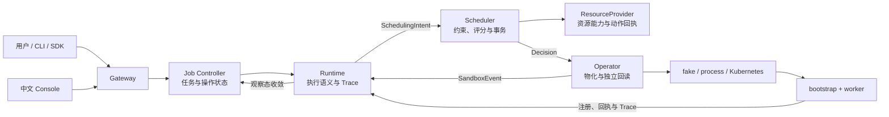

<div align="center">

<h1>TGS-RL</h1>
<p><strong>面向大模型强化学习的 Trace 驱动运行时与算力调度系统</strong></p>
<p>连接任务、训练进程与资源调度，让每一次决策都有可核对的执行证据。</p>
<p>
  <a href="https://github.com/Blizzard-cyber/TGS-RL/actions/workflows/ci.yaml"></a>
  <a href="LICENSE"></a>
</p>

[快速开始](#快速开始) · [毕设进度](docs/project-progress.md) · [系统架构](#系统架构) · [项目文档](docs/README.md) · [参与开发](CONTRIBUTING.md)

</div>

## 为什么做这个系统

强化学习任务由训练、采样、奖励计算和推理等角色协作完成。它们的资源需求随阶段变化：
采样可能在等新策略，训练可能在等样本，而显存仍被空闲进程占用。只观察“Pod 正在运行”或
“GPU 利用率”，无法判断等待是否合理，也无法证明一次调度真正改变了训练进程的行为。

TGS-RL 位于**训练框架与资源基础设施之间**，把这三个问题连起来：

| 问题 | 系统如何回答 |
|---|---|
| 任务在做什么、为什么等待？ | Runtime 把训练事件组织为运行单元、Trace、执行图和结构化观测 |
| 资源该分给谁、能否安全调整？ | Scheduler 根据容量、能力、执行契约和安全点生成可解释的计划 |
| 计划是否生效、失败后如何恢复？ | Operator、Provider 和 bootstrap 核对设备、进程与动作回执，再回写观察态 |

它**不是新的训练框架，也不替代 Kubernetes、DRA 或 HAMi**。训练算法仍由 veRL 等框架实现，
资源注入仍由基础设施完成；TGS-RL 负责跨层控制、身份约束和证据关联。

## 快速开始

### 启动六服务本机栈

需要 Git、Docker Engine 和 Docker Compose v2。宿主机不需要 Go、Python、Node.js 或 GPU；
首次启动会下载基础镜像和依赖。

```bash
git clone https://github.com/Blizzard-cyber/TGS-RL.git
cd TGS-RL
docker compose up -d --build --wait
```

打开 **<http://127.0.0.1:4173>**，运行一次生命周期检查：

```bash
docker compose --profile tools run --rm --no-deps smoke
```

该检查会创建独立任务，完成 `创建 → 准入 → 启动 → 暂停 → 恢复 → 停止`，核对 Decision、
Sandbox 和资源回收，并写入明确标记为 Synthetic 的多轨 Trace。成功输出包含 `"status": "ok"`。

想自己操作：在任务中心导入 [`configs/cpu-job.example.json`](configs/cpu-job.example.json)，
按[快速上手](docs/getting-started.md)完成准入、启动、查询和停止。

> **这是什么环境？** 默认使用 CPU Mock Provider + fake Operator，是真实服务之间的控制链，
> 但不启动训练进程、不创建 GPU 或 Kubernetes 资源。验证真实子进程使用
> `make gate-cpu-integration`；验证 CUDA/DRA 使用独立的 GPU 指南。

### 停止与保留数据

```bash
docker compose stop  # 停止服务，保留容器与数据
# 或
docker compose down  # 删除容器与网络，保留 named volumes
```

不要在日常停止时添加 `--volumes`，它会删除任务和恢复状态。端口默认只监听 `127.0.0.1`；
多个 clone 同时运行时，仅更换 `COMPOSE_PROJECT_NAME` 不够，还需更改宿主机端口映射。
详见[启动与排障](docs/getting-started.md)。

## 系统架构



图中 worker 到 Runtime 的路径经过 bootstrap 和 Scheduler registry；详细信任链见
[进程监管设计](docs/design/managed-worker-bootstrap.md)。

| 边界 | 负责 | 不负责 |
|---|---|---|
| 产品控制：Console、Gateway、Job Controller | Job/Run/Operation、用户操作与展示 | 选卡、实现训练算法 |
| 运行时语义：Runtime、Adapters、Trace、Replay | 执行契约、观察态、Intent 和因果证据 | 维护集群资源权威 |
| 调度与基础设施：Scheduler、Provider、Operator | 选设备、执行计划、创建 workload、回读实际状态 | 用命令成功冒充训练完成 |

**三个不变量**：Scheduler 是设备身份权威；desired state 与 observed state 分离；
身份、代际或动作结果无法确认时拒绝继续，不静默降级为成功。

从设计到实现依次阅读：[系统设计](docs/design/system-design.md) →
[源码与组件导读](docs/maintainers/code-walkthrough.md) →
[配置与恢复](docs/guides/configuration-and-recovery.md)。

## 算力接入与能力边界

**当前硬件实现仅支持 NVIDIA，但不按 GPU 型号设准入白名单。** 每张卡按实际发现的能力调度：

| 资源形态 | 兑现方式 | 当前证据 |
|---|---|---|
| 未启用 MIG 的物理 GPU | Full GPU + NVIDIA DRA，精确 UUID 分配 | 单节点 E1 已验证 |
| 单物理卡分数份额 | HAMi vGPU，核对 UUID、core 与显存份额 | H1 单 worker、H2 双 worker 同卡并发已验证 |
| 已启用 MIG 且预先创建的实例 | MIG UUID + `mig.nvidia.com` DeviceClass | 代码与 CPU 合同测试；待硬件验证 |
| MPS 共享 | 当前不作为生产在线动作开放 | server-level percentage 只影响未来 client；需 checkpoint/recreate adapter |
| 其他厂商加速器 | 通用 Device/Capability/Provider 工厂接口 | 仅扩展边界，没有假实现或支持承诺 |

没有 MIG 的卡仍可使用整卡路径；满足部署条件时可使用 HAMi。默认 `auto` 不启动 MPS，
不同时计入 MIG 父卡和子设备，也不创建或销毁 MIG 拓扑。

- [NVIDIA / HAMi 使用指南](docs/guides/hami.md)
- [NVIDIA A10 工程验收](docs/guides/a10-readiness.md)
- [可插拔加速器设计](docs/design/accelerator-extension.md)
- [完整支持矩阵与限制](docs/reference/current-capabilities.md)

## Trace：把决策和进程行为放到一起

```text
Worker     采样 ───── 安全点 ───── 暂停 ───── 恢复 ─── 采样
Runtime       观测 ───── Intent ───── 状态收敛 ───── 观测
Scheduler          候选 → Decision / Plan → ActionResult
Operator                     物化 / 控制 → 独立回读
                       同一 Run / Sandbox / Binding / Generation
```

中文 Console 提供任务、Trace、时间线、资源、拓扑、沙箱、决策和实验对比等九个工作区：

- 从任务下钻到某次 Run、Decision、Sandbox 和设备身份；
- 在统一时间轴上查看训练阶段、请求、执行器和 worker 的事件；
- 通过请求、span 与 parent span 关联跨轨调用；
- 区分 Synthetic、Replay 与真实观测，不把模拟数据当作硬件证据。

有明确 duration 的事件显示耗时条；没有 duration 的事件显示时间点，不根据相邻事件猜时长。
API 和字段说明见[API、CLI 与 Console](docs/guides/api-and-console.md)。

## 如何选择运行与验证方式

| 目标 | 入口 | 能证明什么 |
|---|---|---|
| 本机体验前后端 | Compose + smoke | 六服务、生命周期、合成 Trace 和资源账本 |
| 本机验证真实进程 | `make gate-cpu-integration` | 实际服务 API、bootstrap、Unix socket、pause/resume 回执与 Trace；不启动 Console |
| 空白 NVIDIA 主机验证全链路 | [GPU Smoke 指南](docs/guides/gpu-smoke.md) | Full GPU、Kubernetes/DRA、CUDA worker、注册与清理 |
| 验证同卡分数共享 | [HAMi 指南](docs/guides/hami.md) | H1 份额兑现与 H2 同卡并发 |
| 毕业设计实验前做 A10 工程验收 | [A10 Readiness](docs/guides/a10-readiness.md) | Full lifecycle、显存释放/恢复、H2、DRA 回归、Helm 证据 |
| 当前单卡毕业实验 | [E1–E8 设计](docs/design/gate-e1-e8.md) | E6 与 E5-STATIC 已通过；正式 E5 仍待动态控制能力 |
| 部署 Kubernetes 控制面 | [部署指南](docs/guides/deployment.md) | 六服务 Helm 的配置、依赖和部署边界 |

**当前阶段已从工程实现转入正式毕业实验。** 最终工程基线 `68f5aea` 已通过 A10 lifecycle、
H2、DRA 恢复 E1 和同一 PVC 上连续两轮六服务 Helm smoke；正式 E1 已通过，但 E2–E8
尚未全部执行，因此当前不宣称完整 veRL trainer、distributed collective、MIG/MPS、多节点、
强隔离或性能收益已经证明。完整阶段矩阵见[毕设推进状态](docs/project-progress.md)。
历史证据各自绑定当时的源代码版本，不能自动覆盖后续修改。

E6 五步 lifecycle 与 `E5-STATIC` 单卡静态份额干扰 pilot 已在真实 A10 上完成执行，
两项独立 report 均为 `PASSED`。E6 已按 pilot 三轮最大值加 25% headroom 冻结为
`60/900/400 ms`，并在后续提交的独立确认运行中正式通过；E5-STATIC 也已在
`9a4321d` 独立确认中以 `10.63%` 平均干扰率通过 `32%` 门槛。
`E5-STATIC` 不替代正式 E5 的动态 share/priority 门禁。

| 已归档的硬件验证 | 记录 |
|---|---|
| E1 单节点 Full GPU | [环境、身份回读与清理](docs/validation/e1-full-gpu-2026-09-12.md) |
| H1 HAMi 单 worker | [请求份额与实际分配](docs/validation/h1-hami-vgpu-2026-09-12.md) |
| H2 HAMi 双 worker | [同卡身份与执行重叠](docs/validation/h2-hami-concurrency-2026-09-13.md) |
| A10 lifecycle、H2、DRA 恢复与 Helm | [工程与部署验收](docs/validation/a10-readiness-2026-09-14.md) |
| E6 与 E5-STATIC | [动作代价与静态共置干扰](docs/validation/e5-e6-single-a10-2026-09-16.md) |

## 代码地图

```text
TGS-RL/
├── proto/ · gen/            跨语言契约与已提交生成代码
├── job-controller-go/       Job、Run、Operation 状态机
├── runtime-python/          Runtime、Trace、DAG、Replay、SQLite
├── scheduler-go/            约束、规划、事务与资源 Provider
├── operator-go/             workload 编译、backend 与状态回读
├── cmd/ · internal/         Operator 入口、helpers、bootstrap 与共享实现
├── adapters/                framework / trainer / execution / rollout 适配
├── gateway-python/          HTTP、CLI 与 Python SDK
├── console/                 中文 React / TypeScript 控制台
├── configs/ · compatibility/配置、场景、BOM 和能力合同
├── deploy/                  CRD、Kubernetes 与 Helm
├── scripts/ · tests/        构建、治理、单测、进程与硬件验证
└── docs/                    使用、设计、参考、维护与验证记录
```

## 开发与贡献

工具版本由 [`compatibility/bom/runtime.yaml`](compatibility/bom/runtime.yaml) 锁定。
控制面与 GPU workload 使用分离的依赖环境；开发机无需安装整套 CUDA 训练栈。

```bash
make doctor-dev
uv sync --frozen
npm --prefix console ci
make lint
make test
make race
make test-performance
make product-e2e
make gate-cpu-integration
```

依赖安装、无 Docker 启动和测试分层见[开发指南](docs/maintainers/development.md)。
修改 Proto 后必须同步生成代码；Python 发布包必须包含 SQLite 迁移，不能只验证 editable 安装。
提交前执行 `make check-repository`、`make check-docs` 和 `make check-public-content`。

欢迎提交问题、回归用例和改进。请先阅读[贡献指南](CONTRIBUTING.md)；
安全问题按[安全策略](SECURITY.md)报告，不在公开 Issue 中附带凭据或原始敏感日志。

## 安全与发布范围

- Gateway、业务 gRPC 与 metrics 没有内建 TLS、登录鉴权或多租户隔离，只用于可信本机或隔离网络。
- worker registry 有作用域令牌和身份校验，但不能代替整个系统的入口安全。
- 各服务独立持久化，不提供跨服务原子事务、自动 HA 或灾备。
- Git 不提交数据库、日志、缓存、原始硬件证据、kubeconfig 或凭据；Docker context 也必须单独排除它们。
- `WORKLOG.local.md` 和 `handoff/` 暂用于跨机器开发测试交接，不是产品运行依赖；正式发布前移除。

详见[仓库与发布内容规范](docs/maintainers/repository-hygiene.md)。

## 许可证

本项目采用 [Apache License 2.0](LICENSE)。上游复用边界见
[系统设计](docs/design/system-design.md)，依赖与补丁记录见 [`upstream/`](upstream/)。
