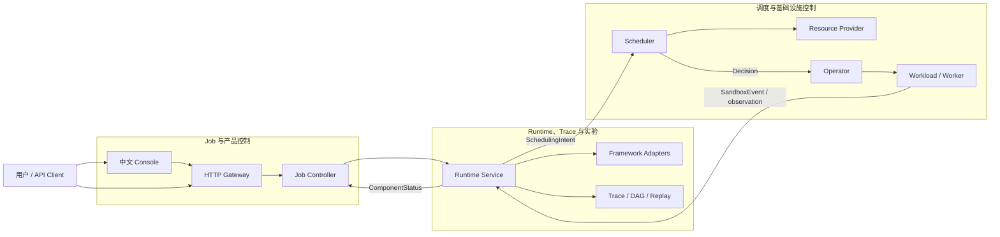
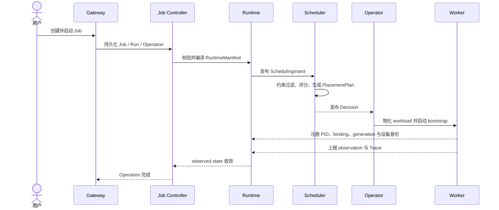

<div align="center">

<h1>TGS-RL</h1>
<h3>面向大模型强化学习的 Trace 驱动运行时与资源调度系统</h3>
<p>把训练任务、运行时状态、调度决策、基础设施执行和可追溯证据连接成一条可观测、可恢复的控制链。</p>
<p>
  <a href="https://github.com/Blizzard-cyber/TGS-RL/actions/workflows/ci.yaml"></a>
  <a href="LICENSE"></a>
  <a href="go.mod"></a>
  <a href="pyproject.toml"></a>
</p>
<p>
  <a href="#三步运行完整系统">快速开始</a> ·
  <a href="#系统架构">系统架构</a> ·
  <a href="#trace">Trace</a> ·
  <a href="#代码地图">代码地图</a> ·
  <a href="#开发与验证">开发与验证</a> ·
  <a href="docs/README.md">项目文档</a>
</p>

</div>

---

## 项目解决什么问题

大模型强化学习不是一个单进程训练任务。Trainer、Rollout、Reward、推理引擎与资源后端具有
不同的负载节奏；训练过程中还会发生扩缩容、暂停、恢复、迁移和故障恢复。传统任务系统通常
只能回答“Pod 是否运行”，很难回答下面这些问题：

| 问题 | TGS-RL 的回答 |
|---|---|
| 哪个训练阶段正在等待，为什么等待？ | 用 Runtime Unit、Sandbox、Trace 和 Gap 表达执行状态与因果关系 |
| 为什么选择这张卡、这个节点或这个动作？ | Scheduler 保存候选、约束、评分、Plan、ActionResult 和 fallback 证据 |
| 调度决定是否真正作用到了训练进程？ | Operator 与 worker bootstrap 校验 binding、generation、设备身份和进程回执 |
| 控制面重启后是否会重复执行或误控旧进程？ | 幂等键、generation fence、durable receipt、cursor 与状态调和共同保证 |
| 一次性能变化来自训练、调度还是资源动作？ | 用统一 Trace 串联 worker、Runtime、Scheduler 和 Operator 事件 |

TGS-RL 的定位不是新的训练框架，也不是 Kubernetes 的替代品。它位于训练框架与资源基础设施
之间，为强化学习任务提供统一的控制语义、确定性调度和可验证的执行证据。

## 当前能做什么

```text
提交训练任务 → 编译运行单元 → 生成调度意图 → 选择并绑定资源
           → 启动受监管进程 → 回传运行状态 → 展示完整 Trace
```

- 管理 Job、Run 和 Operation，支持创建、准入、启动、暂停、恢复、停止、重试与终止。
- 表达 PPO、GRPO 以及同步、部分异步、完全异步 Rollout 的执行约束。
- 执行 admission、fast、medium、slow 多周期规划，以及 L1–L4 资源与生命周期动作。
- 通过确定性候选排序、事务执行、补偿、幂等与 generation fence 保证决策可重放。
- 统一呈现 Runtime、Scheduler、Operator 与 worker 的 Trace、DAG、时间线和决策证据。
- 提供中文 Web Console、HTTP/OpenAPI、CLI、Python SDK 和 `tgsrl.v1` gRPC 接口。
- 支持 CPU Mock 单机闭环，并提供 NVIDIA、DRA、MIG、MPS、Kubernetes 与 veRL 接入代码。

> **验证边界**：CPU/Mock、Replay 和 Synthetic Trace 用于验证控制行为，不代表 GPU 吞吐、
> CUDA 行为、Kubernetes 可用性或模型收敛质量。NVIDIA 与真实训练路径仍需目标环境证据，
> 详见[支持范围与限制](docs/reference/current-capabilities.md)。

## 三步运行完整系统

本机体验只需要 Git、Docker Engine 和 Docker Compose v2。宿主机不需要安装 Go、Python、
Node.js、CUDA 或 Kubernetes。

### 1. 克隆并启动

```bash
git clone https://github.com/Blizzard-cyber/TGS-RL.git
cd TGS-RL
docker compose up -d --build --wait
```

### 2. 打开控制台并验证

打开 <http://127.0.0.1:4173>。Console 包含运行总览、任务、拓扑、Trace、Sandbox、调度决策
和实验对比等页面。

运行一次完整生命周期 smoke：

```bash
docker compose --profile tools run --rm --no-deps smoke
```

它会通过真实的六服务调用链创建独立 CPU/Mock Job，并验证：

```text
create → admit → start → pause → resume → stop
                    │
                    └─ Decision + Sandbox + Trace + allocation cleanup
```

成功输出包含 `"status": "ok"`、四次成功状态切换、两个终态 Sandbox、Decision 与 Trace，
并确认没有残留 allocation。

### 3. 停止服务

```bash
# 停止进程，保留容器和数据。
docker compose stop

# 删除容器与网络，保留 named volumes。
docker compose down
```

<details>
<summary>需要完全清空本机状态时</summary>

下面的命令会删除本机 Job、Runtime、Scheduler 和 Operator 数据：

```bash
docker compose down --volumes --remove-orphans
# 或使用带显式确认的 Make 目标：
CONFIRM_RESET=1 make local-reset
```

</details>

常用入口：

| 地址 | 用途 |
|---|---|
| <http://127.0.0.1:4173> | 中文 Web Console |
| <http://127.0.0.1:8080/health> | Gateway 健康检查 |
| <http://127.0.0.1:4173/openapi.json> | OpenAPI 3.1 文档 |
| <http://127.0.0.1:9090/metrics> | Scheduler Prometheus 指标 |

也可以使用 `make doctor`、`make local-up`、`make compose-smoke`、`make local-status`、
`make local-stop` 和 `make local-down`。同一台机器运行多个 clone 时，请设置不同的
`COMPOSE_PROJECT_NAME`。

## 系统架构

TGS-RL 将产品控制、运行时语义与基础设施调度分成三个边界清晰的系统：



| 系统 | 核心职责 | 明确不负责 |
|---|---|---|
| Job 与产品控制 | Job/Run 生命周期、Operation、用户 API 和 Console | 选择物理设备、解释训练算法 |
| Runtime、Trace 与实验 | Manifest、Unit、Sandbox、Intent、Trace、Replay | 维护集群资源权威 |
| 调度与基础设施控制 | 约束求解、PlacementPlan、Provider 动作、workload 调和 | 管理产品状态、伪造执行成功 |

这三个边界共同遵守两条原则：

1. **desired state 与 observed state 分离**：命令成功只表示请求已接收，最终状态必须由独立
   observation 证明。
2. **资源身份单一权威**：Scheduler 选择设备，Operator 负责兑现和回读；身份不一致时
   fail closed，不退化为“按数量大致分配”。

更完整的职责、状态权威和恢复模型见[系统架构](docs/design/system-design.md)。

## 一次任务如何流转



每一次外部副作用都受幂等键、generation fence 和 durable receipt 约束。控制面重启后，各组件
通过持久化状态、Decision cursor 与 backend readback 继续调和，而不是盲目重复动作。

## Trace

### 让每次调度有据可查

Trace 不是附加日志，而是连接训练行为和调度决策的证据层。Console 使用统一时间轴展示四类来源：

```text
Worker    ─ sample ─ sample ─ safe point ─ pause ───── resume ─ sample ──▶
Runtime   ───────── observation ─────────── state ───── state ───────────▶
Scheduler ───────────── intent ─ decision / plan ───────────────────────▶
Operator  ───────────────────── apply ───── ack ─────── ack ────────────▶
                                      同一 trace / run / binding / generation
```

可以从 Trace 中回答：

- 哪个 worker、rank、Runtime Unit 和 Sandbox 产生了事件；
- 事件对应哪个 Job、Run、Decision、Plan、Action 和设备；
- pause、checkpoint、offload、reload、resume 是否被 worker 确认；
- 调度延迟、执行耗时、吞吐、policy lag、staleness 与 ESS 如何变化；
- 失败发生在决策、基础设施执行还是训练进程，以及是否触发补偿或回滚。

没有真实 duration 的事件只显示为时间点，不会被绘制成虚构耗时。Synthetic、Replay、CPU
和 GPU 证据也会明确标记，避免把协议验证误读为硬件性能结果。

## 核心能力

| 领域 | 已提供的能力 | 当前验证级别 |
|---|---|---|
| 任务控制 | Job 校验、准入、Run generation、生命周期命令、Operation | CPU/Product E2E |
| 运行时语义 | PPO、GRPO、三种 Rollout 模式、Manifest、Unit、Sandbox、DAG | CPU/Mock |
| 调度 | Admission 与三档周期 Planner、L1–L4 动作、Top-K、fallback、补偿 | 单测、race、性能 CI |
| 可观测性 | 多轨 Trace、Decision evidence、Replay、Experiment、Prometheus | CPU full-stack Gate |
| 进程执行 | worker bootstrap、PID/control endpoint 注册、信号转发、退出清理 | CPU 真实子进程 |
| Kubernetes | 六服务 Helm、JobRunBundle、Kueue Workload、Job、ResourceClaimTemplate 与生成的 ResourceClaim | E1 单节点 Full GPU 已验证 |
| NVIDIA | typed inventory、Full GPU/MIG DeviceClass、MPS/MIG/runtime helpers | Full GPU E1 已验证；MIG/MPS 待验证 |
| veRL | lifecycle/observation bridge 与 callback adapter | 对象替身，待真实 veRL/Ray/GPU |

详细状态以[支持范围与限制](docs/reference/current-capabilities.md)为准。

## 本机栈包含什么

| 服务 | 默认地址 | 职责 | 本机实现 |
|---|---|---|---|
| Console | `127.0.0.1:4173` | 中文操作界面与同源 API 代理 | React + TypeScript |
| Gateway | `127.0.0.1:8080` | HTTP/OpenAPI、CLI 与 SDK 入口 | Python |
| Job Controller | `127.0.0.1:50061` | Job、Run、Operation 生命周期权威 | Go + 文件状态 |
| Runtime + Experiment | `127.0.0.1:50071` | Runtime、Trace、Replay 与 Experiment | Python + SQLite WAL |
| Scheduler | `127.0.0.1:50051` | 约束、规划、事务和 Decision | Go + CPU Mock Provider |
| Operator | `127.0.0.1:50081` | Decision 消费、workload 与 observation | Go + fake backend |

端口只绑定到 `127.0.0.1`。四个 named volumes 保存有状态组件的数据，服务重建后可以继续恢复。

## 代码地图

```text
TGS-RL/
├── proto/tgsrl/v1/          # 跨语言 wire contract 的唯一来源
├── gen/go/ · gen/python/    # 已提交的生成代码，保证 clone 后可直接构建
├── job-controller-go/       # Job、Run、Operation 与生命周期状态机
├── runtime-python/          # Runtime、Sandbox、Trace、DAG、Replay、Experiment
├── scheduler-go/            # 约束、Planner、PlacementPlan、Provider 与事务
├── operator-go/ · cmd/      # backend 调和、NVIDIA helpers、worker bootstrap
├── adapters/                # veRL、trainer、execution、rollout engine 适配层
├── gateway-python/          # HTTP Gateway、CLI 与 Python SDK
├── console/                 # 中文 Web Console
├── configs/ · compatibility/# 策略、场景、能力、BOM 与证据合同
├── deploy/                  # CRD、Kubernetes 清单与 Helm Charts
├── scripts/ · tests/        # 生成、治理、Smoke、E2E 与 Gate
└── docs/                    # 设计、使用、维护与能力边界文档
```

第一次阅读源码，建议依次查看：

1. [项目设计与代码 Review](docs/project-design-and-code-review.md)
2. [系统架构](docs/design/system-design.md)
3. [源码导读与维护边界](docs/maintainers/code-walkthrough.md)
4. `proto/tgsrl/v1/` 中的跨服务契约
5. Runtime → Scheduler → Operator → worker 的实际调用链

## 开发与验证

运行产品只需要 Docker。修改源码时，使用
[`compatibility/bom/runtime.yaml`](compatibility/bom/runtime.yaml) 锁定的工具版本：Go 1.26.4、
Python 3.12.14、uv 0.12.7、Node.js 24.20.0、Buf 1.72.0 与 Helm 4.2.4。

```bash
make doctor-dev
uv sync --frozen
npm --prefix console ci
make test
```

常用验证入口：

| 命令 | 验证内容 |
|---|---|
| `make check-repository` | 必需文件、误提交产物、被 ignore 隐藏的源码 |
| `make check-docs` | Markdown 本地链接、Make 目标和 CLI 命令是否仍对应当前代码 |
| `make check-generated` | Proto 生成代码是否与契约一致 |
| `make check-governance` | SBOM、兼容矩阵、上游补丁和 OpenAPI |
| `make check-deploy` | Kubernetes 清单与两层 Helm chart 契约 |
| `make race` | Go 服务竞态 |
| `make test-performance` | Scheduler 与 Provider P95 预算 |
| `make product-e2e` | 完整产品 API 控制链 |
| `make gate-cpu-integration` | 六服务、真实子进程、worker 回执与多源 Trace |
| `make test-console-browser` | 八条 Console 路由与多宽度浏览器 smoke |

## GPU 机器上的第一次全链路验证

项目提供一条独立于 CPU Mock 的单机 Full GPU smoke 路径。它会验证 Scheduler 选择的
GPU UUID 被 NVIDIA DRA 精确兑现，真实 CUDA worker 经 bootstrap 注册并上报 Trace。

```bash
# 先确认机器提供 NVIDIA 580.95.05+ 驱动。仅在缺少下列组件时打开相应安装开关。
TGSRL_INSTALL_DOCKER=1 TGSRL_INSTALL_NVIDIA_TOOLKIT=1 make gpu-install-host
make gpu-create-cluster
make gpu-prepare-cluster
make gpu-configure-access

export TGSRL_IMAGE_REGISTRY=registry.example.com/your-user/tgsrl
export DOCKER_CONFIG=$PWD/.cache/tgsrl/docker
mkdir -p "$DOCKER_CONFIG"
docker login registry.example.com
make gpu-build-images
make gpu-configure-registry

make gpu-render-config
set -a; source .cache/tgsrl/gpu-runtime.env; set +a
make gpu-preflight
make gpu-up
make gpu-smoke
```

中国大陆或跨境下载受限的机器可以在所有 GPU 准备命令前启用仓库内置的公共镜像配置：

```bash
export TGSRL_NETWORK_PROFILE=cn
TGSRL_INSTALL_DOCKER=1 TGSRL_INSTALL_NVIDIA_TOOLKIT=1 make gpu-install-host
```

`cn` 配置使用 DaoCloud 文件/容器代理和清华 PyPI；工具版本与官方模式完全相同，下载后仍以
canonical upstream 的 SHA-256 校验。任何镜像地址都可通过 `TGSRL_*` 环境变量覆盖。

`make gpu-smoke` 只执行并验收 E1。命令非零表示 E1 执行失败、证据无效或规则未通过；
命令成功表示 E1 报告为 `PASSED`，不表示尚未执行的 E2–E8 已通过，也不代表完整 campaign
达到发布准入。

完整前置条件、每一步通过标准和排障表见
[单机 GPU 全链路 Smoke](docs/guides/gpu-smoke.md)。首轮仅验证 E1（单节点 Full GPU），
不把该结果解释为 MIG/MPS、多节点、性能收益或毕业实验结论。

Kubernetes 集成还需要 Docker、kubectl 和 minikube，使用 `make doctor-kubernetes` 检查。
完整开发说明见[维护者指南](docs/maintainers/development.md)。

## Kubernetes 与真实 GPU

全栈 Helm chart 位于 `deploy/helm/tgsrl/`。目标环境需要自行提供 Kubernetes、Kueue、
NVIDIA DRA 或其他受支持资源后端，以及可访问的镜像仓库。TGS-RL 不会隐式安装或修改这些
集群级依赖。

正式 GPU 验证按 E1–E8 campaign 推进：

```text
E1 Full GPU identity → E2 MIG identity → E3–E6 性能与动作代价
                     → E7 故障恢复 → E8 多节点收敛
```

其中 E1–E7 需要真实单节点 GPU 证据，E8 需要两个真实节点。硬件未到位时，报告保持
`NOT_RUN` 或 `BLOCKED`，不会由 Mock 数据自动升级为通过。详见
[E1–E8 硬件验证设计](docs/design/gate-e1-e8.md)。

2026-09-12 已在 NVIDIA A10、Kubernetes 1.35.1、Kueue 0.19.2 与 NVIDIA DRA 0.5.0
环境完成 E1，结果为 `PASSED`。完整边界、指标和证据摘要见
[E1 单节点 Full GPU 验证记录](docs/validation/e1-full-gpu-2026-09-12.md)。E2–E8 仍保持
`NOT_RUN`，本结果不代表 MIG/MPS、多节点或完整训练实验通过。

## 仓库内容边界

应该提交：源码、测试、文档、Proto 与生成代码、OpenAPI、迁移、锁文件、兼容配置、部署工件
和脱敏 example 配置。

必须留在本机：依赖目录、缓存、二进制、构建产物、数据库、日志、PID/socket、Gate 证据、
真实 kubeconfig、生产 values、证书和凭据。

```bash
make check-repository
make check-public-content
git status --short --ignored
```

完整规则见[仓库卫生与发布内容](docs/maintainers/repository-hygiene.md)。

## 文档与参与项目

- [文档导航](docs/README.md)
- [快速上手](docs/getting-started.md)
- [API、CLI 与 Console](docs/guides/api-and-console.md)
- [配置、持久化与恢复](docs/guides/configuration-and-recovery.md)
- [Managed-worker bootstrap](docs/design/managed-worker-bootstrap.md)
- [架构决策记录](docs/adr/README.md)
- [贡献指南](CONTRIBUTING.md)
- [安全策略](SECURITY.md)

提交变更前请阅读[贡献指南](CONTRIBUTING.md)，保持跨服务契约、desired/observed state、
幂等和证据真实性边界。安全问题请不要公开提交 Issue，报告方式见[安全策略](SECURITY.md)。

## 安全与限制

- Gateway、gRPC 与 metrics 没有内建 TLS、认证、授权、多租户隔离和限流。默认栈仅绑定
  `127.0.0.1`；生产部署必须增加可信入口、传输加密、鉴权、审计和网络策略。
- CPU Mock 与 fake backend 验证控制协议，不提供真实 GPU、Kubernetes、吞吐或收敛承诺。
- 各服务独立持久化并执行重启调和，但不提供跨服务原子事务、自动 HA 或灾备。
- MIG helper 不隐式创建或销毁 MIG 拓扑；拓扑变化必须先由资源事务明确表达。

## 许可证

TGS-RL 使用 [Apache License 2.0](LICENSE) 开源。你可以在许可证条款下使用、修改和分发
本项目；提交贡献即表示你有权按相同条款提供相关内容。
