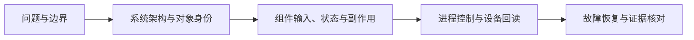

# TGS-RL 文档

TGS-RL 连接强化学习的任务控制、训练语义、资源调度与进程执行。第一次接触项目，建议按
**理解问题 → 本机运行 → 查看执行证据 → 阅读组件实现**的顺序阅读。

## 开始使用

| 你想做什么 | 阅读入口 |
|---|---|
| 了解项目解决什么问题 | [项目首页](../README.md) |
| 在本机启动前后端、提交第一个任务 | [快速上手](getting-started.md) |
| 通过 HTTP、CLI、SDK 操作任务和 Trace | [API、CLI 与 Console](guides/api-and-console.md) |
| 在 Kubernetes 部署控制面 | [部署指南](guides/deployment.md) |
| 在空白 NVIDIA 主机验证全链路 | [单机 GPU Smoke](guides/gpu-smoke.md) |
| 使用 HAMi 兑现单卡分数份额 | [HAMi vGPU 接入](guides/hami.md) |
| 执行实验前 A10 工程验收 | [A10 Readiness](guides/a10-readiness.md) |
| 判断功能是否适合自己的环境 | [支持范围与限制](reference/current-capabilities.md) |

## 理解设计与实现

| 层次 | 文档 | 重点 |
|---|---|---|
| 顶层设计 | [系统架构](design/system-design.md) | 问题、上游复用、职责、对象关系、正常/失败链路 |
| 组件实现 | [源码与组件导读](maintainers/code-walkthrough.md) | 输入输出、核心函数、状态权威、扩展与测试入口 |
| 执行层 | [Managed-worker bootstrap](design/managed-worker-bootstrap.md) | 身份、令牌、PID、socket、注册、退出与代际隔离 |
| 硬件扩展 | [Provider 扩展](design/accelerator-extension.md) | 厂商中立接口、NVIDIA 实现、未来插件边界 |
| 故障恢复 | [配置、持久化与恢复](guides/configuration-and-recovery.md) | 启动参数、数据目录、重启顺序与未知结果 |
| 设计依据 | [架构决策记录](adr/README.md) | Proto-first、Mock-first、设备身份与能力感知 |

## 配置与集成各组件

- [Scheduler](guides/scheduler-service.md)：配置图、接口、候选与动作、Provider 和恢复。
- [Python Runtime](guides/python-runtime.md)：ExecutionContract、Trace、DAG、Replay、Intent 与 adapter。
- [Operator](guides/operator.md)：backend、Bundle、DRA/HAMi、bootstrap、RBAC 与 cursor。

指南描述**如何使用**；设计页解释**为什么这样实现**；源码导读定位**在哪里修改**。
三类文档不混入滚动 CI 数字或临时进度百分比。

## 维护与验证

| 主题 | 文档 |
|---|---|
| 开发依赖、无 Docker 启动、回归命令 | [开发指南](maintainers/development.md) |
| Git、Docker context、Python wheel 的内容边界 | [仓库卫生与发布](maintainers/repository-hygiene.md) |
| 本轮审查、已修复缺陷与未覆盖风险 | [工程审查记录](maintainers/engineering-review.md) |
| 硬件场景与证据规则 | [E1–E8 设计](design/gate-e1-e8.md) |
| Full GPU 实机结果 | [E1 验证记录](validation/e1-full-gpu-2026-09-12.md) |
| HAMi 单 worker 份额 | [H1 验证记录](validation/h1-hami-vgpu-2026-09-12.md) |
| HAMi 双 worker 同卡并发 | [H2 验证记录](validation/h2-hami-concurrency-2026-09-13.md) |
| A10 lifecycle、恢复与六服务 Helm | [A10 工程与 Helm 验收](validation/a10-readiness-2026-09-14.md) |

验证记录只适用于其中写明的 commit、环境和场景；不能把 E1/H1/H2、A10 readiness、Helm
smoke 或 CPU CI 解释为 MIG/MPS、完整训练、生产可靠性或调度收益已证明。当前先完成工程链路
验证，实验标定另行推进。

参与项目请阅读[贡献指南](../CONTRIBUTING.md)和[安全策略](../SECURITY.md)。
