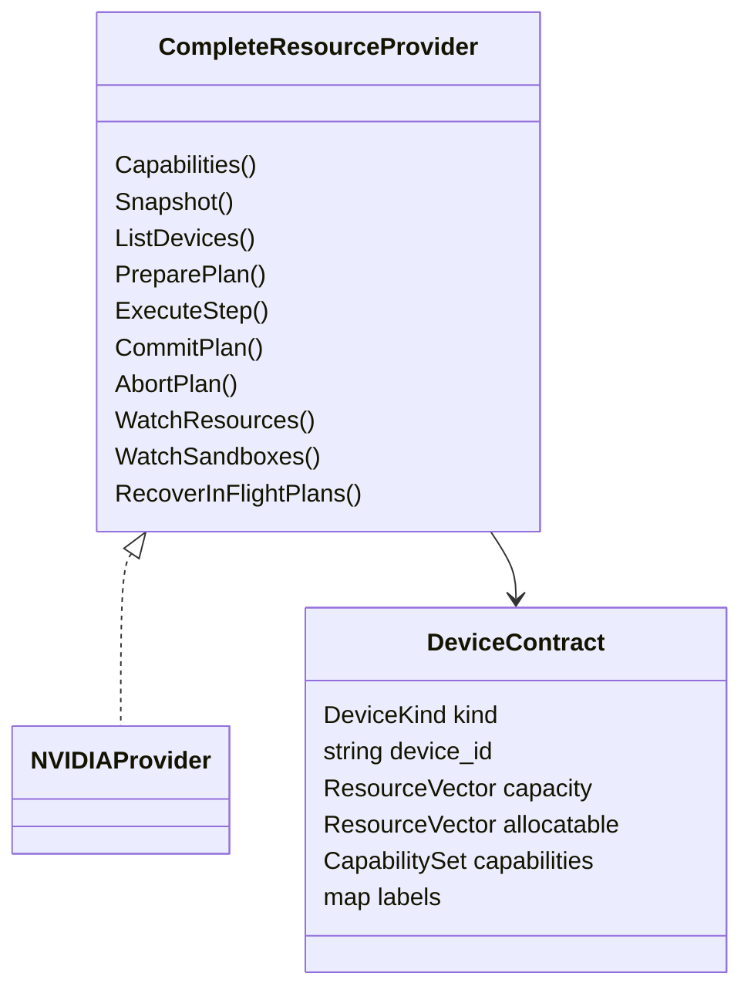

# 加速器 Provider 扩展设计

本文定义 TGS-RL 接入新加速器厂商时必须遵守的边界。当前仓库可执行的硬件实现仅为
NVIDIA；本文不表示昇腾 NPU、TPU 或其他设备已经受支持，也不提供占位实现。

## 目标

新增一种设备时，允许维护者增加一个 Provider 与一个基础设施兑现 adapter，而不修改：

- Job、Run、RuntimeUnit、Sandbox 和 Trace 的通用生命周期；
- Scheduler 的候选生成、容量校验、评分、事务和补偿算法；
- `Binding.device_ids`、revision、generation 与 idempotency 语义；
- Gateway 的资源快照接口和 Console 的通用设备列表。

## 已有抽象



图中只画当前存在的实现。Go 没有类继承；这里的“设备基类”是跨语言的数据契约
`tgsrl.v1.Device`，“厂商插件接口”是 Go 行为接口
`CompleteResourceProvider`（定义于 `scheduler-go/provider/contract.go`）。未来厂商不是先在
仓库中放置空类，而是在真正接入时实现同一接口并注册工厂：

| 抽象 | 位置 | 扩展含义 |
|---|---|---|
| `DeviceKind` | `proto/tgsrl/v1/resource.proto` | 已包含 CPU、GPU、TPU、NPU、CUSTOM；不要为型号新增枚举 |
| `ResourceVector` | `proto/tgsrl/v1/resource.proto` | 用统一数量表达 CPU、内存和 accelerator units |
| `CapabilitySet` | `proto/tgsrl/v1/resource.proto` | 用名称、属性、动作、限制和证据表达厂商差异 |
| `CompleteResourceProvider` | `scheduler-go/provider/contract.go` | 设备发现、事务执行、watch 与恢复的 Go 插件接口 |
| `Registry` | `scheduler-go/provider/registry.go` | composition root 使用的 Provider 工厂注册表；当前只注册 Mock 与 NVIDIA |
| `Backend` | `operator-go/backend/backend.go` | fake/process/Kubernetes workload 执行边界 |
| `RuntimeTarget` / `Binding` | `operator-go/api/` 与 Proto | 在控制链中传递不透明设备 ID 和 generation |

Scheduler 的候选匹配只比较设备健康、`ResourceVector` 和 `CapabilitySet`，不读取产品型号。
`labels["name"]`/`labels["model"]` 只能用于展示、审计和诊断。

## 当前实现

```text
通用 Scheduler
└── NVIDIA Provider
    ├── nvidia-smi inventory
    ├── auto / full / mps / mig partition backend
    ├── binding helper
    ├── runtime helper
    └── MIG helper

通用 Operator backend
└── NVIDIA realization
    ├── NVIDIA DRA identity adapter
    └── HAMi NVIDIA vGPU identity adapter
```

当前 Scheduler 进程通过 `provider.Registry` 只注册 `mock` 和 `nvidia`。注册表不是动态加载
任意二进制的运行时插件系统，而是明确的编译期 composition seam：新增厂商时增加独立包，
实现接口，再在入口注册工厂。Operator 的 GPU profile 也只包含 NVIDIA Device Plugin、
NVIDIA DRA、HAMi NVIDIA vGPU 和旧 Volcano/HAMi 兼容路径。任何其他厂商名称、资源键、命令
或 SDK 都不应进入现有 NVIDIA 包。

## 新厂商接入步骤

未来接入一种新加速器时，按以下顺序增加独立实现。

### 1. Provider

在 `scheduler-go/provider/<vendor>/` 实现 `CompleteResourceProvider`，负责：

- 从厂商 API、驱动或 device plugin 发现稳定设备 ID；
- 将设备类型映射为已有 `DeviceKind`，例如 NPU 使用 `DEVICE_KIND_NPU`；
- 把厂商能力投影为 `CapabilitySet`；
- 实现支持的 action、事务 receipt、generation fence、readback 和恢复；
- 对不支持的 action 明确返回 unsupported，不模拟成功。

只在 `scheduler-go/cmd/scheduler` 的 composition root 向 `provider.Registry` 注册新 Provider
工厂。候选引擎、评分器和 Planner 不得新增型号判断；需要特定设备时，由 Intent 的 capability
names/attributes 表达。

### 2. Operator realization adapter

在 Operator 中新增独立的厂商 realization adapter，负责：

- 从 Kubernetes API 或厂商 CRD 建立 typed inventory；
- 判断一个 Binding 的设备 ID 与份额是否可兑现；
- 生成厂商资源、注解、claim 或 runtime class；
- 从实际 Pod/claim/厂商对象回读设备身份；
- 在 readback 与 Binding 不一致时 fail closed。

新 adapter 必须与 NVIDIA DRA/HAMi 并列，不能把厂商字段继续堆进 NVIDIA helper，也不能让
Operator 自行重新选设备。

### 3. Worker identity verifier

worker bootstrap 当前默认使用 `nvidia-smi` 验证 NVIDIA UUID。新厂商必须提供独立的
identity verifier，并通过显式配置选择。验证器只读取容器实际可见设备，不能修改分配，
且必须输出稳定设备 ID 集合供 exact-set comparison。

### 4. API 与 Console

`GET /v1/resources` 已直接返回通用 `ClusterSnapshot`。Console 根据 `DeviceKind` 展示
GPU、NPU、TPU 或自定义加速器，并保留原始 capability；厂商专属资源方式只有在对应
Provider 上报后才显示。不得通过型号名称猜测能力。

### 5. 验证与发布

每个新厂商至少需要独立完成：

- Provider contract、事务、幂等、恢复和故障注入；
- inventory 重复/过期/不健康设备拒绝；
- Operator projection 与 allocation identity readback；
- bootstrap 可见设备核验；
- 单节点真实硬件 smoke；
- 对应的性能、故障与多节点 Gate；
- 版本、驱动、插件、镜像 digest 和原始证据归档。

在这些证据完成前，只能写“接口已预留”或“代码已实现，待硬件验证”，不能写“已支持”。

## 不变量

1. 型号是属性，不是分支条件。
2. capability 由 Provider 运行时探测，不由 UI 或配置猜测。
3. Scheduler 选择设备，基础设施 adapter 负责兑现与回读。
4. 一个物理资源只能在一个当前资源域中计量。
5. 新厂商不得修改 NVIDIA 的 UUID、MIG、MPS 或 HAMi 语义。
6. 模拟数据、编译成功和 Pod Running 都不能代替真实设备证据。
