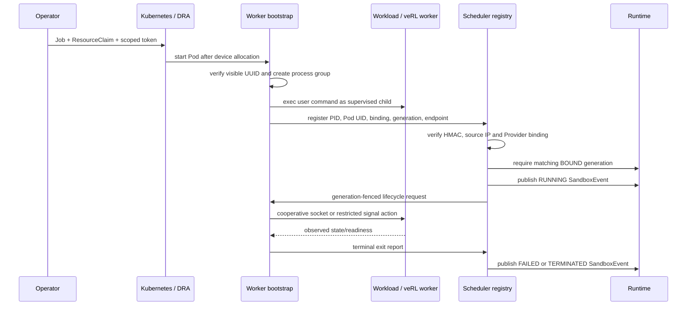

# Managed-worker bootstrap 设计

本文定义 Kubernetes workload 从“已分配设备”到“训练进程可被 TGS-RL 识别和控制”的
执行层契约。实现目标是闭合进程身份与生命周期链路；它不替代 DRA/CDI，不把 Scheduler
变成进程 launcher，也不宣称真实 GPU、Kubernetes 或 veRL 已完成验证。

## 组件与边界



- **Runtime** 只维护 desired/observed state 并发布 Intent，不直接 fork worker。
- **Scheduler/Provider** 仍是 binding、generation 与 device identity 的权威。
- **Operator** 以不可变 `RuntimeManifest` 物化 Pod，并派生注册凭据。
- **Kubernetes DRA/CDI** 负责把 Scheduler 选择的 GPU/MIG 注入容器。
- **bootstrap** 只监管容器内 workload，不重新选择或模拟设备。
- **worker bridge** 负责 safe point、checkpoint、offload、reload 与训练态 observation。

## 身份与信任模型

Operator 与 Scheduler 读取同一个至少 32 bytes 的 HMAC 主 key。主 key 只能存在于控制面；
Operator 为每个 binding 计算 scoped token，claims 包含：

```text
run_id / job_id / runtime_unit_id / sandbox_id
binding_id / generation / sorted device_ids
```

Pod 只获得 scoped token，不能为其他 sandbox、generation 或 device 集合伪造注册。Scheduler
registry 还要求 control URL 的 IP 与 HTTP 请求来源相同，并向 Provider 核对当前 binding。注册
后只持久化 token 的 SHA-256 摘要；bootstrap 的随机 control token 需要回连控制，因此以明文
保存在 runtime helper 私有状态文件中。helper 强制使用 `0700` 目录和 `0600` 文件；备份介质
仍需部署者限制访问。

终态上报继续使用该进程 incarnation 的注册凭据，并同时检查 Pod UID、process token 和请求
generation 是否等于当前 worker generation。合法 rebind 会更新 worker generation，但不会改变
该进程的注册 credential；旧 Pod 或 PID reuse 仍不能覆盖替代进程。

registry 和 control endpoint 支持 HTTP(S)，但没有内建证书签发或授权系统。HTTP 仅允许隔离
Pod 网络；跨信任域必须由部署层提供 TLS/mTLS、NetworkPolicy 和审计。

## 启动与状态机

Operator 为每个 concrete binding 生成独立 Job，设置 `backoffLimit: 0`，并使用 init container
从不可变 digest 镜像安装 bootstrap。main container 的原命令被包装为：

```text
/opt/tgsrl/tgsrl-worker-bootstrap --listen 0.0.0.0:50092 -- <manifest command...>
```

bootstrap 的启动顺序为：

1. 读取并校验 run、job、runtime unit、sandbox、binding、generation、device IDs。
2. DRA 路径调用 `nvidia-smi -L`，要求可见 UUID 与 Binding 完全相同。
3. 创建独立进程组并启动 workload，记录 PID 与防复用 process token。
4. 启动带随机 control token 的 HTTP endpoint。
5. 等待 cooperative socket readiness，或确认 signal-only 进程仍存活。
6. 有界重试 registry；Runtime 尚未观察到 BOUND 时保持未 Ready。
7. 注册成功后 `/readyz` 才返回成功，Operator 才能发布 RUNNING。
8. 转发 SIGTERM/SIGINT，等待子进程退出，generation-fenced 清理 MPS PID 文件并上报终态。

registration、单次 cooperative control 与 shutdown 都有独立的有界超时；shutdown 超时后会
关闭 control server 并把未退出的 workload 进程组升级为 SIGKILL，避免 Pod termination 无限悬挂。

Kubernetes 不在同一 generation 自动重启 workload；失败后由上层 retry 创建新 generation，
避免同一身份下静默替换进程。

## 控制能力分级

| 模式 | 启动/状态 | pause/resume | checkpoint/offload/reload | GPU 资源释放 |
|---|---|---|---|---|
| signal-only | 进程存活；可选 readiness marker | 仅在 safe-point marker 为真时 `SIGSTOP/SIGCONT` | 不支持，fail closed | 不保证；CUDA context/显存通常仍保留 |
| cooperative socket | worker callback 的 status/readiness | worker 显式确认 safe point 和状态 | worker 显式确认并返回 checkpoint | 取决于真实 framework callback |

control request 使用幂等键。bootstrap 会缓存确定结果；连接断开且无法确认副作用时返回
unknown outcome，由 runtime helper 的 durable receipt 在重启后通过 status 调和，不能盲目重放。

## MPS 边界

只有显式设置 `TGSRL_NVIDIA_MPS_PID_DIR` 时，bootstrap 才扫描 `/proc` 中唯一的
`nvidia-cuda-mps-server`，记录 PID、process token 与 generation，并以原子 rename 写入
`<sandbox>.pid`。退出清理要求完整记录匹配，旧 generation 不会删除新记录。

普通 Pod 只能看到自己的 PID namespace，且默认没有节点 helper 的共享目录。因此这一机制
需要 host PID namespace、共享 mount 或专用 node agent 才能用于真实 MPS；当前 CPU 测试只验证
文件 fence 和 PID identity，不是 Kubernetes MPS 可用证据。

## 已验证与未验证

当前 CPU/模拟验证覆盖真实子进程启动、PID identity、scoped token、来源 IP、binding/
generation fence、HTTP control、signal 转发、退出上报、旧 generation 清理保护、Operator
Pod projection/readiness 和 durable runtime receipt。

仍需真实环境完成：

- Kubernetes Pod/init container、Service/NetworkPolicy 与 Pod restart；
- NVIDIA DRA/CDI 的实际可见 UUID；
- host MPS server PID 与共享状态目录；
- 真实 veRL/Ray/PyTorch/vLLM callbacks；
- GPU pause/offload/reload、MIG rebind 与 Gate G/I 证据。
