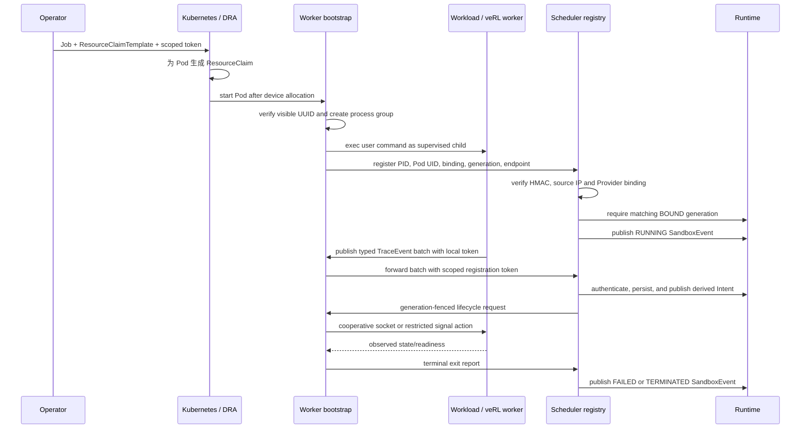

# Managed-worker bootstrap 设计

本文定义 Kubernetes workload 从“已分配设备”到“训练进程可被 TGS-RL 识别和控制”的
执行层契约。它不替代 DRA/CDI，也不把 Scheduler 变成进程 launcher。Full GPU E1、HAMi
H1/H2 已有对应实机证据，但不覆盖完整 veRL、MIG/MPS、显存释放或通用集群故障恢复。

## 组件与边界



- **Runtime** 只维护 desired/observed state 并发布 Intent，不直接 fork worker。
- **Scheduler/Provider** 仍是 binding、generation 与 device identity 的权威。
- **Operator** 以不可变 `RuntimeManifest` 物化 Pod，并派生注册凭据。
- **Kubernetes DRA/CDI** 负责把 Scheduler 选择的 GPU/MIG 注入容器。
- **bootstrap** 只监管容器内 workload，不重新选择或模拟设备。
- **worker bridge** 负责 safe point、checkpoint、offload、reload 与训练态 observation。

## 身份与信任模型

Operator 与 Scheduler 读取同一个至少 32 bytes 的 HMAC 主 key。主 key 只能存在于控制面；
Operator 为每个 binding 计算 scoped token，claims 包含：

```text
run_id / job_id / runtime_unit_id / sandbox_id
binding_id / generation / sorted device_ids
```

Pod 只获得 scoped token，不能为其他 sandbox、generation 或 device 集合伪造注册。Scheduler
registry 还要求 control URL 的 IP 与 HTTP 请求来源相同，并向 Provider 核对当前 binding。注册
后只持久化 token 的 SHA-256 摘要；bootstrap 的随机 control token 需要回连控制，因此以明文
保存在 runtime helper 私有状态文件中。helper 强制使用 `0700` 目录和 `0600` 文件；备份介质
仍需部署者限制访问。

训练进程不会获得 scoped registry token。bootstrap 启动时生成独立随机 trace token，只把
loopback `TGSRL_WORKER_TRACE_URL` 和该 token 注入子进程；收到的 protobuf batch 会以 bootstrap
持有的 registry token 转发。Scheduler 在转发 Runtime 前再次核对当前 registration、Provider
binding、generation、device IDs 和 batch identity，并用共享主 key 对原始 batch bytes 及请求
元数据签名。Runtime 以同一 key 验签，随后把 trace、派生 Intent 和幂等响应作为一个 SQLite
事务落盘，再以至少一次语义发布 Intent。

终态上报继续使用该进程 incarnation 的注册凭据，并同时检查 Pod UID、process token 和请求
generation 是否等于当前 worker generation。合法 rebind 会更新 worker generation，但不会改变
该进程的注册 credential；旧 Pod 或 PID reuse 仍不能覆盖替代进程。

registry 和 control endpoint 支持 HTTP(S)，但没有内建证书签发或授权系统。HTTP 仅允许隔离
Pod 网络；跨信任域必须由部署层提供 TLS/mTLS、NetworkPolicy 和审计。

## 启动与状态机

Operator 为每个 concrete binding 生成独立 Job，设置 `backoffLimit: 0`，并使用 init container
从不可变 digest 镜像安装 bootstrap。main container 的原命令被包装为：

```text
/var/run/tgsrl-bootstrap/tgsrl-worker-bootstrap --listen 0.0.0.0:0 --registration-ready-file /tmp/tgsrl/bootstrap-ready -- <manifest command...>
```

bootstrap 使用独立的 `/var/run/tgsrl-bootstrap` emptyDir；不得挂载到 `/opt/tgsrl` 等常见
workload 路径，否则会遮住镜像自身的代码和入口。

bootstrap 的启动顺序为：

1. 读取并校验 run、job、runtime unit、sandbox、binding、generation、device IDs。
2. DRA 路径调用 `nvidia-smi -L`，要求可见 UUID 与 Binding 完全相同。
3. 若 Operator 注入了 `TGSRL_REQUIRED_PYTHON_MODULES`，用 workload command 的 Python
   解释器验证依赖；该清单仅在存在 workload OCI artifact 时生成，控制面与本机无镜像 fixture
   不承担训练依赖。
4. 创建独立进程组并启动 workload，记录 PID 与防复用 process token。
5. 启动带随机 control token 的 HTTP endpoint。
6. 等待 cooperative socket readiness，或确认 signal-only 进程仍存活。
7. 有界重试 registry；Runtime 尚未观察到 BOUND 时保持未 Ready。
8. 注册成功后原子写入带身份的 marker；Pod 使用 `ready --file /tmp/tgsrl/bootstrap-ready` exec
   probe 核对注册身份。动态 HTTP endpoint 仍提供 `/readyz` 与状态查询，marker 不是完整训练
   健康探针；动态端口避免 hostNetwork 多副本冲突。
9. worker observation 以有界 batch 经 bootstrap/registry 回传 Runtime；完成或关闭时强制 flush。
10. 转发 SIGTERM/SIGINT，等待子进程退出，generation-fenced 清理 MPS PID 文件并上报终态。

registration、单次 cooperative control 与 shutdown 都有独立的有界超时；shutdown 超时后会
关闭 control server 并把未退出的 workload 进程组升级为 SIGKILL，避免 Pod termination 无限悬挂。

Kubernetes 不在同一 generation 自动重启 workload；失败后由上层 retry 创建新 generation，
避免同一身份下静默替换进程。

## 控制能力分级

| 模式 | 启动/状态 | pause/resume | checkpoint/offload/reload | GPU 资源释放 |
|---|---|---|---|---|
| signal-only | 进程存活；可选 readiness marker | 仅在 safe-point marker 为真时 `SIGSTOP/SIGCONT` | 不支持，fail closed | 不保证；CUDA context/显存通常仍保留 |
| cooperative socket | worker callback 的 status/readiness | worker 显式确认 safe point 和状态 | worker 显式确认并返回 checkpoint | 可选回报 allocator bytes；A10 readiness 要求 offload 下降、resume 回升 |

control request 使用幂等键。bootstrap 会缓存确定结果；连接断开且无法确认副作用时返回
unknown outcome，由 runtime helper 的 durable receipt 在重启后通过 status 调和，不能盲目重放。
cooperative bridge 以独立 mutation lock 串行生命周期动作，等待 `prepare_pause` 的同时保持
Trace/observation 路径可用，避免控制线程与训练线程在安全点处互相等待。

## MPS 边界

只有显式设置 `TGSRL_NVIDIA_MPS_PID_DIR` 时，bootstrap 才扫描 `/proc` 中唯一的
`nvidia-cuda-mps-server`，记录 PID、process token 与 generation，并以原子 rename 写入
`<sandbox>.pid`。退出清理要求完整记录匹配，旧 generation 不会删除新记录。

普通 Pod 只能看到自己的 PID namespace，且默认没有节点 helper 的共享目录。因此这一机制
需要 host PID namespace、共享 mount 或专用 node agent 才能用于真实 MPS；当前 CPU 测试只验证
文件 fence 和 PID identity，不是 Kubernetes MPS 可用证据。

## 已验证与未验证

当前 CPU/模拟验证覆盖真实子进程启动、PID identity、scoped token、来源 IP、binding/
generation fence、HTTP control、signal 转发、退出上报、旧 generation 清理保护、Operator
Pod projection/readiness 和 durable runtime receipt。`make engineering-fault-readiness` 会把
crash、响应丢失、pending receipt 重启调和、Operator partial failure、Provider unavailable 和
Runtime SQLite 恢复的实际测试结果写成独立报告。

已归档的 E1 证明单节点 DRA/CDI 可见 UUID、注册、CUDA Trace 与清理；H1/H2 增加 HAMi
份额兑现和双 worker 同卡并发。结果仅适用于各记录中的版本与环境，见
[支持矩阵](../reference/current-capabilities.md)。

仍需目标环境验证：

- Pod restart、跨节点 endpoint、NetworkPolicy 与异常退出恢复；
- MPS checkpoint/recreate 新 client、启动份额注入及 incarnation readback；
- A10 最小 trainer 的 checkpoint/offload/reload 与真实显存释放仍待新提交实机复测；
- 完整 veRL trainer、distributed collective 和真实模型 checkpoint 仍待专门 workload；
- MIG rebind、部分失败、超时和未知结果调和。

bootstrap CLI 单独运行的 listener 默认值仍为 `50092`；Operator compiler 显式传动态端口，
不能把 CLI 默认值写成所有 Pod 的固定端口。
