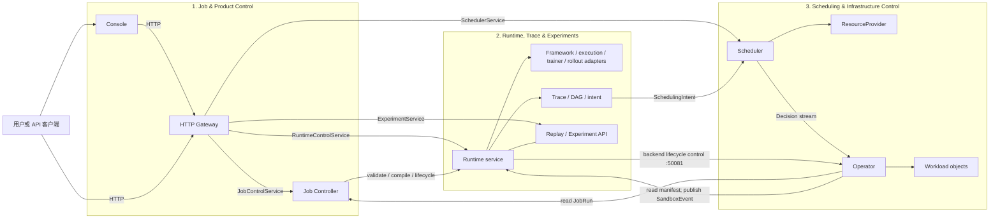
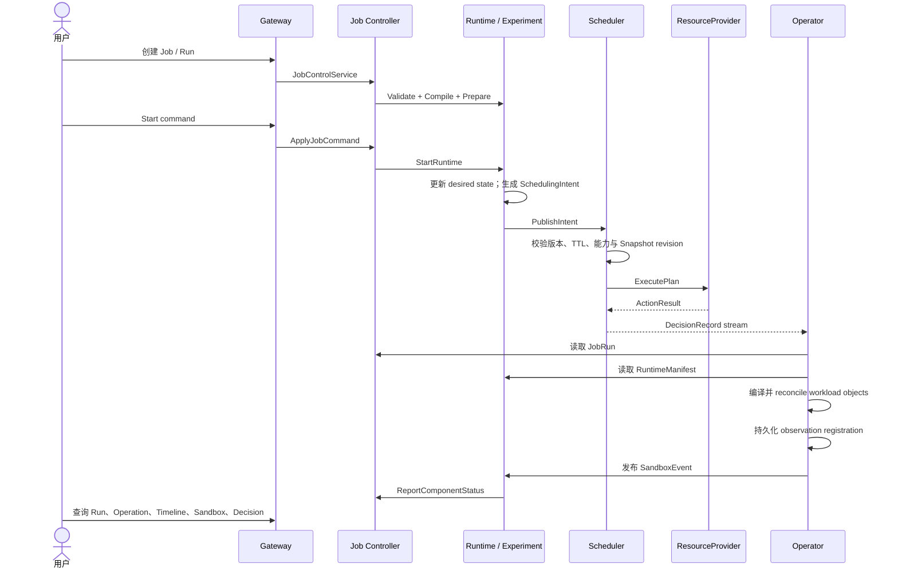

# TGS-RL 系统架构与运行边界

本页帮助部署者和集成方理解组件职责、调用链、状态归属以及故障恢复边界。TGS-RL
使用 `tgsrl.v1` Protobuf/gRPC 契约连接三个系统；用户入口为 Console、CLI、Python SDK
或 HTTP API。

## 总体架构

Runtime 和 Experiment 是同一个 Python 进程中的两个 gRPC 服务，共用 SQLite 状态。
Operator 订阅 Scheduler 的 Decision stream，并在 `50081` 提供
`RuntimeBackendControlService`，用于对 backend 对象执行带 generation fence 的生命周期操作。

## 组件职责

| 系统 | 组件 | 负责 | 不负责 |
|---|---|---|---|
| **Job & Product Control** | Console、Gateway、Job Controller | 提供用户界面与 HTTP API；校验并保存 Job；创建执行规格不可变、状态可演进的 Run generation；记录 Operation 和生命周期事件 | 选择资源、执行 Sandbox、实现训练算法 |
| **Runtime, Trace & Experiments** | Runtime、Adapters、Trace/DAG/Intent、Replay、Experiment | 将 Run 编译为 RuntimeManifest/RuntimeUnit；管理 desired/observed lifecycle；生成 Intent；提供调度预览 Replay | 维护集群资源权威、直接选择物理设备 |
| **Scheduling & Infrastructure Control** | Scheduler、ResourceProvider、Operator | 维护资源快照；生成和执行放置计划；发布 Decision；将成功决策编译为 backend 对象并观察 Sandbox | 管理 Job 产品生命周期、解释 Reward 或训练算法 |

这些边界决定了问题排查入口：

- Job、Run 或 Operation 状态问题先查询 Job Controller；
- Runtime unit、Sandbox、Trace、Replay 或 Experiment 问题先查询 Runtime；
- 候选过滤、fallback 或资源动作问题先查询 Scheduler Decision；
- workload 对象或 lifecycle 调和问题先检查 Operator 与实际 backend。

## Job 到 workload 的控制流

`StartRuntime` 不直接运行用户命令。Runtime 把 unit 置为 requested/starting 并发布
设备无关的 Intent；Scheduler 通过 ResourceProvider 执行资源动作；Operator 只处理成功且
非 fallback 的 Decision，并将 JobRun、RuntimeManifest 与 PlacementPlan 合成为 workload
对象。Sandbox 状态必须由 Operator 的独立观察路径回传，不能仅依据命令响应推断成功。

`pause`、`resume`、`stop` 和 `terminate` 沿反向控制链执行：Job Controller 记录过渡态，
Runtime 更新 desired state 并调用 Operator，Operator 修改 backend，观察器再把新状态作为
SandboxEvent 回报。Operation 在 Runtime 观察态收敛后完成。

因此，客户端需要：

1. 为可重试写操作使用稳定、作用域明确的幂等键；
2. 把命令返回理解为请求已接收，而不是 workload 已完成；
3. 通过 Operation、Sandbox 和 Decision 接口观察最终状态。

## 调度与基础设施边界

Scheduler 使用不可变 Snapshot 副本执行以下过程：

1. 校验 Intent 版本、TTL、幂等键和语义；
2. 过滤状态、容量、capability 或 safe-point 不满足要求的候选；
3. 根据策略评分并稳定排序；
4. 生成带 Snapshot revision、generation fence 和 rollback 声明的 PlacementPlan；
5. 预留资源、调用 ResourceProvider，并按 ActionResult 确认或释放 binding；
6. 发布包含候选、拒绝原因、计划、动作结果或 fallback 原因的 DecisionRecord。

阻断性合同要求的 pause 按完整活跃 allocation 集合执行：已经被新鲜观测确认为 paused
的目标可视为满足，其余目标必须全部进入同一安全计划。缺少或过期 Sandbox 观测、能力不足、
目标冲突或预算不足都会使整组动作 fail closed；普通优化使用的 target filter 不得缩小安全范围。

Scheduler 不使用 reward 数值选择设备。相同输入、配置、时间和 seed 可用于重复比较
决策语义。`noop` fallback 不授权新的资源 mutation；`static` 只保留兼容的已有 allocation。

ResourceProvider 是硬件或基础设施能力边界。通用 Intent、Plan 和 Scheduler 不包含厂商
设备型号字段。选择 Provider 时需遵守以下条件：

- **CPU Mock Provider**：支持资源绑定、L1–L4 模拟动作、故障注入、幂等和补偿；
  只提供逻辑资源，不代表真实硬件行为。
- **NVIDIA Provider + 默认 LocalDriver**：可以通过 `nvidia-smi` 发现本机设备；
  不声明或执行 bind/release、MIG/MPS、resize 或 Runtime 控制。
- **NVIDIA Driver v2（可选）**：Go 侧实现 inventory、MPS/MIG、binding、runtime command、
  transaction、reconciliation 和审计编排；仓库内 `tgsrl-nvidia-binding` 负责持久化
  binding authority、generation fence、幂等 receipt 与重启发现；仓库内
  `tgsrl-nvidia-runtime` 负责本机进程信号控制与 managed-worker safe-point/checkpoint/offload/
  reload/readiness 协议；仓库内 `tgsrl-nvidia-mig` 在现有 MIG 实例之间执行完整 lifecycle
  后的 rebind/recreate，并用 `nvidia-smi -L` 回读目标实例。MPS share 需可用 server PID 与
  硬件读回后才形成 observation。当前 helper 不隐式创建或销毁 MIG 拓扑，且真实 GPU 验证
  证据尚未提供，因此该路径是 Conditional，不是 Supported。

Operator backend 决定 workload 对象的落点：

- **fake**：bundle 保存在进程内，适合单机控制链；进程退出后对象丢失。
- **kubernetes**：使用 kubeconfig 或集群内 ServiceAccount 连接 API Server，管理
  `JobRunBundle`、Kueue `Workload`、Kubernetes `Job` 和可选 `ResourceClaim`；仅在显式
  启用 `runtimeClassCreate` 时创建 `RuntimeClass`。

Kubernetes wire contract 通过 discovery 选择 Kueue `v1beta2`/`v1beta1` 和 DRA
`resource.k8s.io/v1`/`v1beta2`/`v1beta1`，并生成带 `restartPolicy` 的 Job pod spec。部署者必须提供
Scheduler、Job Controller、Runtime、Kueue 以及所选 GPU/DRA 控制器，并确认目标集群
支持这些 API。GPU 设备身份采用单一权威模型：Scheduler 选择并保留 NVIDIA GPU/MIG UUID，
Operator 从最新 ResourceSlice 维护 UUID 对应的 type、driver、pool/device、profile 和 parent UUID；
`kubernetes-dra` profile 为 Full GPU 选择 `gpu.nvidia.com` DeviceClass，为 MIG 选择
`mig.nvidia.com` DeviceClass，并将 UUID 编译为 NVIDIA DRA `uuid` CEL selector。Operator 只有在
ResourceClaim allocation 可通过最新 ResourceSlice 反查到完全相同的 UUID 集合后，才发布
`BOUND`/`RUNNING`。Device Plugin 与 HAMi 只表达数量，不宣称精确 UUID 一致。随附部署工件
不会安装这些依赖。由于当前 Binding 语义始终包含具体设备身份，不能执行该身份约束的
Device Plugin/HAMi profile 会在 Operator capability preflight/compile 阶段 fail closed；它们
保留为已识别但尚不可执行的兼容 profile。

## 状态权威与恢复

| 状态 | 权威组件 | 持久化 | 重启边界 |
|---|---|---|---|
| Job、Run、Operation、JobEvent、请求幂等记录 | Job Controller | `snapshot.gob`、`journal.gob` | 恢复记录；不自动重新执行中间态 Operation |
| RuntimeManifest、RuntimeUnit、Sandbox、RuntimeEvent、Trace、Intent、Checkpoint | Runtime | SQLite，WAL + `synchronous=FULL` | 分页恢复状态与水位；仅补投未确认的 Start Intent |
| Replay、Experiment | Runtime / Experiment | 同一 SQLite 数据库 | 分页恢复并提供查询 |
| Snapshot、Intent、reservation、Decision、ActionResult、cursor | Scheduler | checkpoint + 校验 journal | 对外监听前恢复；先调和未完成 reservation，再重新排队 Intent |
| Provider 动作状态 | ResourceProvider | 由 Provider 决定 | Scheduler checkpoint 不能替代外部 Provider 的状态 |
| delivery、观察注册、lifecycle control | Operator | `decision-cursor.json`、`delivery.json`、`backend-controls.json` | 恢复消费位置、未完成 delivery、注册和幂等记录 |
| workload 对象 | Operator backend | fake 为进程内；Kubernetes 由 API Server 保存 | fake 对象丢失；Kubernetes 可从已有 bundle 恢复观察注册 |
| HTTP 与页面状态 | Gateway、Console | 无业务状态 | 从后端重新查询 |

各组件的持久化彼此独立，不构成分布式事务。部署和恢复流程必须保留每个组件的状态
目录，并在重启后核对 Job、Operation、Decision、reservation、Sandbox 与实际 backend
对象。详细步骤见[配置、持久化与恢复](../guides/configuration-and-recovery.md)。

Job Controller 的内存与文件 Repository 使用相同的 copy-on-write 更新语义：回调成功后
才一次性发布新状态；回调失败不会留下部分 Job、Run、Operation 或 Event 写入。文件实现
在交换 live state 前还必须先完成持久化。

## 配置来源

| 组件 | 配置来源 | 使用要求 |
|---|---|---|
| Scheduler | compatibility manifest、BOM、profile、capabilities、policy、scenario；环境变量与命令行覆盖 | 启动时加载完整配置图；未知能力或冲突引用会被拒绝 |
| Runtime | adapter registry、`--config-root`、`--manifest`、`TGSRL_CONFIG_*` | 将配置投影应用于 manifest 校验、编译和准备 |
| Job Controller | 命令行参数 | 指定监听地址、Runtime target 与状态目录 |
| Operator | 命令行参数、backend 凭据 | 指定 backend、上游 target、namespace、GPU profile 与 cursor 目录 |
| Gateway | 环境变量与命令行参数 | gRPC 模式需连接四个逻辑服务；Runtime/Experiment 可共享 `50071` |
| Console | Vite 环境变量与代理 | HTTP adapter 需要 Gateway；`mock` adapter 不发出 HTTP 请求 |

配置声明用于能力匹配，不能替代实际 backend 的资源保证。互斥 GPU 管理 profile 不得
同时启用；未知 capability 默认拒绝。

## 单机端口

| 组件 | 默认地址 | 协议 |
|---|---|---|
| Scheduler | `127.0.0.1:50051` | gRPC |
| Scheduler metrics | `127.0.0.1:9090/metrics` | HTTP / Prometheus |
| Job Controller | `127.0.0.1:50061` | gRPC |
| Runtime + Experiment | `127.0.0.1:50071` | gRPC |
| Operator | `127.0.0.1:50081` | gRPC lifecycle control |
| Gateway | `127.0.0.1:8080` | HTTP / JSON |
| Console | `127.0.0.1:4173` | HTTP |

Compose 使用 CPU Mock Provider、fake Operator backend 和 named volumes。手动运行时，
Gateway 的 Runtime target 与 Experiment target 都应指向 Runtime 的同一地址。

## 安全、可靠性与性能限制

- HTTP、gRPC 和 Prometheus 端点没有 TLS、认证、授权、租户隔离或限流，只能直接
  绑定可信本机或隔离网络。跨主机访问必须增加受控代理、传输加密、身份认证、授权、
  审计、CORS 和容量保护。
- Gateway 使用 Python 同步 WSGI server，不适合作为公网或高并发入口。
- 状态文件未加密；使用私有目录和限制性文件权限，不要把凭据写入 Job、Manifest、
  环境变量诊断或 Trace。
- fake backend、CPU Mock、Synthetic Trace 和 Replay 不提供真实 GPU、集群可用性、
  训练吞吐、利用率、收敛质量、成本或 wall-clock 收益保证。
- Scheduler、Job Controller、Runtime 和 Operator 没有跨服务原子事务，也不提供 HA
  或灾备。调用方和运维流程必须处理幂等重试、cursor 恢复与状态核对。
