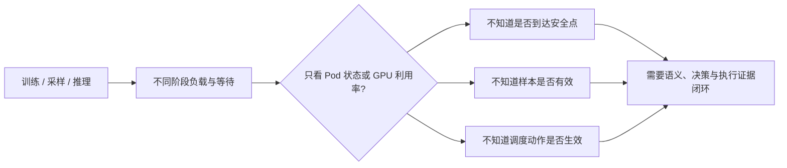
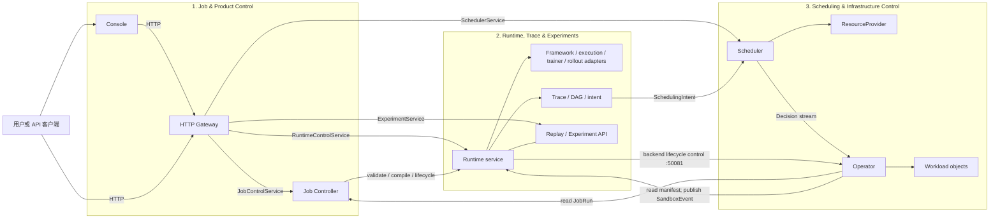
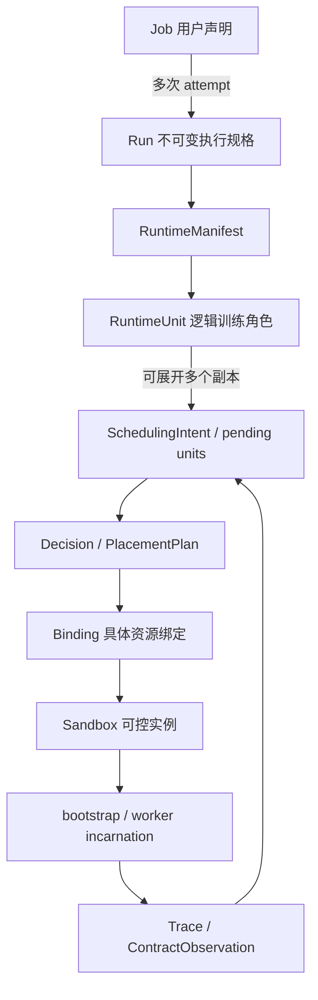
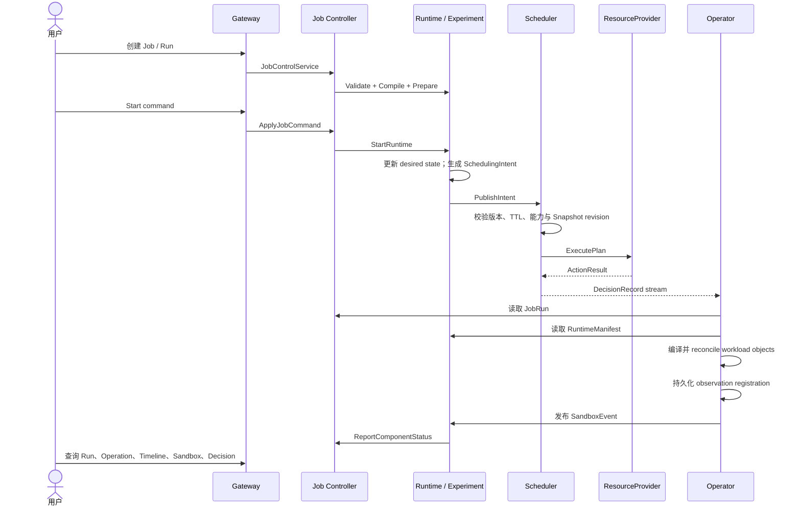
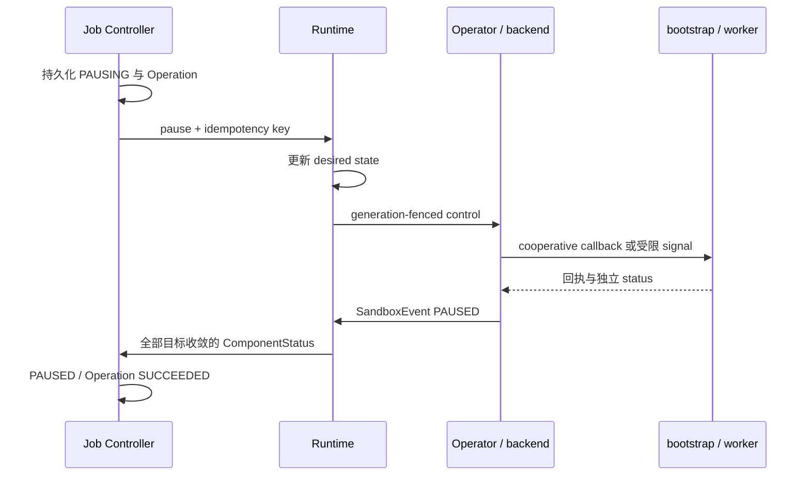
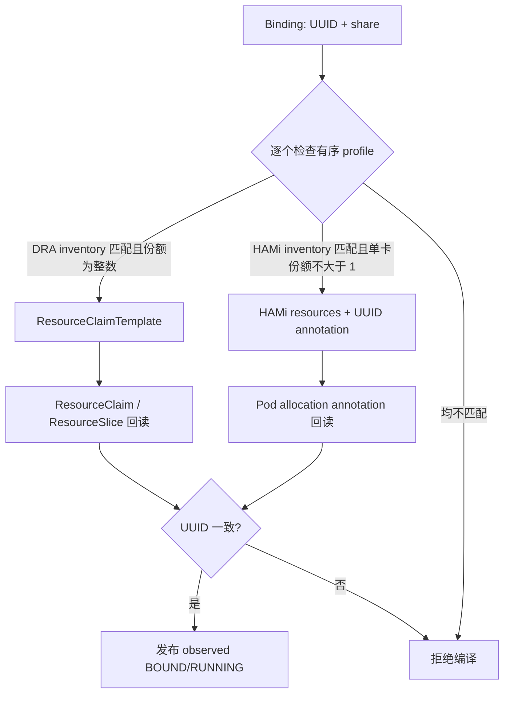

# TGS-RL 系统架构与运行边界

本页从问题讲到架构与状态模型；具体实现入口见[源码与组件导读](../maintainers/code-walkthrough.md)，
运行步骤见[快速上手](../getting-started.md)。设计描述不是硬件验收报告，当前证据见
[支持矩阵](../reference/current-capabilities.md)。

## 1. 先理解问题

强化学习流水线里的训练、采样、奖励计算与推理角色并非持续同时繁忙。阶段之间的等待、
策略版本滞后、样本有效性和显存占用决定了资源能否安全复用；单纯提高 GPU 利用率不一定
提高有效训练产出。

TGS-RL 用 Trace 和结构化 observation 表达训练事实，用 ExecutionContract 声明安全约束，
再把调度计划落实到可核对身份的资源与进程。有效更新吞吐（VUG）是设计目标，**不是当前
已证明的收益**；本周期先验证系统接线、故障行为和可重复运行。

| TGS-RL 提供 | 仍由外部系统提供 |
|---|---|
| Job/Run 生命周期、控制操作与查询 | 训练算法、数据集、模型、loss 与优化器 |
| Intent、资源计划、动作事务与回执 | GPU 驱动、容器运行时和设备注入 |
| Runtime/worker 观察态、Trace 与调度关联 | Kubernetes 节点/Pod 管理、Kueue 配额准入 |
| 可插拔 Provider 与训练 adapter | 厂商硬件实现、框架版本适配和目标环境验证 |

## 2. 复用了哪些开源组件

| 组件 | 使用位置 | 复用边界 |
|---|---|---|
| Protobuf / gRPC / Buf | `proto/`、`gen/`、跨语言服务 | 契约与传输；业务状态机由本项目实现 |
| Kubernetes | `operator-go/backend/`、`deploy/` | 对象持久化、Pod 生命周期和资源调度；不是 TGS-RL 的训练语义层 |
| Kueue | Operator 的 Workload 投影 | 队列/配额准入；不替 TGS-RL 选择具体 UUID |
| NVIDIA DRA / CDI | DRA profile 和 GPU smoke | 按 selector 分配并注入设备；Operator 再核对 allocation |
| HAMi | `hami-vgpu` realization adapter | 使用资源/注解协议兑现份额；不复制其控制面或 WebUI 源码 |
| veRL / Ray / PyTorch / vLLM | workload 镜像与 `adapters/` | 训练和推理执行；控制面不安装完整训练栈 |
| SQLite | Runtime/Experiment 持久化 | 本机事务与恢复；不构成全局分布式事务 |
| React / Vite | `console/` | 中文前端与构建；页面通过 Gateway 获取业务事实 |

锁定版本见 `compatibility/bom/runtime.yaml`、各语言锁文件和 GPU workload 独立 hash lock；
来源与补丁规则见 `upstream/`。HAMi 等外部集群组件不是 vendored 代码，部署版本需另行记录。

## 3. 总体架构

当前可执行硬件实现仅为 NVIDIA。Proto `DeviceKind` 已保留 GPU、NPU、TPU 和 CUSTOM，
Scheduler 的 `CompleteResourceProvider` 使用通用 `Device`/`CapabilitySet`，不根据型号名称
做决策。`provider.Registry` 在 Scheduler composition root 当前只注册 Mock 与 NVIDIA；
未来厂商以新的 Provider、Operator realization adapter 和 worker identity verifier 接入，
不预写空实现，也不修改通用候选、评分、事务与 Runtime 协议。见
[加速器 Provider 扩展设计](accelerator-extension.md)。

Runtime 和 Experiment 是同一个 Python 进程中的两个 gRPC 服务，共用 SQLite 状态。
Operator 订阅 Scheduler 的 Decision stream，并在 `50081` 提供
`RuntimeBackendControlService`，用于对 backend 对象执行带 generation fence 的生命周期操作。

## 组件职责与设计原则

- **Proto-first**：`proto/tgsrl/v1/` 是跨语言 wire contract 的唯一来源，不维护手写影子协议。
- **双平面、三系统**：Python 解释训练语义，Go 承担调度和基础设施控制；产品生命周期独立于两者。
- **多权威而非一个总状态**：Job、Runtime、Scheduler、Provider、backend 各自推进自己负责的状态。
- **可重放但不盲重试**：幂等键去重、generation 防旧实例、cursor 定位消费；结果不明先回读。
- **失败关闭**：未知能力、缺失观察或身份不一致时不执行危险动作，也不宣称成功。

| 系统 | 组件 | 负责 | 不负责 |
|---|---|---|---|
| **Job & Product Control** | Console、Gateway、Job Controller | 提供用户界面与 HTTP API；校验并保存 Job；创建执行规格不可变、状态可演进的 Run generation；记录 Operation 和生命周期事件 | 选择资源、执行 Sandbox、实现训练算法 |
| **Runtime, Trace & Experiments** | Runtime、Adapters、Trace/DAG/Intent、Replay、Experiment | 将 Run 编译为 RuntimeManifest/RuntimeUnit；管理 desired/observed lifecycle；生成 Intent；提供调度预览 Replay | 维护集群资源权威、直接选择物理设备 |
| **Scheduling & Infrastructure Control** | Scheduler、ResourceProvider、Operator | 维护资源快照；生成和执行放置计划；发布 Decision；将成功决策编译为 backend 对象并观察 Sandbox | 管理 Job 产品生命周期、解释 Reward 或训练算法 |

这些边界决定了问题排查入口：

- Job、Run 或 Operation 状态问题先查询 Job Controller；
- Runtime unit、Sandbox、Trace、Replay 或 Experiment 问题先查询 Runtime；
- 候选过滤、fallback 或资源动作问题先查询 Scheduler Decision；
- workload 对象或 lifecycle 调和问题先检查 Operator 与实际 backend。

## 对象关系与身份

| 身份 | 用途 | 不能混淆的边界 |
|---|---|---|
| `job_id` / `run_id` / `trace_id` | 任务、一次尝试与事件集合 | retry 创建新 Run，不复用旧执行规格 |
| `runtime_unit_id` | 逻辑角色 | 不是唯一 worker；一个 Unit 可以有多个 Sandbox 副本 |
| `sandbox_id` / `binding_id` | 可控实例与资源绑定 | rebind 的新绑定不能被旧消息覆盖 |
| `generation` | 实例/绑定代际 fence | 不是队列位置，也不是请求去重键 |
| `device_ids` | Scheduler 选定的具体资源 | 必须与 allocation 和 worker 可见身份一致 |
| Pod UID / PID token | 一次进程 incarnation | PID 数值本身不足以防止复用误控 |
| `decision_id` / `plan_id` / `action_id` | 决策到外部副作用 | 动作响应不等同于 workload 已收敛 |
| `operation_id` / `idempotency_key` | 产品操作及安全重试 | 同 key 不同请求内容必须拒绝 |
| `cursor` | 已完成 durable delivery 的消费位置 | 不能替代 generation 或幂等记录 |

多副本 Trace 保留同一 logical unit，但逐事件核验具体 Sandbox、Binding、generation 和设备；
不能用 Unit 的代表性 `sandbox_id` 排除合法的第二个 worker。

## Job 到 workload 的控制流

`StartRuntime` 不直接运行用户命令。Runtime 把 unit 置为 requested/starting 并发布
设备无关的 Intent；Scheduler 通过 ResourceProvider 执行资源动作；Operator 只处理成功且
非 fallback 的 Decision，并将 JobRun、RuntimeManifest 与 PlacementPlan 合成为 workload
对象。Sandbox 状态必须由 Operator 的独立观察路径回传，不能仅依据命令响应推断成功。

`pause`、`resume`、`stop` 和 `terminate` 沿反向控制链执行：Job Controller 记录过渡态，
Runtime 更新 desired state 并调用 Operator，Operator 修改 backend，观察器再把新状态作为
SandboxEvent 回报。Operation 在 Runtime 观察态收敛后完成。

因此，客户端需要：

1. 为可重试写操作使用稳定、作用域明确的幂等键；
2. 把命令返回理解为请求已接收，而不是 workload 已完成；
3. 通过 Operation、Sandbox 和 Decision 接口观察最终状态。

## 暂停、失败、取消与恢复

| 情况 | 处理 | 不能做的事 |
|---|---|---|
| 请求重复 | 核对请求 digest，复用幂等结果 | 重复启动第二个进程 |
| RPC 超时/客户端断开 | 保留未完成或 ambiguous 状态，恢复后回读 | 认为没有收到响应就没有副作用 |
| worker 启动失败或崩溃 | 上报失败，保留可诊断回执并回收所属资源 | 用 Pod active 推断训练正常 |
| stop/terminate | 向当前身份下发终止，观察退出再收敛 | 直接删除无所有权证明的其他 workload |
| 部分动作失败 | 按已持久化进度补偿；无法确认则 degraded | 把部分成功当作整个计划成功 |
| 控制面重启 | 恢复 outbox、receipt、cursor，核对实际 backend | 仅加载数据库便声称任务已恢复 |

北向命令为 `start/pause/resume/stop/retry/terminate`。资源级 share/offload/rebind 由调度链产生，
不允许客户端绕过资源权威修改设备。signal pause 不释放 CUDA context 或显存；资源腾挪必须
由支持 cooperative socket 的训练 callback 完成并确认。

## 调度与基础设施边界

Scheduler 使用不可变 Snapshot 副本执行以下过程：

1. 校验 Intent 版本、TTL、幂等键和语义；
2. 过滤状态、容量、capability 或 safe-point 不满足要求的候选；
3. 根据策略评分并稳定排序；
4. 生成带 Snapshot revision、generation fence 和 rollback 声明的 PlacementPlan；
5. 预留资源、调用 ResourceProvider，并按 ActionResult 确认或释放 binding；
6. 发布包含候选、拒绝原因、计划、动作结果或 fallback 原因的 DecisionRecord。

阻断性合同要求的 pause 按完整活跃 allocation 集合执行：已经被新鲜观测确认为 paused
的目标可视为满足，其余目标必须全部进入同一安全计划。缺少或过期 Sandbox 观测、能力不足、
目标冲突或预算不足都会使整组动作 fail closed；普通优化使用的 target filter 不得缩小安全范围。

Scheduler 不使用 reward 数值选择设备。相同输入、配置、时间和 seed 可用于重复比较
决策语义。`noop` fallback 不授权新的资源 mutation；`static` 只保留兼容的已有 allocation。

ResourceProvider 是硬件或基础设施能力边界。通用 Intent、Plan 和 Scheduler 不包含厂商
设备型号字段。选择 Provider 时需遵守以下条件：

- **CPU Mock Provider**：支持资源绑定、L1–L4 模拟动作、故障注入、幂等和补偿；
  只提供逻辑资源，不代表真实硬件行为。
- **NVIDIA Provider + 默认 LocalDriver**：可以通过 `nvidia-smi` 发现本机设备；
  不声明或执行 bind/release、MIG/MPS、resize 或 Runtime 控制。
- **NVIDIA Driver v2（可选）**：Go 侧实现能力感知的 Full GPU/MIG inventory、MPS/MIG、
  binding、runtime command、
  transaction、reconciliation 和审计编排；仓库内 `tgsrl-nvidia-binding` 负责持久化
  binding authority、generation fence、幂等 receipt 与重启发现；仓库内
  `tgsrl-nvidia-runtime` 负责本机进程信号控制与 managed-worker safe-point/checkpoint/offload/
  reload/readiness 协议；仓库内 `tgsrl-nvidia-mig` 在现有 MIG 实例之间执行完整 lifecycle
  后的 rebind/recreate，并用 `nvidia-smi -L` 回读目标实例。MPS share 需可用 server PID 与
  硬件读回后才形成 observation。当前 helper 不隐式创建或销毁 MIG 拓扑。
  Scheduler CLI 的 v2 默认 partition mode 是 `auto`：未启用 MIG 的卡形成 share=1 的整卡
  分区，已启用 MIG 的卡只发布已有 MIG 子设备，因此不支持或未启用 MIG 的设备不会退出资源池，
  同一物理卡也不会被整卡和 MIG 重复计量。Full GPU 设备不继承 MIG 专属动作。`full`、`mps`
  和 `mig` 仍可显式选择，MPS 不会被 `auto` 隐式启动。底层 Go 构造器保留 MPS 兼容默认，
  嵌入式调用方必须显式传入期望模式。
  NVIDIA device 只对 accelerator 维度做容量约束；CPU、memory、storage 和 network 由后续
  Kubernetes/节点层调度，不能错误地拿单张 GPU 的属性拒绝整个 workload。

Operator backend 决定 workload 对象的落点：

- **fake**：bundle 保存在进程内，适合单机控制链；进程退出后对象丢失。
- **process**：在宿主机启动真实 bootstrap 与子进程，通过 worker registry 回读状态；用于
  CPU full-stack Gate，不创建容器或 Kubernetes 对象。
- **kubernetes**：使用 kubeconfig 或集群内 ServiceAccount 连接 API Server，管理
  `JobRunBundle`、Kueue `Workload`、Kubernetes `Job` 和可选 `ResourceClaimTemplate`；
  Kubernetes 根据 Pod 模板生成 ResourceClaim；仅在显式
  启用 `runtimeClassCreate` 时创建 `RuntimeClass`。

Kubernetes wire contract 通过 discovery 选择 Kueue `v1beta2`/`v1beta1` 和 DRA
`resource.k8s.io/v1`/`v1beta2`/`v1beta1`，并生成带 `restartPolicy` 的 Job pod spec。部署者必须提供
Scheduler、Job Controller、Runtime、Kueue 以及所选 GPU/DRA 控制器，并确认目标集群
支持这些 API。GPU 设备身份采用单一权威模型：Scheduler 选择并保留 NVIDIA GPU/MIG UUID，
Operator 从最新 ResourceSlice 维护 UUID 对应的 type、driver、pool/device、profile 和 parent UUID；
`kubernetes-dra` profile 为 Full GPU 选择 `gpu.nvidia.com` DeviceClass，为 MIG 选择
`mig.nvidia.com` DeviceClass，并将 UUID 编译为 NVIDIA DRA `uuid` CEL selector。Operator 只有在
Pod 生成的 ResourceClaim allocation 可通过最新 ResourceSlice 反查到完全相同的 UUID 集合后，才发布
`BOUND`/`RUNNING`。

HAMi 采用另一条显式 identity adapter：Operator 从 Node
`hami.io/node-nvidia-register` 建立物理 GPU typed inventory；`hami-vgpu` 把单卡分数份额
投影为 `nvidia.com/gpu=1`、core/memory percentage 和 `nvidia.com/use-gpuuuid`，并固定到
该 UUID 所在节点。Pod 启动后，Operator 从 `hami.io/vgpu-devices-allocated` 回读实际 UUID；
只有与 Binding 完全一致才发布 `BOUND`/`RUNNING`。传统 `nvidia-device-plugin` 和旧
`volcano-hami` 仍只有数量语义；无法证明 exact placement 时不用于携带具体 UUID 的 Binding。
随附部署工件不会安装 DRA、HAMi 或其他集群级 GPU 组件。

Operator 的 GPU profile 配置是有序候选而非集群级单选开关。例如
`kubernetes-dra,hami-vgpu` 会对每个 concrete Binding 分别判断 UUID inventory 与份额：
整数 Full GPU/MIG 可走 DRA，单物理卡分数份额可走 HAMi；不兼容候选被跳过，没有任何候选
可兑现时 fail closed。

显式启用 managed-worker bootstrap 后，Operator 以不可变 `RuntimeManifest` 作为容器命令、
参数、环境和工作目录的权威来源，并为每个 binding 派生只覆盖 run/job/unit/sandbox/
binding/generation/device 集合的 HMAC 注册令牌。init container 从不可变 digest 镜像安装
`tgsrl-worker-bootstrap` 到 `/var/run/tgsrl-bootstrap`，避免覆盖 workload 镜像中的 `/opt/tgsrl`；
main container 由 bootstrap 启动真实子进程、维护进程组、PID token、
Pod UID、私有 control token 与 HTTP control endpoint。Scheduler registry 先验证 scoped token、
请求来源 IP、当前 Provider binding 和 Runtime 已观察到的 `BOUND` generation，再持久化注册并
发布 `RUNNING` observation。compiler 使用动态 control 端口（`--listen 0.0.0.0:0`），
并配置 `ready --file /tmp/tgsrl/bootstrap-ready` exec probe；marker 随注册就绪状态维护，
避免 hostNetwork 多副本争用固定端口。注册 marker 不是完整 GPU 健康探针，实际 worker
状态仍需 registry/status 与 Operator 回读。worker
退出后按 registration credential、instance、process token 和 generation 上报终态，旧进程不能
覆盖替代进程。
对具有 workload OCI artifact 的 Python 训练命令，Operator 还会注入所选 adapter 对应的
必需模块清单，bootstrap 用 workload 自己的 Python 解释器在 fork 前验证；Runtime 控制面
不需要安装 veRL、Ray、PyTorch 或 vLLM。

没有 cooperative Unix socket 时，进程存活足以完成启动注册，但 pause/sleep 仍必须有
safe-point marker；offload、checkpoint、reload 与安全 rebind 继续 fail closed。MPS PID 自动发布
只有在容器可见宿主 MPS server PID 且挂载了共享 PID 目录时成立；普通 Kubernetes PID namespace
并不满足该条件，因此还需要节点侧集成或 host PID/shared mount。

## 状态权威与恢复

| 状态 | 权威组件 | 持久化 | 重启边界 |
|---|---|---|---|
| Job、Run、Operation、JobEvent、请求幂等记录 | Job Controller | `snapshot.gob`、`journal.gob` | 启动时扫描 RUNNING Operation；先用 Runtime 观察收敛，安全时以原幂等键重放，未知结果转为 `RECONCILIATION_REQUIRED` |
| RuntimeManifest、RuntimeUnit、Sandbox、RuntimeEvent、Trace、Intent、Checkpoint | Runtime | SQLite，WAL + `synchronous=FULL` | 分页恢复状态与水位；仅补投未确认的 Start Intent |
| Replay、Experiment | Runtime / Experiment | 同一 SQLite 数据库 | 分页恢复并提供查询 |
| Snapshot、Intent、reservation、Decision、ActionResult、cursor | Scheduler | checkpoint + 校验 journal | 对外监听前恢复；先调和未完成 reservation，再重新排队 Intent |
| Provider 动作与 managed-worker 状态 | ResourceProvider / NVIDIA runtime helper | Provider 状态 + `nvidia-runtime.json`；control token 与 registration token hash 位于私有状态文件 | Scheduler checkpoint 不能替代外部 Provider 或 worker endpoint 的状态；重启后主动 status/readback 调和 |
| delivery、观察注册、lifecycle control | Operator | `decision-cursor.json`、`delivery.json`、`backend-controls.json` | 恢复消费位置、未完成 delivery、注册和幂等记录 |
| workload 对象 | Operator backend | fake 为进程内；Kubernetes 由 API Server 保存 | fake 对象丢失；Kubernetes 可从已有 bundle 恢复观察注册 |
| HTTP 与页面状态 | Gateway、Console | 无业务状态 | 从后端重新查询 |

各组件的持久化彼此独立，不构成分布式事务。部署和恢复流程必须保留每个组件的状态
目录，并在重启后核对 Job、Operation、Decision、reservation、Sandbox 与实际 backend
对象。详细步骤见[配置、持久化与恢复](../guides/configuration-and-recovery.md)。

Job Controller 的内存与文件 Repository 使用相同的 copy-on-write 更新语义：回调成功后
才一次性发布新状态；回调失败不会留下部分 Job、Run、Operation 或 Event 写入。文件实现
在交换 live state 前还必须先完成持久化。

## 配置来源

| 组件 | 配置来源 | 使用要求 |
|---|---|---|
| Scheduler | compatibility manifest、BOM、profile、capabilities、policy、scenario；环境变量与命令行覆盖 | 启动时加载完整配置图；未知能力或冲突引用会被拒绝 |
| Runtime | adapter registry、`--config-root`、`--manifest`、`TGSRL_CONFIG_*` | 将配置投影应用于 manifest 校验、编译和准备 |
| Job Controller | 命令行参数 | 指定监听地址、Runtime target 与状态目录 |
| Operator | 命令行参数、backend 凭据 | 指定 backend、上游 target、namespace、GPU profile 与 cursor 目录 |
| Gateway | 环境变量与命令行参数 | gRPC 模式需连接四个逻辑服务；Runtime/Experiment 可共享 `50071` |
| Console | Vite 环境变量与代理 | HTTP adapter 需要 Gateway；`mock` adapter 不发出 HTTP 请求 |

配置声明用于能力匹配，不能替代实际 backend 的资源保证。Operator 可配置有序 DRA/HAMi
候选，但底层同一卡上的互斥 Device Plugin/管理组件不能未经协调同时接管；未知 capability 默认拒绝。

## 部署形态不是同一套证据

| 形态 | 控制面 | workload | 验证边界 |
|---|---|---|---|
| 默认 Compose | 六服务、CPU Mock | fake bundle | 产品控制、Synthetic Trace；不执行训练命令 |
| CPU process Gate | 五个后端进程 | 本机 bootstrap + worker/socket | 进程与服务接线；没有 Console 或 Kubernetes |
| GPU smoke | Linux host-network Compose 控制面 | Kubernetes Job + CUDA worker | E1/H1/H2 对应设备路径；不是 Helm 实装证据 |
| 全栈 Helm | namespace 内六服务 | 按配置选择 backend/profile | 默认 CPU 配置；GPU 需补 NVIDIA helper、可见设备和网络挂载 |

`Dockerfile.services` 把控制面打包为独立镜像，`Dockerfile.worker-bootstrap` 提供监管二进制，
`Dockerfile.gpu-smoke` 锁定 CUDA 训练依赖。Python wheel 必须携带 SQLite SQL 迁移，缺失时
启动直接失败；只从 checkout 进行 editable 安装不足以验证发布包。

完整安装、镜像输入与 Helm 限制见[部署指南](../guides/deployment.md)。

## 单机端口

| 组件 | 默认地址 | 协议 |
|---|---|---|
| Scheduler | `127.0.0.1:50051` | gRPC |
| Scheduler metrics | `127.0.0.1:9090/metrics` | HTTP / Prometheus |
| Job Controller | `127.0.0.1:50061` | gRPC |
| Runtime + Experiment | `127.0.0.1:50071` | gRPC |
| Operator | `127.0.0.1:50081` | gRPC lifecycle control |
| Gateway | `127.0.0.1:8080` | HTTP / JSON |
| Console | `127.0.0.1:4173` | HTTP |
| Scheduler worker registry（可选） | `50091` | HTTP(S)；GPU smoke 监听 `0.0.0.0` 供 Pod 回连 |
| Worker bootstrap control（Pod 内） | 动态端口 | compiler 传 `--listen 0.0.0.0:0`，向 registry 发布实际 endpoint；单独运行 CLI 的默认值为 `50092` |

Compose 使用 CPU Mock Provider、fake Operator backend 和 named volumes。手动运行时，
Gateway 的 Runtime target 与 Experiment target 都应指向 Runtime 的同一地址。

## 安全、可靠性与性能限制

- HTTP、gRPC 和 Prometheus 端点没有 TLS、认证、授权、租户隔离或限流，只能直接
  绑定可信本机或隔离网络。跨主机访问必须增加受控代理、传输加密、身份认证、授权、
  审计、CORS 和容量保护。
- Gateway 使用 Python 同步 WSGI server，不适合作为公网或高并发入口。
- 状态文件未加密；使用私有目录和限制性文件权限，不要把凭据写入 Job、Manifest、
  环境变量诊断或 Trace。
- fake backend、CPU Mock、Synthetic Trace 和 Replay 不提供真实 GPU、集群可用性、
  训练吞吐、利用率、收敛质量、成本或 wall-clock 收益保证。
- Scheduler、Job Controller、Runtime 和 Operator 没有跨服务原子事务，也不提供 HA
  或灾备。调用方和运维流程必须处理幂等重试、cursor 恢复与状态核对。
