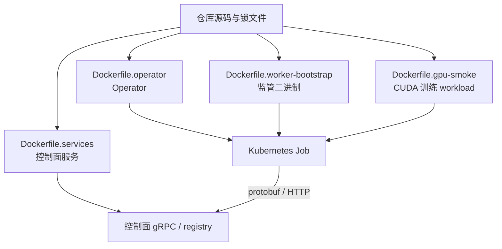

# 部署方式与发布工件

先选环境，再选工件。**默认 Compose、CPU process Gate、GPU smoke 与 Helm 不是可互换的验收方式。**
本页说明部署边界；空白 NVIDIA 主机的逐步操作以 [GPU Smoke](gpu-smoke.md) 为准。

## 1. 选择路径

| 需求 | 工件 | 前置条件 | workload 方式 |
|---|---|---|---|
| 本机体验中文前后端 | `compose.yaml`、`Dockerfile.local` | Git、Docker/Compose | CPU Mock + fake，不执行训练命令 |
| 修改源码与联调 | 各服务源码入口 | Go、Python/uv、Node.js | 默认 fake；进程 Gate 显式选择 process |
| 验证真实进程生命周期 | `scripts/gate-full-stack.sh` | 源码开发依赖 | bootstrap + CPU worker/socket，不启动 Console |
| 专用单节点 NVIDIA 验证 | `compose.gpu.yaml`、GPU 脚本 | Linux、NVIDIA、Docker、Kubernetes、Kueue、DRA | Kubernetes Job + CUDA worker |
| Kubernetes 内六服务控制面 | `deploy/helm/tgsrl/` | 镜像、StorageClass、集群依赖 | 默认 CPU 配置；GPU 需要额外集成 |

## 2. 镜像与依赖隔离



| 工件 | 内含内容 | 不应携带 |
|---|---|---|
| `Dockerfile.local` | 锁定开发工具和依赖；Compose 挂载源码 | 测试结论、生产凭据 |
| `Dockerfile.services` | Scheduler、NVIDIA Scheduler、Job Controller、Operator、Runtime、Gateway、Console targets | GPU 训练依赖、本机环境配置 |
| `Dockerfile.operator` | 独立 Operator 构建入口 | kubeconfig、签名主 key |
| `Dockerfile.worker-bootstrap` | bootstrap 与安装入口 | 训练模型、主机 PID 文件 |
| `Dockerfile.gpu-smoke` | 锁定 veRL/Ray/PyTorch/vLLM/CUDA workload | 控制面私有状态 |
| Python sdist/wheel | Runtime、Gateway、adapters、生成协议与 SQL 迁移 | 运行数据库、editable 环境和构建缓存 |

训练栈与控制面使用各自的依赖锁，通过 wire contract 通信；不要把两者合并到同一个 Python
环境来解决版本冲突。完整控制面启动仍需仓库配置图，安装 wheel 不等于部署整个系统。

## 3. Helm 控制面

### 预先准备

- 可访问的 Kubernetes API、namespace、StorageClass 与所需配额。
- Kueue 和当前集群支持的 Workload API；选择 DRA/HAMi 时另行安装对应控制器。
- 六个服务的可拉取镜像；正式目标环境用 `image.digest`，默认本地 tag 不是发布镜像。
- 启用 worker registry/bootstrap 时，控制面共享的签名 Secret、workload 可回连 registry 的地址。
- 镜像拉取 Secret、入口代理以及必要的 NetworkPolicy；仓库不会隐式创建云资源。

### 渲染与安装

复制 `deploy/helm/tgsrl/values.yaml` 为本机的 `values.production.yaml`，逐项填写镜像/存储/配置。
真实 values 与凭据不提交 Git。先做离线契约校验和渲染：

```bash
make check-deploy
scripts/deploy-full-stack.sh render ./values.production.yaml
```

确认 context、namespace 和渲染内容后，才在目标集群执行：

```bash
scripts/deploy-full-stack.sh install ./values.production.yaml
scripts/deploy-full-stack.sh status
kubectl -n tgsrl-system get pods,services,pvc
kubectl -n tgsrl-system port-forward service/tgsrl-console 4173:8080
```

默认 release 为 `tgsrl`、namespace 为 `tgsrl-system`，可用 `TGSRL_HELM_RELEASE` 和
`TGSRL_HELM_NAMESPACE` 覆盖。脚本在临时目录构建本地 Operator subchart，不把临时归档写回仓库。
升级和回滚：

```bash
scripts/deploy-full-stack.sh upgrade ./values.production.yaml
scripts/deploy-full-stack.sh rollback REVISION
```

`REVISION` 是已存在的 Helm revision。应用回滚不自动回滚数据库迁移；升级前需保存各组件
状态，恢复后核对实际 workload。CRD 生命周期和所有权见 [Operator 指南](operator.md)。

### 关键 values

| 配置 | 作用 |
|---|---|
| 各组件 `image.repository/tag/digest` | 服务镜像；digest 优先表达不可变内容 |
| `global.imagePullSecrets` | 私有 registry 引用 |
| `config.existingConfigMap/items/mountPath` | Scheduler 与 Runtime 共享的配置图 |
| 各有状态组件 `persistence` | PVC、StorageClass、existingClaim 与保留策略 |
| `scheduler.workerRegistry` | registry 开关与签名 Secret |
| `operator.controller.gpuProfile` | 有序兑现候选，如 `kubernetes-dra,hami-vgpu` |
| `operator.controller.workerBootstrap` | 安装镜像、registry URL、签名 Secret 和设备验证 |
| `networkPolicy.enabled` | chart 的基础网络约束；需结合 CNI/入口/Pod 网络验证 |

### 单节点 NVIDIA Helm 模式

Chart 支持显式 `scheduler.nvidia.enabled=true` 的单 GPU 节点模式。当前 Provider 通过本地
`nvidia-smi` 建 inventory，因此 Scheduler 和 managed workload 必须使用相同的 hostname selector。
同时必须配置 NVIDIA RuntimeClass、所有控制面不可变镜像、worker registry/bootstrap、
设备身份验证、NVIDIA compatibility manifest 以及 DRA/HAMi realization profile；缺一项 render 失败。

`scheduler-nvidia` 使用 `Dockerfile.services --target scheduler-nvidia` 构建，基于锁定 NVIDIA CUDA
镜像并包含 Scheduler 与三个 helper；GPU Runtime 在目标节点注入驱动库和 `nvidia-smi`。
`scripts/gpu-build-images.sh` 会生成所有对应不可变引用。专用 A10 测试机可直接运行：

```bash
make gpu-render-helm-values
make gpu-helm-smoke
```

第一个命令检查 context、节点、pull secret 与镜像 digest，并创建 worker-registry Secret；
第二个命令 install/upgrade 六服务、等待 rollout、检查 NetworkPolicy/Gateway/Console，
要求 Gateway 的 Job Controller、Scheduler、Runtime、Experiment 四个 gRPC 依赖全部 serving，
执行 A10 Full lifecycle，并在 `.cache/tgsrl/helm-smoke/` 保存资源、日志和 SHA-256 索引。
宿主机 driver 通过临时 Gateway/registry port-forward 访问集群服务，Pod 内仍使用 ClusterIP
registry 与 scoped token。已有证据目录不会被覆盖。完整顺序见
[A10 Readiness](a10-readiness.md)。

手工 values 示例：

```yaml
scheduler:
  manifest: compatibility/manifests/gpu-smoke-verl.yaml
  workerRegistry:
    enabled: true
    signingKeySecret: tgsrl-worker-registry
  nvidia:
    enabled: true
    image:
      repository: registry.example.com/tgsrl/scheduler-nvidia
      digest: sha256:replace-with-real-digest
    partitionMode: auto
    runtimeClassName: nvidia
    nodeSelector:
      kubernetes.io/hostname: gpu-node-a
operator:
  controller:
    gpuProfile: kubernetes-dra
    nodeSelector:
      kubernetes.io/hostname: gpu-node-a
    workerBootstrap:
      enabled: true
      installerImage: registry.example.com/tgsrl/worker-bootstrap@sha256:replace
      registryURL: http://tgsrl-scheduler:50091
      registrySigningKeySecret: tgsrl-worker-registry
      verifyDeviceIdentities: true
```

已归档的单节点 A10 Helm 记录见
[验证记录](../validation/README.md)。其他目标集群仍需独立验证 RuntimeClass、DRA、
NetworkPolicy、StorageClass、CNI 和 GPU 驱动注入；历史 E1/H1/H2 使用专用 GPU smoke
部署，不能单独替代 Helm 实装证据。多节点需要独立的集群 inventory agent，不能把一个本地
Scheduler 的 `nvidia-smi` 结果扩展成多节点能力。MPS 模式会被 chart 拒绝。

## 4. NVIDIA 首次链路验证

按 [GPU Smoke 指南](gpu-smoke.md) 顺序执行：主机检查 → 固定版本集群依赖 →
不可变镜像 → scoped kubeconfig → 生成本机配置 → preflight → 启动 → E1 → 清理。

网络受限的目标机可以设置 `TGSRL_NETWORK_PROFILE=cn`，使用仓库已定义的公共镜像源和校验；
下载慢时先完成其他独立步骤，不私自换随机依赖版本。

- 不支持 MIG 的卡继续验证 Full GPU；需要共享时按 [HAMi 指南](hami.md) 验证 H1/H2。
- MIG 需已有实例，不通过测试脚本临时重建拓扑。
- MPS 需节点 PID 可见性与共享目录，普通 Pod 默认不满足。
- `SIGSTOP` 不是显存释放；checkpoint/offload/reload 必须使用真实 callback 确认。

## 5. 上线前核对什么

| 层 | 最低核对项 |
|---|---|
| 工件 | commit、干净工作树、不可变镜像 digest、锁文件、SQL 迁移 |
| 服务 | readiness、依赖可达、持久目录可写、重启后状态可读 |
| 业务 | create/admit/start/pause/resume/stop、失败分支、allocation 清理 |
| 进程 | PID token、generation、socket、worker 回执、退出终态 |
| 设备 | Scheduler UUID = allocation UUID = worker 可见 UUID |
| 证据 | 原始 Trace、来源、关联 ID、真实测量、报告完整性 |
| 安全 | 可信入口、传输加密、访问控制、Secret 与备份权限 |

render、单元测试、容器 healthy 和历史 GPU PASS 各有范围，不能彼此替代。具体恢复步骤见
[配置与恢复](configuration-and-recovery.md)，当前缺口见[工程审查](../maintainers/engineering-review.md)。
