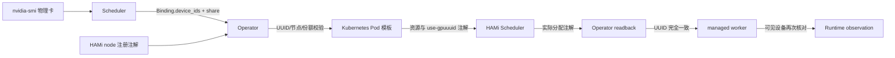

# HAMi vGPU 接入指南

本指南说明 TGS-RL 如何把 Scheduler 选择的 NVIDIA 物理 GPU UUID 和分数份额交给
[HAMi](https://github.com/Project-HAMi/HAMi) 兑现。当前接入复用 HAMi 的公开 Kubernetes
资源与注解协议，不复制 HAMi 源码，也不让 HAMi 取代 TGS-RL 的任务、运行时或决策权威。

> **当前验证边界**：NVIDIA A10 上的 H1 单 worker 与 H2 双 worker 已通过。H2 中两个
> worker 各获得 `40%` core 和 `9211 MiB`，共享同一物理 UUID，并在三轮 measurement
> 中产生真实执行重叠。详见 [H1 验证记录](../validation/h1-hami-vgpu-2026-09-12.md)和
> [H2 验证记录](../validation/h2-hami-concurrency-2026-09-13.md)。这些证据仍不覆盖
> OOM 隔离、公平性、动态改份额或训练收益。

## 解决什么问题

MIG 是部分 NVIDIA 设备提供的硬件切片能力，不是统一调度的前置条件。不支持或未启用
MIG 的设备仍应正常进入资源池：

| 需求 | 推荐资源方式 | 隔离与动态能力 |
|---|---|---|
| 独占一张物理卡 | Full GPU + NVIDIA DRA | 设备独占，UUID 可精确验证 |
| 单卡分数算力与显存 | HAMi vGPU | 软件层共享，适合不支持 MIG 的卡 |
| 在线修改现有 CUDA client 份额 | 当前不支持 | NVIDIA server-level MPS percentage 仅影响未来 client；需 checkpoint/recreate adapter 后才能安全开放 |
| 硬件级切片 | MIG + NVIDIA DRA | 仅适用于支持 MIG 且已创建实例的设备 |

TGS-RL 的统一模型是“每张卡独立声明能力”，而不是“整个集群只能选一种 GPU 模式”。

## 责任边界



| 组件 | 负责 | 不负责 |
|---|---|---|
| TGS-RL Scheduler | 选择设备 UUID、份额、generation，维护 reservation 与 Decision | 重新实现 HAMi 的节点打分或设备注入 |
| TGS-RL Operator | 发现 HAMi inventory，编译 Pod，回读实际 UUID，失败时阻断状态推进 | 在 Scheduler 之外另选一张卡 |
| HAMi | 调度 Pod、分配 vGPU、注入 CUDA 设备并发布分配注解 | 管理 TGS-RL Job/Run/Trace |
| worker bootstrap | 核对进程可见 UUID，注册 PID/control endpoint，上报退出 | 模拟或修改设备分配 |

## 当前支持合同

TGS-RL 的 `hami-vgpu` profile 当前只接受：

- NVIDIA 物理 GPU UUID，格式为 `GPU-...`；
- 一个 Binding 对应一张物理 GPU；
- `accelerator_units` 在 `(0, 1]`；
- HAMi `hami-core` 模式；
- 节点 `hami.io/node-nvidia-register` 中存在完整、健康且唯一的 UUID 记录；
- managed-worker bootstrap 已启用；
- Pod 启动后存在 `hami.io/vgpu-devices-allocated`，且回读 UUID、显存 MiB 和 core
  百分比与 Binding/编译期请求完全一致。

份额向上取整为整数百分比。例如 `accelerator_units: 0.4` 会编译为：

```yaml
metadata:
  annotations:
    nvidia.com/use-gpuuuid: GPU-xxxxxxxx
    nvidia.com/vgpu-mode: hami-core
    tgsrl.io/hami-core-percent: "40"
    tgsrl.io/hami-memory-mib: "9211" # 以 23028 MiB 的卡为例
spec:
  schedulerName: hami-scheduler
  nodeSelector:
    kubernetes.io/hostname: gpu-node-01
  containers:
    - resources:
        requests:
          nvidia.com/gpu: "1"
          nvidia.com/gpucores: "40"
          nvidia.com/gpumem-percentage: "40"
        limits:
          nvidia.com/gpu: "1"
          nvidia.com/gpucores: "40"
          nvidia.com/gpumem-percentage: "40"
```

当前 TGS-RL 使用同一个份额同时约束 core 和 memory percentage。需要分别表达显存与算力时，
应先扩展 `ResourceVector`/Intent 契约，不要在 Operator 中私自推导两个不同数值。

## 集群前置条件

生产集群应由管理员按
[HAMi 官方安装文档](https://project-hami.io/docs/get-started/deploy-with-helm/) 安装并锁定版本。
仓库只为专用单节点 Minikube 验证环境提供可逆的 H1/H2 安装辅助脚本，不会由 Operator 在运行时
隐式安装 HAMi。无论采用哪种方式，至少确认：

1. NVIDIA 驱动、容器运行时和 NVIDIA Container Toolkit 正常；
2. HAMi scheduler、admission webhook 与 device plugin 均为 Ready；
3. 目标 GPU 节点已由 HAMi 纳管；
4. 节点发布 `hami.io/node-nvidia-register`；
5. `nvidia.com/gpu`、`nvidia.com/gpucores` 和
   `nvidia.com/gpumem-percentage` 能被集群识别；
6. Kueue 的 ResourceFlavor/ClusterQueue 已包含上述资源配额；
7. workload Pod 显式使用 `schedulerName: hami-scheduler`，admission webhook 正常；
8. TGS-RL Operator ServiceAccount 可以 `list` Node，并可 `get/list/watch` workload Pod。

先做只读检查：

```bash
kubectl get pods -n kube-system | grep -E 'hami-scheduler|hami-device-plugin'
kubectl get nodes -o custom-columns=\
'NAME:.metadata.name,HAMI_GPU:.status.allocatable.nvidia\\.com/gpu'
kubectl get node <gpu-node> \
  -o jsonpath='{.metadata.annotations.hami\.io/node-nvidia-register}'; echo
```

注册记录必须包含物理 UUID、split count、显存、core limit、型号、健康状态和模式。TGS-RL
支持 HAMi 当前 JSON 格式，也兼容旧的 7/9 字段冒号分隔格式；字段缺失、UUID 重复、设备不健康
或模式不是 `hami-core` 时不会开放 `hami-vgpu` 精确兑现。

## TGS-RL 配置

### Scheduler

NVIDIA Driver v2 推荐使用能力感知模式：

```text
-nvidia-driver-v2
-nvidia-partition-mode=auto
```

`auto` 的规则：

- 未启用 MIG 的卡发布为 Full GPU UUID；
- 已启用 MIG 的卡只发布已存在的 MIG 子设备；
- 不同时发布同一物理卡的整卡和 MIG 容量；
- Full GPU 设备不会声明 MIG 专属的 `rebind/recreate`；
- MPS 不会自动启动，仍需显式选择 `mps`。

Scheduler 只负责设备与份额决策。是否使用 DRA 或 HAMi 兑现由 Operator 根据目标集群
inventory 决定。

### Operator

`-gpu-profile` 接受逗号分隔的有序偏好。推荐在同时提供 DRA 和 HAMi 的集群使用：

```text
-gpu-profile=kubernetes-dra,hami-vgpu
```

选择按每个 Binding 独立进行：

1. 整数份额且 UUID 存在于 DRA inventory 时选择 `kubernetes-dra`；
2. 单卡 `(0,1]` 份额且 UUID 存在于 HAMi inventory 时选择 `hami-vgpu`；
3. 当前候选无法精确兑现时继续尝试下一个 profile；
4. 所有候选均不满足时 fail closed，不退化为按数量随机分配。

HAMi 与 DRA 路径都要求 managed-worker bootstrap。完整参数还需要不可变 bootstrap 镜像、
worker registry URL 和共享 HMAC signing key，见 [Operator 指南](operator.md)。

Helm 建议通过 values 文件设置，避免命令行对逗号做二次解析：

```yaml
operator:
  controller:
    gpuProfile: "kubernetes-dra,hami-vgpu"
    workerBootstrap:
      enabled: true
      installerImage: "registry.example.com/tgsrl/worker-bootstrap@sha256:<digest>"
      registryURL: "http://tgsrl-scheduler:50091"
      registrySigningKeySecret: "tgsrl-worker-registry"
      verifyDeviceIdentities: true
```

若集群只提供 HAMi，可将 `gpuProfile` 设为 `"hami-vgpu"`。旧
`volcano-hami` 仅保留 `volcano.sh/gpu` 数量资源兼容，不具备 Scheduler UUID 的 typed
inventory/readback，不应作为新的精确设备方案。

## 分配与回读

一次 HAMi Binding 的关键证据是：

```text
Scheduler Binding.device_ids
  = Operator 发现的 node registration UUID
  = Pod nvidia.com/use-gpuuuid
  = Pod hami.io/vgpu-devices-allocated
  = bootstrap 在容器内观察到的 UUID
```

查看实际 Pod：

```bash
kubectl get pods -n <namespace> -l job-name=<job-name> -o jsonpath=\
'{range .items[*]}{.metadata.name}{"\t"}{.metadata.annotations.hami\.io/vgpu-devices-allocated}{"\n"}{end}'
```

Operator 只有在注解中解析到唯一且匹配的 UUID 后，才把资源分配视为已完成。多个 Pod
报告不同集合、注解格式损坏、UUID 不一致或实际 memory/core 份额不等于编译期请求都会返回
错误，阻止 `BOUND/RUNNING`。

## 本地验证

macOS 或无 GPU 开发机只能验证代码合同：

```bash
GOCACHE=/tmp/tgsrl-go-cache go test \
  ./operator-go/compiler \
  ./operator-go/kube \
  ./operator-go/bundleadapter \
  ./operator-go/worker \
  ./scheduler-go/provider/nvidia

UV_CACHE_DIR=/tmp/tgsrl-uv-cache uv run --frozen pytest tests/api -q
npm --prefix console test -- --run
npm --prefix console run test:browser
```

这些测试覆盖 typed inventory、profile fallback、非 MIG 物理卡分数投影、Pod allocation UUID 回读、
异构资源页面和响应式布局，但不能证明真实 CUDA 隔离或共享有效。

## H1 单卡分数 GPU 验证

H1 是独立于正式 E1–E8 发布矩阵的 realization smoke。它只回答：一张物理 NVIDIA GPU 上，
Scheduler 选定的 UUID 和 `0.4` 份额能否被 HAMi 精确兑现，并被真实 CUDA worker 与 Trace
确认。它不证明双 workload 共置隔离、性能收益或模型收敛。

在 E1 已通过、namespace 无运行中 TGS-RL workload 且 GPU 控制面已停止后执行：

```bash
make gpu-down
make gpu-prepare-hami
make gpu-hami-status

TGSRL_OPERATOR_GPU_PROFILES=hami-vgpu \
TGSRL_GPU_MANIFEST=compatibility/manifests/hami-smoke-verl.yaml \
  make gpu-up
make gpu-hami-smoke
```

如果当前使用 Helm 常驻控制面，应先保存 release/资源快照并执行
`helm uninstall tgsrl --namespace tgsrl-system --wait`；chart-managed PVC 带 keep
策略，不会随 release 删除。HAMi 实验结束并执行 `make gpu-restore-dra` 后，再用
`make gpu-render-helm-values` 和 `scripts/deploy-full-stack.sh install
.cache/tgsrl/gpu-helm-values.yaml` 恢复六服务。切换前还应重新执行
`make gpu-configure-access`，因为 Compose Operator 使用的 scoped token 有效期为 24 小时。

`gpu-prepare-hami` 从 HAMi 官方 GitHub Release 获取并锁定 chart `2.10.0` 及其 SHA-256；
启用 `TGSRL_NETWORK_PROFILE=cn` 时只替换下载传输地址，仍校验同一摘要。脚本停用 Minikube 自带 NVIDIA
Device Plugin，安装 HAMi、标记测试节点并创建独立 Kueue `hami` queue。脚本拒绝在
namespace 仍有 JobRunBundle、Workload、Job 或 Pod 时切换；安装前记录节点标签、HAMi
注解和原 GPU capacity。安装失败或显式恢复时，只有原 Device Plugin Ready、capacity 恢复且
HAMi 残留注解清理完成，脚本才删除恢复状态并返回成功。

H1 必须同时满足：

```text
Scheduler Binding UUID
= HAMi Node registration UUID
= Pod use-gpuuuid
= Pod allocated UUID
= worker-visible UUID

requested core/memory == HAMi allocated core/memory
```

结果写入：

```text
.cache/tgsrl/hami-smoke/h1-hami-vgpu/report.json
.cache/tgsrl/hami-smoke/h1-hami-vgpu/artifacts/traces/baseline-trace.json
.cache/tgsrl/hami-smoke/h1-hami-vgpu/artifacts/traces/variant-trace.json
```

## H2 双 worker 同卡并发验证

H2 复用同一 HAMi 集群，但把一个逻辑 RuntimeUnit 展开为两个独立 pending unit、Binding、
sandbox 和 managed worker。每个 worker 请求 `0.4`，总份额为 `0.8`。`gpu-hami-up`
会原子选择：

```text
Operator profile = hami-vgpu
Scheduler/Runtime manifest = hami-concurrency-verl
```

不要只手工切换其中一项，否则控制面配置与 Job 的 compatibility profile 会不一致。

```bash
make gpu-down
make gpu-prepare-hami
make gpu-hami-status
make gpu-hami-up
make gpu-hami-concurrency-smoke
```

H2 必须同时满足：

```text
两个 worker 的 sandbox_id / binding_id / pending_unit_id 互不相同
两个 worker 的 logical runtime_unit_id 相同
两个 worker 的 Scheduler / HAMi / 可见 GPU UUID 相同
每个 worker requested/allocated core == 40/40
每个 worker requested/allocated memory == 9211/9211 MiB
aggregate allocated core == 80%
每轮 measurement 的两个执行区间 overlap > 0
```

结果写入：

```text
.cache/tgsrl/hami-concurrency-smoke/h2-hami-concurrency/report.json
.cache/tgsrl/hami-concurrency-smoke/h2-hami-concurrency/artifacts/traces/baseline-trace.json
.cache/tgsrl/hami-concurrency-smoke/h2-hami-concurrency/artifacts/traces/variant-trace.json
```

H2 是并发共置 smoke，不是隔离或性能实验。它证明两个真实 CUDA worker 可以同时消费同一
物理 GPU 的两个 HAMi 份额，并能被 TGS-RL 按独立 sandbox/binding 观测；它没有故意触发
OOM，也没有为公平性、干扰率或吞吐收益设置统计门槛。

在 H2 通过后，可运行单卡静态份额干扰 pilot：两个 worker 均固定为 `40%`，baseline
通过 `TGSRL_REPLICA_INDEX` 错峰执行，variant 并发执行；orchestrator 从两组逐 worker
吞吐推导干扰率并校验时间区间。入口与输出为：

```bash
make gpu-e5-interference
# .cache/tgsrl/e5-static-interference/e5-static-interference/report.json
```

这项 `E5-STATIC` pilot 不声明 HAMi 在线动态修改份额或优先级。正式 E5 仍要求 Scheduler
权威动作和 infrastructure readback；当前 HAMi 实现只兑现启动时静态 core/memory 配额。

2026-09-16 已在单张 A10 上完成该 pilot：两个 worker 均实际获得 `40%` core 和
`9211 MiB`，baseline 重叠为 `0 ms`，variant 重叠为 `8570.544 ms`，由逐 worker
吞吐推导的三轮干扰率为 `0.222769/0.218472/0.246678`。按三轮最大值乘 `1.25`
向上冻结 `0.32` 门槛；后续干净提交 `9a4321d` 独立确认测得三轮
`0.071733/0.058150/0.188928`，均值 `0.106270`，正式 gate 为 `PASSED`。见
[E6 与 E5-STATIC 单 A10 实验记录](../validation/e5-e6-single-a10-2026-09-16.md)。

在 NVIDIA A10 上做毕业设计实验前验收时，优先使用 `make gpu-a10-hami-readiness` 或
完整的 `make gpu-a10-readiness`。它会先核对卡型，再复用同一 H2 合同，并在结束后恢复
DRA；完整入口还会复跑 E1 和生成聚合摘要。详见 [A10 Readiness](a10-readiness.md)。

测试完成后先停止控制面，再恢复 DRA 所需的原 NVIDIA Device Plugin：

```bash
make gpu-down
make gpu-restore-dra
```

不要用 MIG 测试阻塞不具备该能力的设备。后续分开验证：

1. **E5/HAMi 干扰边界**：E5-STATIC 已通过 32% 门槛，下一步补动态 share/priority、OOM 与单 worker 失败；
2. **HAMi 动态份额**：验证运行中修改 core/memory 份额及 readback；
3. **MPS**：未来实现 checkpoint/recreate 新 client 后，验证启动限额、incarnation readback 和显存边界；
4. **MIG**：获得支持型号后再执行 E2，验证 DeviceClass、parent UUID 和 rebind。

HAMi smoke 的原始输出仍应写入 `.cache/tgsrl/`，只将脱敏报告和必要日志放入 `handoff/`
供开发机复核。测试未运行时保持 `NOT_RUN`，失败时保留原始错误，不把 HAMi Pod 成功调度
等同于训练质量或性能收益。

## 常见故障

| 现象 | 优先检查 |
|---|---|
| Operator 启动时报没有可兑现 profile | `-gpu-profile` 顺序、Node 注册注解、DRA ResourceSlice、bootstrap 配置 |
| Binding UUID 不在 HAMi inventory | Scheduler 与 Kubernetes 是否看到同一物理集群，UUID 是否稳定 |
| 编译提示 HAMi 只支持一张卡 | 当前 Binding 不能用 `hami-vgpu`；把 DRA 放入 fallback，或拆成单卡 RuntimeUnit |
| Pod Pending | HAMi scheduler/webhook、Kueue quota、三个 NVIDIA 扩展资源、node selector |
| Pod Active 但 Runtime 未 RUNNING | `hami.io/vgpu-devices-allocated`、bootstrap readiness、registry token |
| allocation UUID mismatch | 立即停止；检查 `use-gpuuuid`、HAMi 分配注解和旧 Pod，不要绕过核验 |
| 容器看不到预期卡 | CDI/device-plugin 注入与 bootstrap `nvidia-smi -L`；不要只信 Pod phase |
| 非 MIG 设备被判定不可调度 | 不应按型号或 MIG 能力拒绝；检查 Scheduler `auto` 是否发布 Full GPU UUID |

## 尚未支持

- Operator 或生产部署自动安装、升级或配置 HAMi；仓库脚本只服务于专用 H1/H2 Minikube；
- 在一个 Binding 中通过 HAMi 分配多张物理 GPU；
- 分别配置 core percentage 与 memory percentage；
- 由 TGS-RL 操作 HAMi dynamic MIG；
- 将 `volcano-hami` 旧 profile 当作精确 UUID 路径；
- 用本地 mock、Pod phase 或单次 CUDA 成功替代正式性能与收敛实验。
