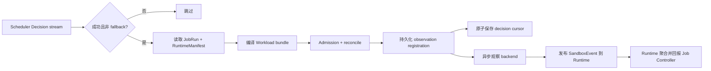

# Operator 指南

Operator 位于 **Scheduling & Infrastructure Control** 系统中。它不负责生成调度决策；
Scheduler 已经执行 Provider 动作并发布成功 Decision 后，Operator 才读取 JobRun 与
RuntimeManifest，编译 workload bundle，执行 admission/reconcile，并向 Runtime 与 Job
Controller 闭合观察态生命周期。

## 本地启动

先启动 Scheduler、Runtime/Experiment 和 Job Controller，再运行：

```bash
go run ./cmd/operator \
  -mode fake \
  -listen 127.0.0.1:50081 \
  -scheduler 127.0.0.1:50051 \
  -control 127.0.0.1:50061 \
  -runtime 127.0.0.1:50071 \
  -namespace default \
  -cursor-dir .cache/tgsrl/operator
```

Operator 同时运行两个长期服务：它订阅 Scheduler Decision，并在 `127.0.0.1:50081`
提供 `RuntimeBackendControlService`，供 Runtime 下发 pause/resume/stop/terminate。终端
没有持续输出并不代表进程退出。

| 参数 | 默认值 | 说明 |
|---|---|---|
| `-mode` | `kubernetes` | `fake` 或 `kubernetes` backend |
| `-controller` | `true` | 是否运行 decision reconcile loop；关闭时仍提供 backend lifecycle control gRPC |
| `-scheduler` | `127.0.0.1:50051` | Scheduler gRPC target |
| `-control` | `127.0.0.1:50061` | Job Controller gRPC target |
| `-runtime` | `127.0.0.1:50071` | Runtime gRPC target |
| `-listen` | `127.0.0.1:50081` | backend lifecycle control gRPC 地址 |
| `-namespace` | `default` | 编译对象的 namespace |
| `-cursor-dir` | 系统临时目录 | cursor、delivery/observation 与 backend-control ledger 所在目录 |
| `-kubeconfig` | 空 | 显式 kubeconfig；仅 `kubernetes` 模式使用 |
| `-gpu-profile` | `none` | `none`、`nvidia-device-plugin`、`kubernetes-dra` 或 `volcano-hami` |
| `-runtime-class-name` | 空 | 引用已有 RuntimeClass；默认不设置 |
| `-runtime-class-create` | `false` | 是否由 Operator 创建 RuntimeClass；启用时还需 handler 和额外集群权限 |
| `-node-selector` | 空 | Pod node selector，使用可重复的 `key=value` 参数 |

## 决策处理



只有包含 selected plan、至少一个 action result、所有 action 均成功且非 fallback 的
Decision 会进入调和路径。每个 concrete binding 会编译为一个独立 bundle 和单副本
Workload/Job，避免不同设备、资源或 generation 的副本被错误聚合。bundle key 由
`pending_unit_id` 稳定派生，Workload、Job 与 ResourceClaim 名称包含 generation；重复
generation 和相同 fingerprint 是幂等操作。观察
注册在 cursor 推进前落盘，之后由独立 watcher 读取 backend；因此 cursor 已推进不代表
Sandbox 已经收敛。

## Backend 边界

| 模式 | 当前行为 |
|---|---|
| `fake` | 在进程内保存编译后的 bundle，适合完整 CPU Mock 本地栈 |
| `kubernetes` | 使用窄 HTTP client 物化并读写 API Server 中的 JobRunBundle、Workload、Job 与按需创建的 ResourceClaim；仅当显式开启 `runtimeClassCreate` 时才创建 RuntimeClass，并选择配置的 GPU profile |

两种模式都会运行同一决策消费与状态回报链路。`kubernetes` 模式依次使用显式
`-kubeconfig`、`KUBECONFIG`、用户默认 `.kube/config` 或集群内 ServiceAccount 配置。
当前 kubeconfig 读取器只解析 API server、静态 bearer token、内嵌 CA data 和 namespace；
不执行 exec/auth-provider 插件，也不合并多文件 `KUBECONFIG`。需要这类认证时，应使用
集群内 ServiceAccount，或预先提供当前读取器支持的最小 kubeconfig。
Kubernetes wire payload 根据 API discovery 选择当前集群实际提供的版本：

- Kueue Workload 优先 `kueue.x-k8s.io/v1beta2`，兼容 `v1beta1`，并从
  `status.conditions[type=Admitted]` 与 `status.admission` 读取准入结果；
- Kubernetes `batch/v1` Job，pod template 包含合法的 `restartPolicy`；
- 需要设备 claim 时优先使用稳定的 DRA `resource.k8s.io/v1` ResourceClaim，并兼容
  `v1beta2`/`v1beta1`；`v1`/`v1beta2` 使用 `devices.requests[].exactly`，`v1beta1`
  使用旧的扁平 request；`kubernetes-dra` 当前明确绑定 NVIDIA `gpu.nvidia.com` driver/class，
  并要求 ResourceSlice 发布可解析的 `uuid` 属性；
- 主资源写入前剥离 `uid`、`generation`、`resourceVersion`、`managedFields`、
  `creationTimestamp`、未解析 owner reference 和 `status` 等 server-owned 字段。

Operator ServiceAccount 通过只读 ClusterRole 列举 Node、RuntimeClass、DeviceClass 和 ResourceSlice，
用于上述能力发现；JobRunBundle、Workload、Job 与 ResourceClaim 的写权限仍限制在目标
namespace。Kubernetes observer 通过轮询读取 Workload、Job 和可选 ResourceClaim，在准入、claim
分配及 Job active 条件满足后发布 Bound/Running；失败和完成也由观察状态投影。仓库的
本地 HTTP 合同测试覆盖这些 JSON 约定，但仍没有真实 Kubernetes/Kueue/DRA 集群 E2E。
Scheduler binding 中的 `device_ids` 代表 NVIDIA GPU/MIG UUID。`kubernetes-dra` profile 会把
这些 UUID 编译进 ResourceClaim 的 CEL selector，并在观察阶段用 allocation 的
`driver/pool/device` 从最新 ResourceSlice 解析实际 UUID；缺失、数量不符或身份不符都会
fail closed，不能发布 `BOUND`/`RUNNING`。NVIDIA DRA driver 再通过 Pod resource claim/CDI
将已分配设备注入容器。Device Plugin 与 HAMi profile 仍只表达资源数量，不保证具体 UUID。
当前 DRA claim 未生成 NVIDIA MPS/time-slicing sharing configuration，因此只接受整数个完整
GPU/MIG 设备；分数 share 会在编译时 fail closed。
鉴于当前 `Binding` 的资源所有权属于 Scheduler，Operator 不会在 Device Plugin/HAMi 模式下
丢弃 `device_ids` 后继续创建 Pod；这两种 count-only profile 会在启动预检或编译时被拒绝，
直到实现可验证的身份映射。

## Kubernetes 部署工件

本地 CPU 集成推荐使用 minikube `1.38.1`、Kubernetes `1.35.1` 和 Kueue
`0.19.2`；kubectl 应与 API server 保持在同一 minor 或相邻 minor。这个组合用于验证
Operator 的真实 API/RBAC/恢复链路，不提供 GPU 或 CUDA 证据。

```bash
minikube start --profile tgsrl --driver=docker --kubernetes-version=v1.35.1
kubectl apply --server-side \
  -f https://github.com/kubernetes-sigs/kueue/releases/download/v0.19.2/manifests.yaml
kubectl wait --for=condition=Available deployment/kueue-controller-manager \
  --namespace kueue-system --timeout=120s

docker build -f Dockerfile.operator -t tgsrl-operator:local .
minikube image load --profile tgsrl tgsrl-operator:local
kubectl apply --server-side -f deploy/crds/tgsrl_jobrunbundles.yaml
helm upgrade --install tgsrl-operator deploy/helm/operator \
  --namespace tgsrl-system --create-namespace \
  --set image.repository=tgsrl-operator \
  --set image.tag=local \
  --set image.pullPolicy=Never
kubectl rollout status deployment/tgsrl-operator \
  --namespace tgsrl-system --timeout=90s
```

默认 `gpuProfile=none`，所以该流程不会声称 GPU 可用。Operator 启动日志会记录 discovery
选择的 Kueue 和 DRA API 版本。若显式选择的 GPU profile、Kueue API 或 RBAC 不可用，
启动前置检查会失败。

仓库不假定已有公开镜像。先从当前源码构建默认镜像，并按集群运行时要求将其加载到
目标集群或推送到你自己的镜像仓库：

```bash
docker build -f Dockerfile.operator -t tgsrl-operator:0.1.0 .
```

这个 tag 只用于本地开发。**生产部署必须使用不可变的 `sha256` digest**，避免同一 tag
被重新推送后产生不可审计的镜像漂移。例如先发布多架构镜像，再用仓库返回的 digest
安装：

```bash
docker buildx build --platform linux/amd64,linux/arm64 \
  -f Dockerfile.operator \
  -t registry.example.com/tgsrl/operator:0.1.0 --push .

helm upgrade --install tgsrl-operator deploy/helm/operator \
  --namespace tgsrl-system --create-namespace \
  --set image.repository=registry.example.com/tgsrl/operator \
  --set-string image.digest='sha256:0123456789abcdef0123456789abcdef0123456789abcdef0123456789abcdef'
```

Helm 中非空的 `image.digest` 优先于 `image.tag`；tag 默认值仅保留给本地加载镜像的
工作流。使用原生 YAML 时，生产部署也必须先把 `image` 替换为
`registry/repository@sha256:<64-hex-digest>`。

### CRD 所有权与安装顺序

`JobRunBundle` CRD 是**集群级外部前置条件**。Helm chart 和原生 Operator manifest 都
不会安装、升级或删除它；这样卸载某个 namespaced Operator release 时不会连带删除所有
namespace 中的 `JobRunBundle` 实例。由集群管理员在首次安装 Operator 前显式执行：

```bash
kubectl apply --server-side -f deploy/crds/tgsrl_jobrunbundles.yaml
kubectl wait --for=condition=Established \
  crd/jobrunbundles.tgsrl.io --timeout=60s
```

升级时应先审查并应用兼容的 CRD 版本，再升级 Operator。卸载 Operator 不会删除 CRD；
只有在确认所有 release、实例和数据都不再需要后，才应由集群管理员单独删除它。Kueue
以及所选 GPU/DRA 资源的 CRD 和 controller 同样由集群平台侧管理。

`deploy/kubernetes/operator.yaml` 和 `deploy/helm/operator/` 已包含：

- Operator `50081` ClusterIP Service；
- Scheduler、Job Controller 与 Runtime 的 service address 参数；
- 默认将 JobRunBundle、Workload、Job 与 ResourceClaim 权限限制在目标 namespace 的
  `Role` / `RoleBinding`，其中 `jobrunbundles` 包含 `create`；
- 默认只授予 Node、RuntimeClass、DeviceClass 和 ResourceSlice 的集群级 `list` 权限；不授予
  `RuntimeClass` 写权限。仅 Helm 显式启用 `runtimeClassCreate=true` 时，
  才追加只含 `get/create` 的 `ClusterRole` / `ClusterRoleBinding`。已有 RuntimeClass
  只读取并校验 handler，不覆盖管理员维护的字段。集群级 RBAC 名称
  由 Helm release 与 release namespace 共同派生，避免不同 namespace 的 release 争用；
- Pod 默认以 UID/GID `65532` 非 root 运行，使用 `RuntimeDefault` seccomp；容器禁止提权、
  丢弃全部 Linux capabilities，并使用只读 root filesystem。`cursor-dir` 始终挂载独立
  可写 volume：默认是保留的 PVC，关闭持久化时则是仅供本次 Pod 使用的 `emptyDir`；
- 默认启用的 `ReadWriteOnce` PVC，将整个 Operator 状态目录挂载到
  `/var/lib/tgsrl-operator`；Helm 可配置现有 claim、storage class、容量和保留策略；

这些工件只部署 Operator，并假定 Scheduler、Job Controller、Runtime、上述外部 CRD、
Kueue 和所选 GPU/DRA 依赖已经由部署者提供。它们不构成真实集群兼容性、可用性或
性能证明。

## Lifecycle control

Runtime 对 pause/resume/stop/terminate 先记录 desired state，再把 generation-fenced target
发送到 Operator。Operator 的 unary 响应只确认 backend mutation 被接受或幂等命中；它
不等于观察态完成。独立 observer 读回 backend 状态并发布带 control idempotency key、
backend revision 与调度因果字段的 SandboxEvent。Runtime 原子保存观察投影并向 Job
Controller 回报聚合状态；Job Controller 在观察态收敛后完成对应 Operation。

## Cursor 与恢复

Operator 在一个 Decision 完成 reconcile 且 observation registration 已持久化后，将 ID、
sequence 和 cursor 原子写入 `decision-cursor.json`。状态目录还包括：

- `delivery.json`：当前 delivery phase、已发布事件以及可恢复的 observation registrations；
- `backend-controls.json`：backend lifecycle request、revision 与幂等结果。

重启后，Decision 消费从 cursor 继续，observation manager 从 registrations 继续观察。

恢复行为取决于 backend：

- fake backend 的对象随进程退出而消失，ledger 不能重建这些内存对象；
- Kubernetes backend 会列出现有 `JobRunBundle`，并可为其中带 runtime target 的 bundle
  补建 observation registration，但不会在启动时主动重新编译所有对象；高 generation
  注册会替换同一 bundle 的旧 watcher，旧 watcher 不能清理新 generation；
- 更新同一 bundle 时先创建新 generation 的全部对象，再清理旧对象，最后更新 marker；
  如果新对象创建失败，旧 workload 与旧 marker 保持不变；
- Runtime 持久化 terminal observation 后，Operator 才执行 generation-fenced cleanup，删除
  该 bundle 的 Job、Workload、ResourceClaim 和 marker；共享 RuntimeClass 不随单 bundle 删除；
- backend、Operator ledger、Runtime SQLite 与 Job Controller 文件之间没有分布式事务；
- 若 Decision 在 observation registration 落盘前失败，它不会推进 cursor；若注册已落盘，
  watcher 可在重启后继续发布观察事件。

因此这些本地 ledger 是恢复机制的一部分，但不是生产集群灾备方案。处理异常恢复前，
应同时核对 Scheduler Decision、Operator registration/control ledger、Runtime Sandbox 和
基础设施实际状态。

更多状态边界见[配置、持久化与恢复](configuration-and-recovery.md)，真实集成状态见
[当前能力与限制](../reference/current-capabilities.md)。
