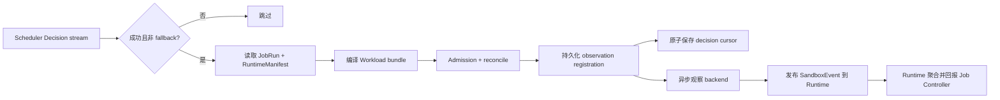

# Operator 指南

Operator 位于 **Scheduling & Infrastructure Control** 系统中。它不负责生成调度决策；
Scheduler 已经执行 Provider 动作并发布成功 Decision 后，Operator 才读取 JobRun 与
RuntimeManifest，编译 workload bundle，执行 admission/reconcile，并向 Runtime 与 Job
Controller 闭合观察态生命周期。

## 本地启动

先启动 Scheduler、Runtime/Experiment 和 Job Controller，再运行：

```bash
go run ./cmd/operator \
  -mode fake \
  -listen 127.0.0.1:50081 \
  -scheduler 127.0.0.1:50051 \
  -control 127.0.0.1:50061 \
  -runtime 127.0.0.1:50071 \
  -namespace default \
  -cursor-dir .cache/tgsrl/operator
```

Operator 同时运行两个长期服务：它订阅 Scheduler Decision，并在 `127.0.0.1:50081`
提供 `RuntimeBackendControlService`，供 Runtime 下发 pause/resume/stop/terminate。终端
没有持续输出并不代表进程退出。

| 参数 | 默认值 | 说明 |
|---|---|---|
| `-mode` | `kubernetes` | `fake`、`process` 或 `kubernetes` backend；`process` 仅用于本地 CPU 集成 |
| `-controller` | `true` | 是否运行 decision reconcile loop；关闭时仍提供 backend lifecycle control gRPC |
| `-scheduler` | `127.0.0.1:50051` | Scheduler gRPC target |
| `-control` | `127.0.0.1:50061` | Job Controller gRPC target |
| `-runtime` | `127.0.0.1:50071` | Runtime gRPC target |
| `-listen` | `127.0.0.1:50081` | backend lifecycle control gRPC 地址 |
| `-namespace` | `default` | 编译对象的 namespace |
| `-cursor-dir` | 系统临时目录 | cursor、delivery/observation 与 backend-control ledger 所在目录 |
| `-kubeconfig` | 空 | 显式 kubeconfig；仅 `kubernetes` 模式使用 |
| `-gpu-profile` | `none` | 逗号分隔的有序兑现候选：`none`、`kubernetes-dra`、`hami-vgpu`、`nvidia-device-plugin` 或旧 `volcano-hami` |
| `-runtime-class-name` | 空 | 引用已有 RuntimeClass；默认不设置 |
| `-runtime-class-handler` | 空 | `-runtime-class-create` 启用时必填的 RuntimeClass handler |
| `-runtime-class-create` | `false` | 是否由 Operator 创建 RuntimeClass；启用时还需 handler 和额外集群权限 |
| `-node-selector` | 空 | Pod node selector，使用可重复的 `key=value` 参数 |
| `-worker-bootstrap` | `false` | 用 managed-worker bootstrap 包装 workload；`process` 模式自动启用，`kubernetes-dra`/`hami-vgpu` 未启用时拒绝启动 |
| `-worker-bootstrap-image` | 空 | 只接受 `repository@sha256:...` 的 bootstrap installer 镜像 |
| `-worker-registry-url` | 空 | workload 可访问的 Scheduler registry HTTP(S) base URL |
| `-worker-registry-signing-key-file` | 空 | 派生 scoped registration token 的主 HMAC key；至少 32 bytes |
| `-worker-verify-device-identities` | `false` | 注册前用 `nvidia-smi -L` 核对 UUID；DRA claim 会强制开启 |
| `-worker-host-network` | `false` | 仅供单机单 worker smoke：让宿主机 Scheduler 能回连 worker；常规部署保持关闭 |
| `-worker-bootstrap-binary` | `tgsrl-worker-bootstrap` | `process` 模式使用的本机 bootstrap 路径 |
| `-process-state-dir` | `<cursor-dir>/processes` | `process` 模式的 worker 日志与状态根目录，必须是绝对路径 |

## 决策处理



只有包含 selected plan、至少一个 action result、所有 action 均成功且非 fallback 的
Decision 会进入调和路径。每个 concrete binding 会编译为一个独立 bundle 和单副本
Workload/Job，避免不同设备、资源或 generation 的副本被错误聚合。bundle key 由
`pending_unit_id` 稳定派生，Workload、Job 与 ResourceClaimTemplate 名称包含 generation；重复
generation 和相同 fingerprint 是幂等操作。观察
注册在 cursor 推进前落盘，之后由独立 watcher 读取 backend；因此 cursor 已推进不代表
Sandbox 已经收敛。

## Backend 边界

| 模式 | 当前行为 |
|---|---|
| `fake` | 在进程内保存编译后的 bundle，适合完整 CPU Mock 本地栈 |
| `process` | 在本机真实启动 bootstrap/worker，以 registry readback 投影状态；只用于 CPU 集成，不代表容器/Kubernetes |
| `kubernetes` | 使用窄 HTTP client 物化并读写 API Server 中的 JobRunBundle、Workload、Job 与 ResourceClaimTemplate；Kubernetes 为 Pod 生成 ResourceClaim；仅当显式开启 `runtimeClassCreate` 时才创建 RuntimeClass，并选择配置的 GPU profile |

三种模式都会运行同一决策消费与状态回报链路。`kubernetes` 模式依次使用显式
`-kubeconfig`、`KUBECONFIG`、用户默认 `.kube/config` 或集群内 ServiceAccount 配置。
当前 kubeconfig 读取器只解析 API server、静态 bearer token、内嵌 CA data 和 namespace；
不执行 exec/auth-provider 插件，也不合并多文件 `KUBECONFIG`。需要这类认证时，应使用
集群内 ServiceAccount，或预先提供当前读取器支持的最小 kubeconfig。
Kubernetes wire payload 根据 API discovery 选择当前集群实际提供的版本：

- Kueue Workload 优先 `kueue.x-k8s.io/v1beta2`，兼容 `v1beta1`，并从
  `status.conditions[type=Admitted]` 与 `status.admission` 读取准入结果；
- Kubernetes `batch/v1` Job，pod template 包含合法的 `restartPolicy`；
- 需要设备 claim 时优先使用稳定的 DRA `resource.k8s.io/v1` ResourceClaimTemplate，并兼容
  `v1beta2`/`v1beta1`；`v1`/`v1beta2` 使用 `devices.requests[].exactly`，`v1beta1`
  使用旧的扁平 request；`kubernetes-dra` 当前明确绑定 NVIDIA `gpu.nvidia.com` driver，
  Full GPU 使用 `gpu.nvidia.com` DeviceClass，MIG 使用 `mig.nvidia.com` DeviceClass；
  ResourceSlice 必须提供 `type`、`uuid`，MIG 还必须提供 `profile` 和 `parentUUID`；
- 主资源写入前剥离 `uid`、`generation`、`resourceVersion`、`managedFields`、
  `creationTimestamp`、未解析 owner reference 和 `status` 等 server-owned 字段。

Operator ServiceAccount 通过只读 ClusterRole 列举 Node、RuntimeClass、DeviceClass 和 ResourceSlice，
用于上述能力发现；JobRunBundle、Workload、Job 与 ResourceClaimTemplate 的写权限仍限制在目标
namespace，并具有 namespaced Pod `get/list/watch` 权限以读取 managed-worker readiness。
生成的 ResourceClaim 只有 namespaced `get/list/watch` 权限。Kubernetes observer 轮询 Workload、
Job、Pod 和生成的 ResourceClaim：从 `pod.status.resourceClaimStatuses` 获取实际 claim 名，先发布 `BOUND`，只有
bootstrap 注册成功、Pod Ready 后才允许 `RUNNING`；失败和完成也由观察状态投影。仓库的
本地 HTTP 合同测试覆盖这些 JSON 约定；单节点 A10 的 Kubernetes/Kueue/DRA E1 与
HAMi H1 单 worker 和 H2 双 worker 同卡并发已通过。MIG、MPS、HAMi OOM/公平性/动态份额
和混合 profile 计划仍需各自目标环境验证。
Scheduler binding 中的 `device_ids` 代表 NVIDIA GPU/MIG UUID。`kubernetes-dra` profile 根据
ResourceSlice 的 typed inventory 选择 Full GPU 或 MIG DeviceClass，把这些 UUID 编译进
ResourceClaimTemplate 的 CEL selector，并在观察阶段用生成 claim allocation 的
`driver/pool/device` 从最新 ResourceSlice 解析实际 UUID；缺失、数量不符或身份不符都会
fail closed，不能发布 `BOUND`/`RUNNING`。NVIDIA DRA driver 再通过 Pod resource claim/CDI
将已分配设备注入容器。

`hami-vgpu` profile 从 Node 的 `hami.io/node-nvidia-register` 读取物理 GPU UUID、节点、
型号、健康状态、split count、显存和 core limit。单卡 `(0,1]` 份额被编译为
`nvidia.com/gpu=1`、`nvidia.com/gpucores`、`nvidia.com/gpumem-percentage`，
并用 `nvidia.com/use-gpuuuid` 限定 Scheduler 已选择的卡。Pod 启动后，Operator 从
`hami.io/vgpu-devices-allocated` 回读实际 UUID；未发布、格式错误或与 Binding 不一致时
不会发布 `BOUND`/`RUNNING`。HAMi 会通过 admission webhook 设置自己的 scheduler，TGS-RL
不在 Pod spec 中硬编码 scheduler name。

`-gpu-profile=kubernetes-dra,hami-vgpu` 表示有序候选，而不是同时给一个 Pod 注入两套资源。
Compiler 对每个 concrete Binding 独立选择首个兼容 profile，因此一个 PlacementPlan 可让
整数 Full GPU/MIG Binding 走 DRA，让未启用 MIG 的物理卡上的单卡分数 Binding 走 HAMi。
传统 Device Plugin 和旧 `volcano-hami` profile 仍只有数量语义；携带具体 UUID 且无法证明
exact placement 时不会被选中。完整接入见 [HAMi vGPU 接入指南](hami.md)。

一个 binding 不能混用 Full GPU 与 MIG DeviceClass。top-level 与 v1beta1 `basic` attributes 会
合并，同名字段冲突、未知类型、过期 inventory 或重复 UUID 都会被拒绝。当前 DRA claim 未生成 NVIDIA MPS/time-slicing sharing configuration，因此只接受整数个完整
GPU/MIG 设备；分数 share 会在编译时 fail closed。
同一 NVIDIA driver 发布但当前不支持调度的 VFIO 设备不会进入 TGS-RL capability inventory。
鉴于当前 `Binding` 的资源所有权属于 Scheduler，Operator 不会在 Device Plugin/HAMi 模式下
丢弃 `device_ids` 后继续创建 Pod；没有 typed identity/readback 的 count-only profile 会在
编译时被跳过或拒绝。

## Managed-worker bootstrap

bootstrap 不改变 DRA/CDI 设备分配，只消费 Operator 编译出的身份和容器已经获得的设备：

```text
RuntimeManifest command → init container 安装 bootstrap → 启动 workload 进程组
→ 核对可见设备（DRA 必须）→ Scheduler registry 验证 scoped token + 当前 Binding
→ Runtime BOUND → RUNNING → lifecycle control → exit observation
```

Operator 与 Scheduler 必须读取同一个至少 32 bytes 的主签名 key；该 key 只挂载到控制面，
不会进入 workload。Operator 为每个 binding 生成 scoped HMAC token，Pod 中只保存这个令牌。
Scheduler registry 和 bootstrap control endpoint 都没有内建 TLS；明文 HTTP 只允许受控 Pod
网络，跨节点或跨信任域必须使用 HTTPS/TLS 终止层和 NetworkPolicy。

普通进程无需 marker 即可按进程存活完成注册；若配置 `TGSRL_WORKER_READINESS_FILE`，文件值
必须确认 Ready 后才注册。signal pause/sleep 还需要 `TGSRL_WORKER_SAFE_POINT_FILE` 为真，且
只会执行 `SIGSTOP/SIGCONT`，不会释放 CUDA context 或显存。`TGSRL_VERL_CONTROL_SOCKET` 或
`TGSRL_WORKER_CONTROL_SOCKET` 存在时才可进入 checkpoint/offload/reload 等 cooperative 路径。
`TGSRL_NVIDIA_MPS_PID_DIR` 是显式 opt-in：容器还必须能从同一 PID namespace 看到唯一的
`nvidia-cuda-mps-server`，并把目录共享给节点侧 helper；否则启动会 fail closed。

## Kubernetes 部署工件

本地 Kubernetes 工具链固定 Minikube `1.38.1`、Kubernetes `1.35.1` 和 Kueue
`0.19.2`；kubectl 应与 API server 保持在同一 minor 或相邻 minor。E1/H1/H2 已在专用
单节点 GPU smoke 路径验证设备兑现、注册和 CUDA Trace；Helm 工件仍以模板/参数契约校验为主，
不把 smoke 的成功推广为全栈 Helm 安装、网络策略或所有故障恢复已验证。

```bash
minikube start --profile tgsrl --driver=docker --kubernetes-version=v1.35.1
kubectl apply --server-side \
  -f https://github.com/kubernetes-sigs/kueue/releases/download/v0.19.2/manifests.yaml
kubectl wait --for=condition=Available deployment/kueue-controller-manager \
  --namespace kueue-system --timeout=120s

docker build -f Dockerfile.operator -t tgsrl-operator:local .
minikube image load --profile tgsrl tgsrl-operator:local
kubectl apply --server-side -f deploy/crds/tgsrl_jobrunbundles.yaml
helm upgrade --install tgsrl-operator deploy/helm/operator \
  --namespace tgsrl-system --create-namespace \
  --set image.repository=tgsrl-operator \
  --set image.tag=local \
  --set image.pullPolicy=Never
kubectl rollout status deployment/tgsrl-operator \
  --namespace tgsrl-system --timeout=90s
```

要一次安装 Scheduler、Runtime/Experiment、Job Controller、Operator、Gateway 和 Console，
使用 umbrella chart。部署脚本会在临时目录构建本地依赖；通过 values 文件用不可变镜像
digest 覆盖各组件镜像：

```bash
scripts/deploy-full-stack.sh render ./values.production.yaml
scripts/deploy-full-stack.sh install ./values.production.yaml
```

生产部署必须为六个服务及 bootstrap 分别设置真实 registry digest；示例只展示一个字段。
全栈 chart 包含 `JobRunBundle` CRD 和 TGS-RL 控制面，但不安装 Kueue、NVIDIA DRA、
Device Plugin 或 HAMi。默认 NetworkPolicy 只允许 TGS-RL/managed-workload Pod 访问控制面，
并开放 Console Service；入口控制器或代理仍需由部署方配置 TLS、认证和授权。
Scheduler 与 Runtime 默认使用镜像内的锁定配置图；`config.existingConfigMap` 可把同一份
外部配置只读挂载给两者。worker registry signing key 不放入通用 ConfigMap 或全局环境，
通过同名 Secret 挂载给 Scheduler、Operator 和需要验证 worker Trace 的 Runtime，不注入 workload。
`scripts/deploy-full-stack.sh upgrade ./values.production.yaml` 使用 Helm 4 的失败回滚与等待；
`scripts/deploy-full-stack.sh rollback REVISION` 回退到已有 release revision。CRD 仍需在升级前
单独审查，因为 Helm 不会通过普通 upgrade 更新 `crds/`。

默认 `gpuProfile=none`，所以该流程不会声称 GPU 可用。可将 Helm value 设置为
`"kubernetes-dra,hami-vgpu"`；引号用于保证 YAML 将逗号分隔值作为一个字符串传给
Operator。Operator 启动日志会记录 profile 候选以及 discovery 选择的 Kueue 和 DRA API
版本。若所有 GPU profile、Kueue API 或 RBAC 均不可用，
启动前置检查会失败。umbrella chart 的 `scheduler.nvidia` 可显式接入单 GPU 节点 Driver v2，
要求 Scheduler/workload 相同节点选择器、NVIDIA RuntimeClass、不可变专用镜像、registry/bootstrap
与身份验证。多节点 inventory 和 MPS 节点 PID 集成仍不在该模式内。第一次实机验证优先走
[GPU Smoke](gpu-smoke.md)；完整 values 与边界见[部署指南](deployment.md)。

仓库不假定已有公开镜像。先从当前源码构建默认镜像，并按集群运行时要求将其加载到
目标集群或推送到你自己的镜像仓库：

```bash
docker build -f Dockerfile.operator -t tgsrl-operator:0.1.0 .
```

这个 tag 只用于本地开发。**生产部署必须使用不可变的 `sha256` digest**，避免同一 tag
被重新推送后产生不可审计的镜像漂移。例如先发布多架构镜像，再用仓库返回的 digest
安装：

```bash
docker buildx build --platform linux/amd64,linux/arm64 \
  -f Dockerfile.operator \
  -t registry.example.com/tgsrl/operator:0.1.0 --push .

helm upgrade --install tgsrl-operator deploy/helm/operator \
  --namespace tgsrl-system --create-namespace \
  --set image.repository=registry.example.com/tgsrl/operator \
  --set-string image.digest='sha256:0123456789abcdef0123456789abcdef0123456789abcdef0123456789abcdef'
```

Helm 中非空的 `image.digest` 优先于 `image.tag`；tag 默认值仅保留给本地加载镜像的
工作流。使用原生 YAML 时，生产部署也必须先把 `image` 替换为
`registry/repository@sha256:<64-hex-digest>`。

### CRD 所有权与安装顺序

对独立 Operator chart 和原生 Operator manifest，`JobRunBundle` CRD 是**集群级外部前置条件**，它们
不会安装、升级或删除它；这样卸载某个 namespaced Operator release 时不会连带删除所有
namespace 中的 `JobRunBundle` 实例。由集群管理员在首次安装 Operator 前显式执行：

```bash
kubectl apply --server-side -f deploy/crds/tgsrl_jobrunbundles.yaml
kubectl wait --for=condition=Established \
  crd/jobrunbundles.tgsrl.io --timeout=60s
```

umbrella chart 的 `crds/` 会在首次安装时创建 CRD，但 Helm 不会自动升级或删除 CRD。
升级时应先审查并应用兼容的 CRD 版本，再升级 Operator。卸载 Operator 不会删除 CRD；
只有在确认所有 release、实例和数据都不再需要后，才应由集群管理员单独删除它。Kueue
以及所选 GPU/DRA 资源的 CRD 和 controller 同样由集群平台侧管理。

`deploy/kubernetes/operator.yaml` 和 `deploy/helm/operator/` 已包含：

- Operator `50081` ClusterIP Service；
- Scheduler、Job Controller 与 Runtime 的 service address 参数；
- 默认将 JobRunBundle、Workload、Job 与 ResourceClaimTemplate 权限限制在目标 namespace 的
  `Role` / `RoleBinding`，四类受管资源均具有 `get/list/watch/create/update/patch/delete`；
  Kubernetes 自动生成的 ResourceClaim 仅有 `get/list/watch`；
- 默认只授予 Node、RuntimeClass、DeviceClass 和 ResourceSlice 的集群级 `list` 权限；不授予
  `RuntimeClass` 写权限。仅 Helm 显式启用 `runtimeClassCreate=true` 时，
  才追加只含 `get/create` 的 `ClusterRole` / `ClusterRoleBinding`。已有 RuntimeClass
  只读取并校验 handler，不覆盖管理员维护的字段。集群级 RBAC 名称
  由 Helm release 与 release namespace 共同派生，避免不同 namespace 的 release 争用；
- 为读取 bootstrap Pod readiness 授予目标 namespace 内 Pod `get/list/watch`；
- Pod 默认以 UID/GID `65532` 非 root 运行，使用 `RuntimeDefault` seccomp；容器禁止提权、
  丢弃全部 Linux capabilities，并使用只读 root filesystem。`cursor-dir` 始终挂载独立
  可写 volume：默认是保留的 PVC，关闭持久化时则是仅供本次 Pod 使用的 `emptyDir`；
- 默认启用的 `ReadWriteOnce` PVC，将整个 Operator 状态目录挂载到
  `/var/lib/tgsrl-operator`；Helm 可配置现有 claim、storage class、容量和保留策略；
- 可选挂载含 `signing-key` 的 Secret 到 Operator，并要求 bootstrap installer 使用不可变 digest；

这些独立 Operator 工件假定 Scheduler、Job Controller、Runtime、上述外部 CRD、
Kueue 和所选 GPU/DRA 依赖已经由部署者提供；umbrella chart 补齐前三个控制面依赖，
但 Kueue 与 GPU/DRA 依赖仍由平台侧提供。Helm render 与镜像合同不构成集群安装证明；
已有 E1/H1/H2 只覆盖对应版本、专用环境和设备路径。

## Lifecycle control

Runtime 对 pause/resume/stop/terminate 先记录 desired state，再把 generation-fenced target
发送到 Operator。Operator 的 unary 响应只确认 backend mutation 被接受或幂等命中；它
不等于观察态完成。独立 observer 读回 backend 状态并发布带 control idempotency key、
backend revision 与调度因果字段的 SandboxEvent。Runtime 原子保存观察投影并向 Job
Controller 回报聚合状态；Job Controller 在观察态收敛后完成对应 Operation。

## Cursor 与恢复

Operator 在一个 Decision 完成 reconcile 且 observation registration 已持久化后，将 ID、
sequence 和 cursor 原子写入 `decision-cursor.json`。状态目录还包括：

- `delivery.json`：当前 delivery phase、已发布事件以及可恢复的 observation registrations；
- `backend-controls.json`：backend lifecycle request、revision 与幂等结果。

重启后，Decision 消费从 cursor 继续，observation manager 从 registrations 继续观察。

恢复行为取决于 backend：

- fake backend 的对象随进程退出而消失，ledger 不能重建这些内存对象；
- Kubernetes backend 会列出现有 `JobRunBundle`，并可为其中带 runtime target 的 bundle
  补建 observation registration，但不会在启动时主动重新编译所有对象；高 generation
  注册会替换同一 bundle 的旧 watcher，旧 watcher 不能清理新 generation；
- 更新同一 bundle 时先创建新 generation 的全部对象，再清理旧对象，最后更新 marker；
  如果新对象创建失败，旧 workload 与旧 marker 保持不变；
- Runtime 持久化 terminal observation 后，Operator 才执行 generation-fenced cleanup，删除
  该 bundle 的 Job、Workload、ResourceClaimTemplate 和 marker；Pod 生成的 ResourceClaim 随 Pod
  owner 生命周期清理，共享 RuntimeClass 不随单 bundle 删除；
- backend、Operator ledger、Runtime SQLite 与 Job Controller 文件之间没有分布式事务；
- 若 Decision 在 observation registration 落盘前失败，它不会推进 cursor；若注册已落盘，
  watcher 可在重启后继续发布观察事件。

因此这些本地 ledger 是恢复机制的一部分，但不是生产集群灾备方案。处理异常恢复前，
应同时核对 Scheduler Decision、Operator registration/control ledger、Runtime Sandbox 和
基础设施实际状态。

更多状态边界见[配置、持久化与恢复](configuration-and-recovery.md)，真实集成状态见
[当前能力与限制](../reference/current-capabilities.md)。Helm、原生 Operator manifest 与 GPU smoke
ServiceAccount 已为 Job、Workload、ResourceClaimTemplate 和 JobRunBundle 提供最小
read/upsert/delete 权限，并为生成的 ResourceClaim 提供只读权限；
权限；`make check-deploy` 与 `make gpu-preflight` 分别校验静态规则和目标集群实际授权。真实
generation replacement、terminal cleanup 与 ServiceAccount 行为仍须由 E1 集群运行证明。
