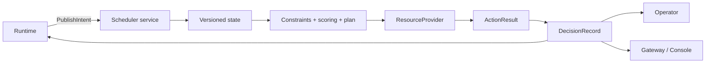

# Scheduler 指南

Scheduler 是 **Scheduling & Infrastructure Control** 的决策核心。它加载兼容性与
策略配置，维护版本化资源状态，接收设备无关的 `SchedulingIntent`，执行 Provider
动作并发布可审计的 `DecisionRecord`。默认使用 CPU Mock Provider。

## 启动

```bash
go run ./scheduler-go/cmd/scheduler \
  -listen 127.0.0.1:50051 \
  -config-root . \
  -manifest compatibility/manifests/cpu-mock.yaml \
  -state-dir .cache/tgsrl/scheduler-state \
  -metrics-listen 127.0.0.1:9090
```

| 参数 | 默认值 | 说明 |
|---|---|---|
| `-listen` | `127.0.0.1:50051` | gRPC 地址 |
| `-config-root` | `.` | 配置引用解析根目录 |
| `-manifest` | CPU Mock manifest | 兼容性清单覆盖 |
| `-fallback` | 由 policy 推导 | 兼容参数：`noop` 或 `static` |
| `-state-dir` | `.tmp/scheduler-state` | checkpoint 与 journal 目录 |
| `-metrics-listen` | `127.0.0.1:9090` | Prometheus 地址；空字符串可禁用 |

`GET http://127.0.0.1:9090/metrics` 可读取指标。gRPC 与指标端点都没有 TLS 或
认证，只应绑定可信接口。

## 调度路径



一次已接受的 Intent 会先物化 pending units，并在不可变 Snapshot 上评估执行契约、
过滤硬约束、评分和计划。提交计划前会复核 Snapshot revision 与 Intent version。Provider
动作完成后，每个 binding 分别确认或释放资源；证据缺失时采用 fail-closed 处理。

Scheduler 使用 fast、medium、slow 三条进程内 keyed queue 处理同一个
`(execution_id, stage_id)`。Intent 首次进入队列后会保持周期调度，直至过期、被移除或
服务停止，因此 idle 阈值等基于时间的条件无需依赖新的外部事件。同一 key 的新事件会合并
cause、最新 revision 和 contract observation；每个频率最多保留一个待处理项。三个 loop 的
默认周期分别为 `25ms`、`100ms` 和 `250ms`；周期控制开始处理的节奏，不是决策完成时限或
SLA。同一档 tick 尚未完成时，重叠 tick 会被跳过。

## gRPC 接口

| RPC | 用途 |
|---|---|
| `PublishIntent` | 接受版本化 Intent，并异步触发调度与动作 |
| `GetSnapshot` | 读取最新资源快照，或等待快照至少达到指定 revision |
| `Schedule` | 预览决策；不执行动作或提交 allocation |
| `ListDecisions` / `GetDecision` | 分页读取或按 ID 查询决策 |
| `WatchDecisions` | 使用 cursor 持续订阅决策 |

Python 异步客户端示例（放在调用方的 `async` 函数中运行）：

```python
from tgsrl_runtime import SchedulerClient

async with SchedulerClient(
    "127.0.0.1:50051",
    timeout=5.0,
    max_retries=3,
) as client:
    response = await client.publish_intent(intent)
    async for decision in client.watch_decisions(
        job_ids=(intent.job_id,),
        after_sequence=0,
        heartbeat_seconds=10.0,
    ):
        print(response.status, decision.decision_id, decision.fallback)
        break
```

通过 Gateway 查询决策通常更适合交互式客户端：

```bash
uv run --frozen tgsrl list-decisions JOB_ID --run-id RUN_ID
uv run --frozen tgsrl get-decision JOB_ID DECISION_ID
```

## 执行契约评估

候选放置前，Scheduler 会对 Intent 中的 `ExecutionContract` 执行确定性评估。当前评估：

- 带 typed `predicate` 的 `ValidityRule` 和 `Condition`；
- runtime registry 提供的 protocol、scheduler、runtime、operator、provider、framework
  adapter、rollout engine、trainer 与 CUDA/driver component version；
- `BackpressurePolicy`；
- `CommitPolicy.require_safe_point` 与 `SafePointPolicy`。

每条 `ContractEvaluation` 记录 clause、状态、观测值、证据、缺失字段、failure mode 和建议
动作，并保存在 `DecisionRecord.contractEvaluations`。要求 reject、pause、abort 或等待 safe
point 的结果会阻止本次放置，形成 fallback；对应的 rejected candidate 也会携带该评估。

以下边界需要由调用方处理：

- 只有字符串 `expression`、没有 typed predicate 的旧式 validity rule 不会解释执行该
  字符串，而会记录为 `INDETERMINATE` 并按兼容规则放行；
- 未注册的 component version 会按对应 missing-fact policy 产生可解释的
  `BLOCK`、`HOLD`、`DEGRADE` 或 `NOT_APPLICABLE` 结果；
- backpressure 的 block、shed 或 scale-out 是决策建议和审计证据；Scheduler 当前不会直接
  操作生产者、删除样本或扩容外部基础设施。

## 决策与 Fallback

Scheduler 会记录输入版本、tick 与 evaluation context、有界候选和拒绝证据、分项得分、
选中计划、Fallback、动作与补偿结果。`PublishIntent` 返回 accepted 只表示接收成功；应查看
`DecisionRecord` 的 `fallback` 和 `action_results` 判断资源动作结果。

`top_k` 是每个 pending unit 的策略选择面，不是全局候选上限，也不会跳过 unit/device pair
的硬约束评估。候选引擎先按统一的 score-first 顺序形成 TopK shortlist，再允许配置的
策略在该 shortlist 内二次选择。
`DecisionRecord.candidates` 与 `rejectedCandidates` 是有界审计投影，不保证包含完整候选
矩阵。candidate 与 rejection 共用默认 4096 条 evidence budget；已选候选始终保留，必要时
有效预算会增长。客户端应使用 `totalCandidateCount`、`totalRejectedCandidateCount` 和
`evidenceTruncated` 判断证据是否完整，不能用数组长度推断实际评估总数。

支持的 Fallback：

- `noop`：不授权新的资源 mutation；
- `static`：保留可用的已有 binding，不创建新的 mutation。

`Schedule` 是无资源副作用的预览：返回的 Decision 不进入 Scheduler 的 retained decision
history。Replay 会把这类预览结果作为自己的 typed artifact 保存。`WatchDecisions` 只订阅
权威 `PublishIntent` 路径发布的记录，支持 sequence 或 decision ID 恢复、job 过滤和
heartbeat；cursor 早于保留窗口时会返回 `OUT_OF_RANGE`。

## 配置和策略

Scheduler 启动时会加载 manifest 引用的 BOM、profile、capabilities、policy 和 scenario，
并进行 schema、引用、版本、能力和交叉字段校验。策略支持：

- `stable-first-fit` / `score-first`；
- `binpack`；
- `trace-aware`；
- 可配置 `top_k` 和 fast/medium/slow event-loop interval。

三档 tick 同时限定本轮可执行的最大动作级别：

| Tick | 默认周期 | 最大 ActionLevel |
|---|---:|---:|
| fast | `25ms` | L1 |
| medium | `100ms` | L3 |
| slow | `250ms` | L4 |

Action type 与 level 的映射由 Scheduler 统一校验：

| ActionLevel | Action type |
|---|---|
| L1 | `set_share`、`set_priority`、`resize`、`bind`、`release` |
| L2 | `pause`、`resume` |
| L3 | `sleep`、`offload` |
| L4 | `rebind`、`recreate` |

Action 声明的 level 必须与 type 匹配，`tick_kind` 必须与 Decision 的 tick 一致，且不得超过
该 tick 的 ceiling；不符合规则的 plan 会 fail closed，执行前还会再次校验。Admission
Planner 生成 `bind`；Fast Planner 处理 share、priority、resize 与逐次 scale-in release；
Medium Planner 处理 pause、resume、sleep 与 offload；Slow Planner 处理 rebind 与 recreate。
所有 eligible Planner（包括存在待调度单元时的 Admission 和当前 tick 对应的 mutation
Planner）进入同一个候选池。仲裁顺序优先处理 Contract pause、Recovery、Preemption、
Admission，再处理普通 Rebalance/对账；只合并 PlanPurpose 相同且 mutation 维度不冲突的
action。`actions.max_actions_per_tick`、`max_affected_sandboxes`、
`max_gpu_reconfigurations`、`max_recovery_cost_nanos` 和 `disable_l4` 在最终事务计划上限制
实际 action 集合，因此多 unit admission 也不能绕过预算。每个候选都会记录触发事实、
固定点 utility、拒绝原因与最终选择。仅兼容输入允许缺失 tick 的旧式 L1 action；新调用方
应始终发送明确的 `tick_kind`。

Fast Planner 在没有显式 target 时会把结构化信号转换为方向明确的 share 目标：高 buffer
pressure 或 policy lag 会降低 rollout/decode 生产侧 share，并提高 actor/optimizer 消费侧
share；sample staleness 和低 ESS 只会降低生产侧 share，不会给无关的 priority、resize 或
release 动作加分。每次变化使用有界步长，并在最近一次同目标方向调节后的 observation
window 内保持不变；证据记录 current、target、delta、reason、预期收益和恢复成本。没有这些
方向信号时，仍保留按 Intent 进行 share/priority/resource 对账的兼容路径。

默认 policy 还启用 mutation protection：按 execution/stage 应用 cooldown、hysteresis、
时间窗 action budget 和 circuit breaker。保护拒绝会形成带 `PROTECTION_*` 原因的 fallback。
可选择 `low_priority_first` preemption 候选策略，并应用 safe-point/capability 检查；
默认 CPU Mock policy 将 preemption 关闭为 `noop`。显式启用时，Store 在一个逻辑事务中
锁定 victim、预留 replacement capacity 并校验 expected revision；Provider 按有序 action
执行并在失败时补偿。物理操作本身不是分布式原子事务，补偿失败会进入显式 degraded
状态并保留审计证据。

路径和环境变量详见[配置、持久化与恢复](configuration-and-recovery.md)。

## Provider 边界

### Mock Provider

Mock Provider 支持能力检查、资源绑定、L1–L4 状态转换、故障注入、幂等 action 和
逐动作补偿。它只提供逻辑资源状态，不代表任何真实硬件行为或性能。

### NVIDIA Provider

选择 `provider=nvidia` 时，Provider 维护设备、Sandbox、action 幂等记录、plan 状态以及
resource/sandbox watch；执行 action 时先调用 Driver，再提交 Provider 自有状态，并在状态
提交失败时按声明尝试 rollback。默认 `LocalDriver` 只通过 `nvidia-smi` 探测本机设备，
不声明 supported actions，并拒绝 bind/release、MIG/MPS share/resize 和 Runtime 控制。

因此默认 NVIDIA 方案只支持设备发现，不能分配 GPU 或运行训练。要执行资源动作，
可显式启用 `-nvidia-driver-v2`。v2 已实现 Go 侧 inventory、MPS/MIG、binding、runtime
command、事务、幂等、超时、回滚、重启发现、dry-run 和审计编排。仓库内
`tgsrl-nvidia-binding` 提供 binding 状态、generation fence、幂等 durable receipt 和重启
发现；它不直接修改已启动进程的 GPU 可见性，实际设备注入仍由 Runtime/容器集成完成。
仓库内 `tgsrl-nvidia-runtime` 提供 PID identity、generation fence、幂等 receipt、
SIGSTOP/SIGCONT pause/resume，以及 Unix socket managed-worker 的 safe-point、checkpoint、
offload、reload 和 readiness 协议。仓库内 `tgsrl-nvidia-mig` 复用同一 worker 状态，在
已经发现的 MIG 实例之间执行 checkpoint/stop/reload/readiness；它不会在 Scheduler 不知情时
创建或销毁 MIG 实例。
Provider 只会公开 helper 握手确认的 action；helper 缺失、协议不匹配或能力不完整时
明确返回 unavailable。MPS 当前只公开带 active-thread percentage 读回校验的
`set_share`；通用 `resize` 不作为 MPS 能力公开。MIG `rebind/recreate` helper 还必须显式
声明 safe-point、checkpoint、stop、restore、readiness、durable receipt、generation fence 和
idempotency，才会公开对应 L4 action。仓库当前没有真实 NVIDIA/CUDA 验证证据。

使用 `make build-nvidia-binding` 构建 helper。Scheduler 的 `-nvidia-binding-helper` 指定
可执行文件，`-nvidia-binding-state` 指定状态文件（默认在 `-state-dir` 下），
`-nvidia-mps-pid-dir` 指向 Runtime 提供的 `<sandbox>.pid` 目录。helper 只在 PID 可验证存活时
声明 `mps_profile_pid`；receipt 的 `committed=false` 表示步骤已执行但 Provider 尚未完成事务
提交，重启时由 PlanExecutor 依据 durable plan 和 action digest 调和后续步骤。
binding 状态必须由实际启动进程或容器的执行层消费；仅写入 helper 状态不等于已经完成
CUDA/container 级设备隔离。

使用 `make build-nvidia-runtime` 构建 runtime helper。Scheduler 的
`-nvidia-runtime-helper` 指定可执行文件，`-nvidia-runtime-state` 指定持久化 worker/receipt
文件。worker 需要先通过 helper 的 `register` 命令登记 PID；未配置 managed-worker socket
时 offload 会 fail closed，不会把暂停进程误报为显存已释放。
`make build-nvidia-mig` 构建 MIG helper，`-nvidia-mig-helper` 指定其路径；该 helper 通过
`nvidia-smi -L` 验证目标 UUID、父 GPU 与 profile，并继续使用同一 runtime state 文件。

## 持久化与恢复

Scheduler 在 `-state-dir` 下维护 checkpoint 与 journal，并在监听请求前恢复 Snapshot、
Intent、Decision、action result、cursor、reservation 和 transaction。启动恢复由统一 Plan
Executor 调和新式 transaction；旧式 reservation 才使用 Provider 兼容恢复接口。每个外部
step 前后都会持久化 transaction 状态，无法确认的 effect 不会被盲目重放。收敛并保存
checkpoint 后，Scheduler 按稳定顺序重新送入恢复出的 Intent；已由 active allocation 满足的
Intent 会被跳过。持久化失败会关闭后续 mutation 入口；损坏、I/O 或 Provider 调和错误会
使启动失败。完整恢复边界见
[配置、持久化与恢复](configuration-and-recovery.md)。
