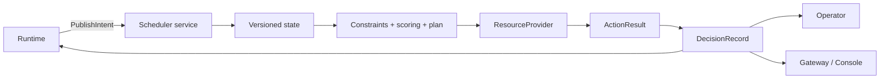

# Scheduler 指南

Scheduler 是 **Scheduling & Infrastructure Control** 的决策核心。它加载兼容性与
策略配置，维护版本化资源状态，接收设备无关的 `SchedulingIntent`，执行 Provider
动作并发布可审计的 `DecisionRecord`。默认使用 CPU Mock Provider。

## 启动

```bash
go run ./scheduler-go/cmd/scheduler \
  -listen 127.0.0.1:50051 \
  -config-root . \
  -manifest compatibility/manifests/cpu-mock.yaml \
  -state-dir .cache/tgsrl/scheduler-state \
  -metrics-listen 127.0.0.1:9090
```

| 参数 | 默认值 | 说明 |
|---|---|---|
| `-listen` | `127.0.0.1:50051` | gRPC 地址 |
| `-config-root` | `.` | 配置引用解析根目录 |
| `-manifest` | CPU Mock manifest | 兼容性清单覆盖 |
| `-fallback` | 由 policy 推导 | 兼容参数：`noop` 或 `static` |
| `-state-dir` | `.tmp/scheduler-state` | checkpoint 与 journal 目录 |
| `-metrics-listen` | `127.0.0.1:9090` | Prometheus 地址；空字符串可禁用 |

`GET http://127.0.0.1:9090/metrics` 可读取指标。gRPC 与指标端点都没有 TLS 或
认证，只应绑定可信接口。

## 调度路径



一次已接受的 Intent 会先物化 pending units，再以不可变 Snapshot 进行约束过滤、
评分和计划。提交计划前会复核 Snapshot revision 与 Intent version。Provider 动作完成
后，每个 binding 分别确认或释放资源；证据缺失时采用 fail-closed 处理。

## gRPC 接口

| RPC | 用途 |
|---|---|
| `PublishIntent` | 接受版本化 Intent，并异步触发调度与动作 |
| `GetSnapshot` | 读取最新资源快照，或等待快照至少达到指定 revision |
| `Schedule` | 预览决策；不执行动作或提交 allocation |
| `ListDecisions` / `GetDecision` | 分页读取或按 ID 查询决策 |
| `WatchDecisions` | 使用 cursor 持续订阅决策 |

Python 异步客户端示例（放在调用方的 `async` 函数中运行）：

```python
from tgsrl_runtime import SchedulerClient

async with SchedulerClient(
    "127.0.0.1:50051",
    timeout=5.0,
    max_retries=3,
) as client:
    response = await client.publish_intent(intent)
    async for decision in client.watch_decisions(
        job_ids=(intent.job_id,),
        after_sequence=0,
        heartbeat_seconds=10.0,
    ):
        print(response.status, decision.decision_id, decision.fallback)
        break
```

通过 Gateway 查询决策通常更适合交互式客户端：

```bash
uv run --frozen tgsrl list-decisions JOB_ID --run-id RUN_ID
uv run --frozen tgsrl get-decision JOB_ID DECISION_ID
```

## 决策与 Fallback

Scheduler 会记录输入版本、候选、拒绝原因、分项得分、选中计划、Fallback、动作与
补偿结果。`PublishIntent` 返回 accepted 只表示接收成功；应查看 `DecisionRecord` 的
`fallback` 和 `action_results` 判断资源动作结果。

支持的 Fallback：

- `noop`：不授权新的资源 mutation；
- `static`：保留可用的已有 binding，不创建新的 mutation。

`Schedule` 是无资源副作用的预览：返回的 Decision 不进入 Scheduler 的 retained decision
history。Replay 会把这类预览结果作为自己的 typed artifact 保存。`WatchDecisions` 只订阅
权威 `PublishIntent` 路径发布的记录，支持 sequence 或 decision ID 恢复、job 过滤和
heartbeat；cursor 早于保留窗口时会返回 `OUT_OF_RANGE`。

## 配置和策略

Scheduler 启动时会加载 manifest 引用的 BOM、profile、capabilities、policy 和 scenario，
并进行 schema、引用、版本、能力和交叉字段校验。策略支持：

- `stable-first-fit` / `score-first`；
- `binpack`；
- `trace-aware`；
- 可配置 `top_k` 和 fast/medium/slow event-loop interval。

默认 policy 还启用 mutation protection：按 execution/stage 应用 cooldown、hysteresis、
时间窗 action budget 和 circuit breaker。保护拒绝会形成带 `PROTECTION_*` 原因的 fallback。
可选择 `low_priority_first` preemption 候选策略，并应用 safe-point/capability 检查；
默认 CPU Mock policy 将 preemption 关闭为 `noop`。Store 不能原子表达“释放 victim
并预留 replacement”，所以即使显式启用也会 fail closed 为
`PREEMPTION_NOT_EXPRESSIBLE`，不会执行 release-only 计划。

路径和环境变量详见[配置、持久化与恢复](configuration-and-recovery.md)。

## Provider 边界

### Mock Provider

Mock Provider 支持能力检查、资源绑定、L1–L4 状态转换、故障注入、幂等 action 和
逐动作补偿。它只提供逻辑资源状态，不代表任何真实硬件行为或性能。

### NVIDIA Provider

选择 `provider=nvidia` 时，Provider 维护设备、Sandbox、action 幂等记录、plan 状态以及
resource/sandbox watch；执行 action 时先调用 Driver，再提交 Provider 自有状态，并在状态
提交失败时按声明尝试 rollback。默认 `LocalDriver` 只通过 `nvidia-smi` 探测本机设备，
不声明 supported actions，并拒绝 bind/release、MIG/MPS share/resize 和 Runtime 控制。

因此默认 NVIDIA 方案只支持设备发现，不能分配 GPU 或运行训练。要执行资源动作，
用户必须提供基础设施专用 Driver，并为其声明的 action 实现幂等、回滚、调和与隔离语义。

## 持久化与恢复

Scheduler 在 `-state-dir` 下维护 checkpoint 与 journal，并在监听请求前恢复 Snapshot、
Intent、Decision、action result、cursor 和 reservation。启动恢复会先向完整 Provider
查询或调和未完成 plan，把 reservation 收敛为成功或失败并保存 checkpoint；随后按稳定
顺序把恢复出的 Intent 重新送入同一权威调度路径。已由恢复 allocation 满足的 Intent
会被跳过，避免重复执行 bind。无法确认的 in-flight plan 会 fail closed 为失败，不会盲目
重放外部副作用。持久化失败会关闭后续 mutation 入口；损坏、I/O 或 Provider 调和错误
会使启动失败。完整恢复边界见
[配置、持久化与恢复](configuration-and-recovery.md)。
