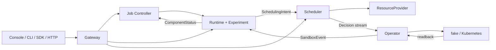

# TGS-RL 源码导读与维护边界

本文面向第一次阅读或准备修改 TGS-RL 的维护者。目标不是逐文件复述代码，而是回答四个
更重要的问题：**请求从哪里进入、状态由谁负责、外部副作用在哪里发生、失败后从哪里恢复**。

阅读本页时应始终区分三类事实：

- **期望状态**：用户或控制器希望系统达到的状态；
- **执行回执**：某个组件已经接受或执行了一步命令；
- **权威观测**：从实际 Runtime、Provider 或 Kubernetes 对象回读的状态。

命令返回成功不等于工作负载已经收敛。TGS-RL 的主要设计约束，就是不允许用前两类事实
冒充第三类事实。

## 1. 先看哪些文件

推荐按以下顺序阅读：

| 顺序 | 文件或目录 | 先理解什么 |
|---|---|---|
| 1 | `proto/tgsrl/v1/` | 跨语言业务对象、RPC 和枚举；这是契约唯一来源 |
| 2 | `job-controller-go/controller/` | Job、Run、Operation 的生命周期与幂等入口 |
| 3 | `runtime-python/tgsrl_runtime/supervisor.py` | Manifest、RuntimeUnit、Sandbox、Trace 和 Intent 如何关联 |
| 4 | `scheduler-go/service/` | Intent 如何进入 keyed event loop，并在执行前后持久化 |
| 5 | `scheduler-go/scheduler/` | 候选生成、合同评估、自适应目标、仲裁和预算 |
| 6 | `scheduler-go/planexecutor/`、`scheduler-go/state/` | 事务状态机、reservation、receipt、补偿与恢复 |
| 7 | `scheduler-go/provider/` | Mock 与 NVIDIA 的统一 Provider 边界 |
| 8 | `operator-go/worker/`、`operator-go/backend/` | Decision 如何变成 fake/Kubernetes 对象并产生观测 |
| 9 | `gateway-python/tgsrl_gateway/`、`console/src/api/` | 北向 HTTP、CLI、SDK 和页面数据映射 |
| 10 | `scripts/gate-tools.py` | 验证证据如何从原始事件重算，而不是信任汇总值 |

`gen/` 是由 Proto 生成的代码，不应手工修改。`.cache/`、`.tmp/`、`bin/`、虚拟环境、
Node 依赖、Console 构建目录和 `WORKLOG.local.md` 都是本地产物，不属于提交内容。

## 2. 三个系统与五个状态权威



| 状态 | 权威 | 主要代码 |
|---|---|---|
| Job、Run、Operation、JobEvent | Job Controller | `job-controller-go/controller/`、`job-controller-go/state/` |
| Manifest、RuntimeUnit、Sandbox、Trace、Replay、Experiment | Runtime | `runtime-python/tgsrl_runtime/` |
| Snapshot、Intent、Plan、Decision、reservation、transaction | Scheduler | `scheduler-go/service/`、`scheduler-go/state/` |
| 资源动作与硬件回执 | ResourceProvider | `scheduler-go/provider/` |
| workload 对象和实际生命周期观测 | Operator backend | `operator-go/backend/`、`operator-go/statuswatch/` |

同一业务状态可能出现在多个对象中，但只有表中对应组件可以推进自己的权威状态。
例如，Runtime 命令返回成功后，Job Controller 仍保持 `STARTING`；只有 Runtime 收到
Operator 的 Sandbox 观测并回报带 `runtime.source=runtime-observation` 的收敛状态后，Run 才
进入 `RUNNING`。

## 3. Job 从创建到运行

### 3.1 创建与准入

1. `GatewayApplication` 在 `gateway-python/tgsrl_gateway/app.py` 解析 HTTP、限制请求体并
   转换查询参数。
2. `GrpcGatewayBackend` 把请求转换为 `JobControlService` RPC，并保留 gRPC 错误的 HTTP
   语义。
3. `Controller.CreateJob` 调用 `compiler.NormalizeJob`：整理字符串、验证 Runtime pin、生成
   确定性 Job ID，并记录 validate Operation。
4. `Controller.AdmitJob` 先持久化 `ADMITTING` Run 和运行中 Operation，再调用 Runtime 的
   validate、compile、prepare。
5. Runtime 准备成功后 Run 进入 `WAITING`；失败则记录失败 Operation 和 component status。

所有写操作都应提供稳定的 idempotency key。Job 的请求指纹只包含调用方可控的规范化
内容，不能包含服务端临时生成的时间或状态，否则延迟重试会被误判为 key 冲突。

### 3.2 启动与收敛

1. `Controller.ApplyJobCommand` 先把 Run 改为 `STARTING`，创建运行中 Operation。
2. `RuntimeExecutor` 根据 Manifest 选择 Adapter，并把 generation、idempotency key 和
   checkpoint reference 传给 bridge。
3. Runtime 保存 desired state，生成并发布 `SchedulingIntent`。
4. Scheduler 完成资源计划和 Provider 事务后发布 `DecisionRecord`。
5. Operator 消费 Decision，读取 JobRun 与 RuntimeManifest，编译并调和 backend 对象。
6. 独立观察路径发布 `SandboxEvent`；Runtime 聚合后向 Job Controller 报告 component status。
7. `advanceRunFromComponent` 只接受权威、已收敛的 Runtime 观测，然后完成 Operation。

这条链路解释了为什么 `runtime.dispatch.accepted=true` 只表示命令已投递，不能直接把 Run
改为最终状态。超时或连接中断属于结果不确定，Operation 会保持可恢复的运行态，而不是
错误地标记失败或成功。

## 4. Runtime、Trace 与 Intent

`RuntimeSupervisor` 是 Python 数据面的协调中心，但不会成为集群资源权威。它组合以下模块：

- `runtime_registry.py`：根据 Manifest 选择 framework、execution、trainer 和 rollout adapter；
- `executor.py`：执行 lifecycle hook，并维护每个 Run 的 generation 和幂等结果；
- `trace_ingest.py`、`trace.py`：校验、规范化并按因果顺序保存 TraceEvent；
- `aggregation.py`：从事件形成 typed `ContractObservation`；
- `dag.py`：维护增量 phase DAG 和 gap 分类；
- `intent.py`、`intent_coordinator.py`：生成版本化、带 TTL 的 SchedulingIntent；
- `replay.py`、`experiments.py`：用记录的输入执行无资源副作用的调度预览；
- `storage/`：通过 SQLite 保存运行态和恢复水位。

Runtime 恢复时只重放明确可安全重试的 outbox 项。Checkpoint 记录的是完成元数据，不是
训练进程镜像；外部 worker 的 checkpoint、reload 和 readiness 必须由 bridge 明确确认。
`RuntimeManifest.image_digests` 保存内容身份，`oci_image` artifact 保存可拉取的
`repository@sha256:...` 引用；Operator 只用后者填 Kubernetes `container.image`。训练依赖在
worker bootstrap 内验证，不能要求 Runtime 服务镜像安装整套训练栈。

## 5. Scheduler 的两层决策

### 5.1 Admission 选择

`scheduler-go/scheduler/integration.go` 负责传统放置：

```text
Snapshot + Intent
→ 合同和输入校验
→ pending unit 展开
→ 硬约束过滤
→ 候选评分与稳定排序
→ PlacementPlan
```

同一输入、配置、时间和 seed 必须产生同样的候选顺序、Plan ID 和 Action ID。Scheduler 不
读取 reward 来选择设备。

### 5.2 Adaptive 控制与统一仲裁

`adaptive_integration.go` 将 admission plan 与当前 tick 的 runtime mutation 放进同一候选池：

```text
Observation
→ normalizePlanningSignals
→ directional target
→ Admission / Fast / Medium / Slow proposals
→ priority + conflict + budget arbitration
→ one transactional PlacementPlan
```

- **Fast**：share、priority、resize、scale-in；
- **Medium**：pause、resume、sleep、offload；
- **Slow**：rebind、recreate；
- **Admission**：bind。

预算在最终 Action 集合上执行，同时限制受影响 Sandbox、GPU 重配置次数、恢复成本和 L4。
安全优先级高于普通 admission。阻断性 contract 的 pause 是全体动作：所有匹配的活跃
allocation 必须已经被新鲜观测确认为 paused，或在同一计划中获得 pause；任何目标缺失、
过期、冲突或超预算都会整体 fail closed。调用方的优化 target filter 不能缩小这类安全动作。

Directional controller 当前是可解释的有界规则，而不是学习型控制器。producer 和 consumer
对 buffer pressure、policy lag、sample staleness、ESS 的响应方向不同，并受 hysteresis、
observation window、cooldown 和 recovery cost 约束。

## 6. 事务执行与崩溃恢复

`scheduler-go/planexecutor/Executor` 驱动下面的状态机：

```text
PROPOSED → RESERVED → PREPARED → APPLYING → COMMITTED
                                   │
                                   └→ APPLY_FAILED → COMPENSATING → ABORTED
                                                        └→ DEGRADED
```

关键规则：

- `state.Store` 是 reservation 和 transaction progress 的持久权威；
- 每个外部副作用前后都经过 checkpoint 边界；
- receipt 必须匹配 transaction、plan、action index、action ID、idempotency key 和 generation；
- 进程在 `APPLYING` 中退出后，先由 Provider 重建/读取 receipt，再决定继续、提交、补偿或
  标记 degraded；
- 多 Action 计划要求稳定顺序和补偿能力；不允许部分成功被整体解释为成功。

Scheduler 进程恢复时，`service.ResumeRecoveredState` 先恢复 Decision 与保护状态，再调和
transaction 和旧 reservation，最后重新排队 Intent。恢复期间不会对外提供服务。

## 7. Provider 与 NVIDIA Helper

### 7.1 Mock Provider

`scheduler-go/provider/` 的 Mock Provider 是完整的协议实现，可验证 reservation、action、
rollback、watch 和 recovery，但其资源、GPU 和生命周期效果都是逻辑状态，不能作为真实
硬件证据。

### 7.2 NVIDIA Driver v2

NVIDIA 路径分成编排层和三个本机 helper：

| 部分 | 责任 | 不代表什么 |
|---|---|---|
| `driver_v2.go` | inventory、capability handshake、backend 路由、互斥、审计与恢复 | 不直接操作训练进程 |
| `tgsrl-nvidia-binding` | binding authority、generation fence、幂等 receipt、MPS PID 发现 | 不改变已运行进程的 CUDA 可见性 |
| `tgsrl-nvidia-runtime` | PID 身份、pause/resume/sleep、managed-worker checkpoint/offload/reload/readiness | 无 socket 时不能声称 offload |
| `tgsrl-nvidia-mig` | 在已发现 MIG UUID 间执行停止、切换、恢复和回读 | 不创建或销毁 MIG 拓扑 |

helper 状态通过 `helperstate.Store` 使用文件锁、临时文件、`fsync` 和原子 rename。exit code
`75` 表示外部副作用可能已经发生但结果无法确认，调用方必须通过 receipt 和 readback 调和，
不能直接重放。

## 8. veRL Bridge

`adapters/frameworks/verl.py` 声明 veRL adapter，`verl_bridge.py` 提供协议与持久化状态机，
`verl_runtime.py` 则把 callback 显式接到 veRL 0.9 trainer 的 actor/critic worker groups 和
checkpoint manager。训练循环仍须在 batch/rollout 边界调用 `VerlControlHook.safe_point()`，
从而让控制线程只在真实安全点执行 checkpoint/offload/reload，并开放 Unix socket。
该适配器锁定 veRL `0.9.0` 的 `save_checkpoint`/`load_checkpoint`、worker-group `to()`，以及
checkpoint manager 的 replica sleep/wake/abort 和 weight update 接口；它不通过反射猜测其他
方法，也不会自动 monkey-patch trainer。

生命周期映射为：

| TGS-RL 动作 | Worker 协议 |
|---|---|
| pause | `prepare_pause → pause` |
| checkpoint | `prepare_pause → checkpoint` |
| sleep/offload | `prepare_pause → checkpoint → offload` |
| wake | `reload → resume` |
| terminate | `stop` |

bridge 在调用 callback 前持久化 pending request，完成后持久化 response。重启发现 pending
意味着副作用结果未知，因此不会盲目重放。`scripts/verl-reference-workload.py` 只验证协议、
队列、checkpoint 和进程生命周期；它不是完整 veRL 训练或模型质量验证。

## 9. Operator、Gateway 与 Console

Operator 的 `worker` 消费 Decision 后执行：

```text
Decision
→ 读取 JobRun / RuntimeManifest
→ compiler 生成 Bundle
→ backend reconcile
→ 保存 observation registration
→ statuswatch 回读对象
→ 发布 SandboxEvent
```

fake backend 用于纯内存控制契约；process backend 在本机复用同一 Bundle 投影，但由 Operator
真实启动 `tgsrl-worker-bootstrap` 和子进程，并通过 Scheduler registry 的 scoped status/action
接口执行 pause/resume/stop。它只用于 CPU 集成和 Gate harness，不模拟 Kubernetes 或 GPU。
Kubernetes backend 管理 CRD、Kueue Workload、Job 和可选
ResourceClaim。GPU 身份由 Scheduler 选择：NVIDIA Driver v2 的 device ID 就是 GPU/MIG UUID；
`kubernetes-dra` 按 typed inventory 为 Full GPU/MIG 选择不同 DeviceClass，再编译 NVIDIA DRA
`uuid` CEL selector。Operator 从 ResourceClaim 的
`driver/pool/device` 和最新 ResourceSlice 回读 UUID，完全一致后才发布收敛状态。传统
Device Plugin/HAMi 只承诺数量，不能用于证明精确 UUID 落点。

启用 managed-worker 后，compiler 以不可变 `RuntimeManifest` 的 command/args/environment/
working directory 包装主容器，并通过 init container 安装 `tgsrl-worker-bootstrap`。Operator
使用控制面主 key 为每个 binding 派生 scoped HMAC；Pod 不得到主 key。bootstrap fork 真实
进程、生成 PID token/control token、发布 HTTP control endpoint，并向 Scheduler registry 注册。
registry 再验证当前 Provider binding、Runtime BOUND generation 与来源 IP，注册成功后 readiness
才允许 Operator 投影 RUNNING。退出上报由注册 token hash、Pod UID、process token 与 generation
共同 fence。signal-only 路径只能在 safe point 上 pause/resume；checkpoint/offload/reload 必须由
cooperative worker socket 确认。

Gateway 不保存业务状态，只做 Proto/JSON 转换、分页 token 封装、RPC 转发和错误映射。
Console 的 `HttpApiClient` 再把 Gateway JSON 映射为页面模型。前端判断 Sandbox 是否使用
accelerator 时，应以 binding resource 为主、设备标识为辅；MIG UUID 不包含普通 `gpu`
文本，不能只靠字符串 `gpu`/`a100` 判断。

## 10. Gate G/I 证据链

`scripts/gate-tools.py` 固定运行同一个 workload manifest 的 baseline 和 variant，保存原始
stdout/stderr 和 trace，再从事件重新计算指标。校验器不信任外部报告中的汇总值：

- 指标必须是有限数值，不能是布尔值、`NaN` 或无穷；
- trace digest、suite、seed、label、warmup 和 measurement 次数必须匹配；
- 执行记录必须完整且无超时；
- full-stack 模式按每个 warmup/measurement iteration 校验唯一 service job/run、Scheduler
  decision/plan、managed-worker identity，variant 还必须有 Operator pause/resume 因果事件；
- GPU PASS 需要 CUDA measurement、正 GPU active time、硬件指纹和干净 commit；
- `GPU_MULTI_NODE` 还要求两侧出现同一组至少两个节点身份。

`SIMULATED` 与 `CPU_INTEGRATION` 永远不能生成真实 GPU PASS。

`configs/gates/e1-e8.json` 在单次 Gate report 之上增加 release campaign：E1 Full GPU
identity、E2 MIG identity、E3 throughput/VUG、E4 staleness/ESS、E5 共置干扰、E6 动作
代价、E7 故障恢复、E8 多节点收敛。每个 experiment 都绑定独立 scenario、最低证据等级、
执行模式、GPU profile、节点/设备数量、必需动作与故障事件。使用
`campaign-ingest E<n> --report ...` 导入单项外部证据，使用 `campaign-evaluate` 汇总。缺失报告、
CPU 证据、身份不一致或故障未恢复都不能通过；`calibration_required` 阈值补齐前结果为
`BLOCKED`。

## 11. 全仓源码审查发现并修复的问题

| 问题 | 风险 | 修复 | 回归位置 |
|---|---|---|---|
| MemoryRepository 的失败 Update 会残留部分写入 | 内存模式违反原子事务，且与 FileRepository 语义不同 | 统一使用隔离副本，回调成功后一次性替换 live state | `job-controller-go/state/file_repository_test.go` |
| CreateJobRun 用前 100 条记录数量计算 attempt | 第 102 个 Run 起可能重复 attempt 和确定性 Run ID | 改为最新 Run 的 attempt 加一，并检查溢出 | `job-controller-go/controller/controller_test.go` |
| 服务生成的 Job 时间进入 idempotency hash | 延迟重试被误判为同 key 不同请求 | 请求指纹排除服务生成字段，保留显式调用方字段 | `job-controller-go/controller/controller_test.go` |
| 真实 Job Controller 忽略 `after_job_id`/`after_run_id` | memory Gateway 与 gRPC 后端分页行为不一致 | 将 after cursor 纳入 Repository 查询，并拒绝与 page token 混用 | `job-controller-go/controller/controller_test.go` |
| 最新 Operation 按完成时间而非创建时间选择 | 新的运行中操作可能被旧完成记录遮蔽 | 改为按创建时间和 ID 稳定选择 | `job-controller-go/state/file_repository_test.go` |
| 无幂等键的重复 lifecycle 命令复用 Operation ID | 新命令会覆盖同 Run 的旧操作历史 | 无幂等键时把创建时间加入身份；有 key 时保持稳定 | `job-controller-go/controller/controller_test.go` |
| 阻断性 pause 只检查可生成 proposal 的目标 | 观测缺失/过期时可能执行部分安全动作 | 按全部活跃 allocation 对账，并忽略优化 target filter | `scheduler-go/scheduler/adaptive_planner_test.go` |
| Gateway 丢失部分 gRPC 状态语义 | 权限、限流、超时和未实现被错误显示为统一 503 | 映射为 401/403/429/501/504 | `tests/api/test_gateway_api.py` |
| Operation 数值过滤接受未知枚举 | 无效过滤静默退化为不可预期查询 | 拒绝 0 和未声明枚举值 | `tests/api/test_gateway_api.py` |
| Gate 接受 bool、NaN、Infinity 作为数值 | 非法证据可能绕过 schema 检查 | 要求非 bool 的有限 int/float | `tests/governance/test_gate_tools.py` |
| Console 不识别 MIG 或 opaque accelerator ID | 已绑定 GPU 的 Sandbox 被错误展示为未绑定 | 优先检查 `acceleratorUnits`，兼容常见设备标识 | 由 Console 全量 typecheck/lint/test/build 覆盖 |
| veRL raw/typed trace 分两次读取共享 sequence | 并发 observe 时两种输出的事件身份可能错位 | `_emit` 返回本次不可变身份，typed event 复用同一快照 | `tests/python/test_adapters_runtime.py` |
| 多个本地状态文件显式使用宽松权限 | 运行元数据可能被同机其他用户读取 | 核心状态文件改为 `0600`、新建目录改为 `0700`，cursor 增加 fsync | 既有 persistence/restart 测试 |
| admit/retry 成功分支重复 upsert Operation | 增加阅读噪声，容易误判为追加两次 | 保留单一统一 upsert | Job Controller 测试集 |
| 普通单测以单批本机 p95 判定性能 | CI 负载变化会造成孤立抖动失败，也不能代表生产性能 | 从普通单测移出墙钟断言；独立非 race CI 固定单 P，以多次同进程 CPU 校准归一化 P95，并用 allocation 上限防止内存回退 | `make test-performance`、`scheduler-go/scheduler/benchmark_test.go` |
| 手写 Proto 描述符与 Gate JSON 常量测试重复正式门禁 | 生成面或配置每次变化都要维护第二份影子契约 | 依赖 Buf、跨语言 round-trip、Gate loader 与治理验证 | `make check-generated`、`make proto-roundtrip`、`tests/governance/test_gate_tools.py` |
| 测试 fake 与仅测试使用的查询方法位于生产源码 | 扩大公开表面，并让读者误判其为产品能力 | 将 NVIDIA driver/command fake 移入既有 `_test.go`，删除未使用的 `Guard.Snapshot` | NVIDIA、Protection 与 Provider 测试集 |
| 硬件 workflow 约束单独占用一个极小测试文件 | 增加碎片化，但与治理门禁属于同一职责 | 合并到既有 governance 测试；继续禁止 CPU/模拟证据冒充 GPU | `tests/governance/test_governance.py` |
| Scheduler UUID 只进入 RuntimeTarget，且 MIG class 无法区分 | 调度账本与训练进程可能分别使用 GPU-A/GPU-B，MIG claim 可能永远无法满足 | typed DRA inventory 区分 Full GPU/MIG class；claim 使用 UUID selector；allocation 回读不一致时 fail closed | Operator Compiler、Kube client、BundleAdapter 与 StatusWatch 测试 |
| Kubernetes Job 直接执行用户命令，无 PID/control 注册与退出回报 | Scheduler 动作没有真实进程对象可控，Pod active 可能被误报为 Runtime running | 增加 workload bootstrap、scoped registry、PID/Pod UID/process token fence、readiness gate 与 exit observation；manifest 成为执行输入权威 | bootstrap、runtimehelper、Scheduler registry、Operator compiler/statuswatch 测试 |
| bootstrap emptyDir 挂载到 workload 的 `/opt/tgsrl` | 注入 bootstrap 时遮住镜像自身代码，Pod 启动后找不到 workload | 将 bootstrap 安装目录隔离到 `/var/run/tgsrl-bootstrap` 并保持原 working directory | Operator compiler 与 StatusWatch 测试 |
| Full GPU v2 复用 MPS 默认与 capability 名称 | 普通整卡 smoke 会启动无关 MPS，或因重复 capability 被 Scheduler 拒绝 | 增加无分区 mutation 的 `full` backend，默认选择 full，并去重 capability | NVIDIA Driver v2 与 Scheduler CLI 测试 |
| Kueue DRA patch 只做字符串断言 | 错误缩进的 YAML 可绕过测试并在目标集群失败 | 修正嵌套列表缩进，并对生成结构做回归校验 | `tests/governance/test_gpu_setup.py` |
| GPU workload 与控制面共用 Python dependency 约束 | vLLM CUDA 13 需要 protobuf 6，而控制面锁定 protobuf 5，镜像会产生不可满足依赖 | GPU workload 使用独立 hash lock 与 site-packages，通过 protobuf wire/HTTP registry 连接控制面 | GPU lock、SBOM 与 governance 测试 |

## 12. 测试和提交边界

测试应保护长期契约，而不是保留一次性实验。全仓测试按责任分成五层：

| 层级 | 应保留的内容 | 不应承担的内容 |
|---|---|---|
| 单元测试 | 原子性、幂等、状态机、排序、校验和 fail-closed 分支 | 本机性能 SLA、第三方服务可用性 |
| 组件集成 | 跨 Repository、RPC、Provider、Operator 或持久化边界的失败与恢复 | 重复每个底层纯函数的所有分支 |
| 契约与治理 | Proto round-trip、OpenAPI、配置图、SBOM、证据防伪 | 复制生成描述符或整份 JSON 常量 |
| 进程 E2E | 真实启动、重启、恢复和跨组件闭环 | 伪装成 GPU、Kubernetes 或训练性能验证 |
| Benchmark | 可重复比较算法吞吐、耗时和分配数 | 作为普通 `go test` 的绝对 wall-clock 通过条件 |

新增或保留测试前逐项判断：失败时能否指出一个长期产品契约；同一断言是否已由更低层测试
或正式门禁覆盖；是否依赖机器负载、网络或当前输出文案；fixture 是否会被多个测试复用。仅用于
开发时观察输出、验证测试替身自身、复制已有覆盖或一次性定位问题的文件应在本地验证后删除。
小型同类检查应合并进现有测试文件，避免每个修复都新增一个文件。

调度性能通过显式 benchmark 观察，不进入普通单测的固定毫秒门禁：

```bash
go test ./scheduler-go/scheduler -run '^$' -bench BenchmarkEvaluateSimulation -benchmem
```

`scheduler-go/scheduler/benchmark_test.go` 同时保留 1000 device × 1000 unit 的无时间阈值
正确性用例，防止性能清理误删大规模绑定唯一性覆盖。`job-controller-go/runtimeclient/fake.go`
是当前唯一明确保留在生产目录的纯测试支撑：Controller 与 Service 两个外部测试包共享同一套
完整 lifecycle fake；迁移会复制状态机。其他名为 mock/fake 的实现均是公开的本地运行模式，
不是一次性测试桩。

提交前至少执行：

```bash
git diff --check
make lint
make test
make race
make product-e2e
make check-generated
make check-governance
make check-public-content
```

逐文件暂存源码、必要测试和文档，不使用 `git add .`。以下内容必须留在本地：

- `WORKLOG.local.md`；
- `.cache/`、`.tmp/`、`bin/`；
- `.venv/`、`node_modules/`、`console/dist/`；
- `__pycache__`、pytest/mypy/Ruff cache、`*.tsbuildinfo`；
- Gate 输出、运行时数据库、checkpoint、journal、日志和本机凭据。

## 13. 当前仍需真实环境完成的验证

代码和本地门禁不能替代以下证据：

- NVIDIA CUDA、MPS share 写入与读回；
- 真实 MIG 实例 rebind/recreate 与故障恢复；
- 真实 veRL/Ray/PyTorch/vLLM/SGLang 训练进程；
- bootstrap registry/control endpoint 在真实 Kubernetes 网络、Pod restart 与 NetworkPolicy 下的行为；
- Kubernetes、Kueue、DRA 与 GPU 控制器的目标集群联调；
- 单节点和多节点吞吐、延迟、恢复时间与训练质量。

在这些验证完成前，对外表述应使用“已实现，CPU/fixture 验证通过，真实环境待验证”，
不能写成生产可用或真实性能已证明。
