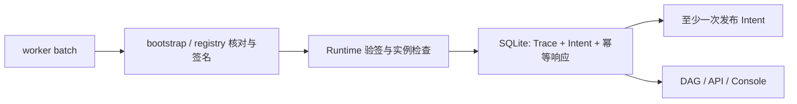
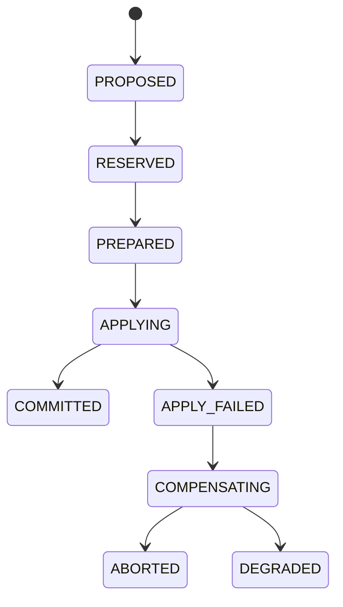

# 源码与组件导读

先阅读[系统设计](../design/system-design.md)理解问题、职责与身份关系。本页回答：
**请求在哪进入、状态在哪保存、副作用在哪执行、错误后从哪恢复、修改后测什么。**
阶段性发现与验证结果见[工程审查记录](engineering-review.md)，不混入长期设计。

## 1. 阅读地图

| 层 | 入口 | 核心对象 | 修改时关注 |
|---|---|---|---|
| 契约 | `proto/tgsrl/v1/` | Job、Run、Manifest、Intent、Plan、Trace | wire compatibility 与跨语言语义 |
| 产品控制 | `job-controller-go/controller/` | Job/Run/Operation | 持久化后派发、幂等与观察态收敛 |
| 运行时 | `runtime-python/tgsrl_runtime/supervisor.py` | Unit/Sandbox/Trace/Intent | 逻辑角色与具体实例的关联 |
| 调度服务 | `scheduler-go/service/` | keyed event loop、Decision | 版本、TTL、snapshot revision |
| 调度算法 | `scheduler-go/scheduler/` | candidate、proposal、Plan | 硬约束、稳定排序、安全与预算 |
| 事务 | `scheduler-go/planexecutor/`、`scheduler-go/state/` | reservation/receipt/transaction | 副作用前后 checkpoint、补偿 |
| 资源 | `scheduler-go/provider/` | Device/Capability/Binding | 实际能力与观察，不按型号分支 |
| 基础设施 | `operator-go/worker/`、`compiler/`、`backend/` | Bundle、delivery、cursor | 一 Binding 一 Bundle、设备回读 |
| 进程 | `cmd/tgsrl-worker-bootstrap/`、`internal/managedworker/` | PID token、endpoint、receipt | 注册、退出与旧代际隔离 |
| 用户接口 | `gateway-python/`、`console/src/api/` | HTTP JSON、页面模型 | 错误、分页与数据来源 |
| 验证 | `scripts/`、`tests/` | Gate、Trace、report | 从实际证据重算 |

`gen/` 来自 Proto，不手改。SQL 迁移、OpenAPI、锁文件是发布所需输入，不因“自动生成”而删除。

## 2. Job Controller：生命周期权威

```text
HTTP 请求 → GatewayApplication / GrpcGatewayBackend
 → Normalize / Validate → Repository 保存 Job、Operation、幂等记录
 → Runtime validate / compile / prepare → WAITING Run
 → StartRuntime → 等待 ComponentStatus → RUNNING + Operation SUCCEEDED
```

| 文件 | 责任 |
|---|---|
| `job-controller-go/compiler/compiler.go` | 规范化、合法性与确定性身份 |
| `job-controller-go/controller/catalog.go` | 创建、查询、校验 |
| `job-controller-go/controller/admission_prepare.go` | 准入阶段、Runtime 准备与结果保存 |
| `job-controller-go/controller/command.go` | 生命周期派发、过渡态、不确定结果 |
| `job-controller-go/state/` | Repository、copy-on-write、snapshot/journal |

关键约束：

- Job 是声明；Run 保存一次 attempt 的不可变执行规格，retry 创建新 Run。
- 请求指纹不混入服务端后来生成的时间，否则延迟重试会冲突。
- 先保存过渡态与 Operation，再调用 Runtime；网络超时可能发生在副作用之后。
- 仅权威 `runtime-observation` 推进最终 Run 状态，不以 dispatch accepted 代替完成。
- 恢复先核对观察态；不具备安全重放条件时进入 `RECONCILIATION_REQUIRED`。
- 内存与文件 Repository 均在隔离副本更新，回调失败不留下部分状态。

测试：`job-controller-go/controller/controller_test.go`、`job-controller-go/state/file_repository_test.go`、
`tests/api/test_gateway_api.py`、`make product-e2e`。

## 3. Runtime：训练事实到调度意图

`RuntimeSupervisor` 组合存储、Adapter、Executor、Trace、DAG、Intent 和实验协调器，
不选择物理设备，不直接创建 Kubernetes Job。

| 模块 | 输入 → 输出 |
|---|---|
| `adapters/runtime_registry.py` | 组件声明 → adapter、LaunchSpec 与逻辑角色 |
| `runtime_lifecycle.py` | 生命周期请求 → desired state、Start outbox、backend control |
| `executor.py` | LifecycleAction → hook 结果与命令 receipt |
| `trace_ingest.py`、`trace.py` | batch → 身份验证、去重、规范事件 |
| `aggregation.py` | Trace → typed ContractObservation |
| `dag.py` | phase 事件 → 增量 DAG 与等待分类 |
| `intent.py`、`intent_coordinator.py` | Unit/observation → 版本化 Intent |
| `replay.py`、`experiments.py` | 记录输入 → 无资源副作用的决策预览与对比 |
| `storage/` | 状态变更 → SQLite 事务与恢复水位 |

`RuntimeExecutor` 的 LAUNCH 维护控制语义，真实启动在 Operator 的 process/Kubernetes backend。
`_failure_context_spec` 仅供 adapter 编译失败时诊断，不是未实现的 launcher。
Runtime 先保存 Start Intent，发布成功才确认 outbox，重启只补投未确认项。



- managed-worker 路径核对 run、trace、execution、stage、phase、unit、sandbox、binding、generation、设备。
- 一个 RuntimeUnit 可有多个副本；校验具体 Sandbox，不只接受 Unit 的代表性 sandbox。
- 重复 batch 不重复写事件；未确认 Intent 可以再次投递。
- `image_digests` 表达内容身份，`oci_image` artifact 才是可拉取的 `repository@sha256:...`。
- Replay 重算语义，不运行 GPU 动作；不同 DataKind 不可混合冒充硬件证据。

SQLite 使用 WAL、`synchronous=FULL`、foreign keys、busy timeout。迁移缺失立即失败，
初始化失败关闭连接；sdist/wheel 必须包含 `storage/migrations/*.sql`，不能只测 editable 安装。
测试：`tests/python/`、`tests/storage/`、`tests/governance/test_packaging.py`。

## 4. Scheduler：候选与安全动作

启动入口为 `scheduler-go/cmd/scheduler/main.go`：配置图 → Provider → snapshot →
checkpoint/journal → 未完成事务调和 → event loop → gRPC。恢复完成前不接受新请求。
Intent 按 execution/stage 合并，避免旧版本排队覆盖新版本。

### 放置路径

```text
Snapshot + Intent + 固定 evaluation time/seed
 → 版本 / TTL / 合同校验 → pending unit 展开
 → health / capacity / capability / topology 硬过滤
 → scoring 与稳定排序 → Top-K evidence → PlacementPlan
```

约束、候选、评分、策略分别在 `constraints/`、`candidates/`、`scoring/`、`policy/`；
`scheduler/integration.go` 组合调用。同输入必须产生稳定 Plan/Action identity。
证据可能截断，检查 totals 和 truncation flag，不把 Top-K 当全部候选。

### 自适应路径

`adaptive_integration.go` 把 admission 与 runtime mutation 放入同一仲裁：

| Planner | 动作方向 | 约束 |
|---|---|---|
| Admission | bind | 容量、能力、队列、合同 |
| Fast | share、priority、resize、scale-in | pressure、hysteresis、cooldown |
| Medium | pause、resume、sleep、offload | 新鲜 observation、安全点、恢复成本 |
| Slow | rebind、recreate | 替代资源、动作能力、L4 预算 |

这是一套可解释的有界规则，不是学习控制器。producer/consumer 对 buffer、lag、staleness、ESS
的响应方向不同。阻断性合同要求 pause 时，必须覆盖全部相关 active allocation：已被新鲜观察
确认为 paused，或全部进入同一安全计划；观察缺失、过期、冲突、超预算都拒绝，优化 filter
不能缩小安全集合。`noop` 不授权新 mutation，`static` 仅保留兼容分配；不读取 reward 选设备。

测试：`scheduler-go/scheduler/`、`scheduler-go/semantics/`、`make test-performance`。

## 5. 事务与资源 Provider



`planexecutor.Executor` 与 `state.Store` 管理 reservation、pending checkpoint 和逐步结果。
receipt 匹配 transaction、plan、action/index、幂等键、generation、digest。失败逆序补偿已执行
动作；field-scoped before-image 不覆盖无关并发字段。`APPLYING` 恢复先查 Provider receipt/readback，
再决定继续、提交、补偿或 degraded。

Provider 是厂商接口，不是第二个 Scheduler。工厂当前只注册 Mock/NVIDIA；未来新增实现再注册，
不添加空的 Ascend 实现或型号白名单。

| NVIDIA 模块 | 责任 |
|---|---|
| `inventory_backend.go` | 物理卡、MIG 模式、已有子设备和拓扑 |
| `driver_v2.go` | 能力握手、路由、互斥、审计与恢复 |
| `binding_backend.go` | binding helper、持久回执 |
| `runtime_backend.go` | 已注册 worker 生命周期 |
| `mps_backend.go` | MPS daemon 与既有 profile 发现；在线 share mutation fail closed |
| `mig_backend.go` | 已有 MIG UUID 间 lifecycle/rebind |

`auto` 逐卡发布 Full GPU 或已有 MIG 子设备，不重复计量、不启动 MPS。默认 LocalDriver 仅发现
资源；v2 才接动作 helpers。文件 helper 使用 lock、临时文件、fsync、rename；退出码 `75` 表示
结果不确定，不可盲重放。MPS 需可信 server PID 与共享目录；同 server PID 的 worker 是否可独立
兑现份额需实机验证。SIGSTOP 不释放显存，MIG helper 不改拓扑。

测试：`scheduler-go/planexecutor/`、`state/`、`provider/nvidia/`、`internal/managedworker/`。
扩展见[Provider 设计](../design/accelerator-extension.md)。

## 6. Operator：兑现与回读

```text
WatchDecisions(cursor)
 → 成功、非 fallback、身份完整的 Decision
 → JobRun + 不可变 RuntimeManifest
 → 每个 concrete Binding 编译一个 Bundle
 → backend apply + durable delivery/观察注册
 → 推进 cursor → 独立 statuswatch → SandboxEvent
```

| backend | 对象与回读 | 用途 |
|---|---|---|
| fake | 内存 bundle | 本机产品控制；退出丢失实际对象 |
| process | bootstrap 子进程 + scoped registry | CPU Gate；不模拟 Kubernetes |
| Kubernetes | API Server、Job/Pod、Kueue、DRA/HAMi | 目标环境 |

`JobRunBundle` 是 Kubernetes completion marker。新 generation 对象准备、旧对象清理完成后才
更新 marker；同 generation fingerprint 不得静默变更。lifecycle ledger 保存 pending/in-flight/
ambiguous/completed；NOT_FOUND 与查询失败必须区分。cursor 不能越过未完成 delivery。

| 设备路径 | 编译 | 回读 |
|---|---|---|
| DRA | typed ResourceSlice → class/type/UUID selector → ResourceClaimTemplate | Pod 生成的 claim → allocation → 最新 ResourceSlice → UUID/class |
| HAMi | typed Node inventory → UUID annotation + core/memory | Pod allocation annotation → UUID、core、显存 |

Full GPU class 为 `gpu.nvidia.com`，MIG class 为 `mig.nvidia.com`，driver domain 均为 `gpu.nvidia.com`。
单 Binding 不混 class。HAMi 当前单 Binding 单物理卡 `(0,1]`，多 Binding 可共享 UUID。
有序 profile 逐 Binding 选择，没有候选能精确兑现便拒绝。

compiler 从 manifest 获取 command/args/environment/working directory，init container 将 bootstrap
装入 `/var/run/tgsrl-bootstrap`，不遮住 workload 的 `/opt/tgsrl`。主容器使用动态 control port，
`ready --file` exec probe 核对注册 marker，避免 hostNetwork 多副本端口冲突。

Operator/Scheduler 持主签名 key，Pod 仅持 binding-scoped HMAC。bootstrap 记录 PID token、Pod UID、
control token、endpoint 后注册；registry 核对 Provider binding、来源 IP、Runtime BOUND generation。
worker 仅拿独立 loopback trace token，退出按 incarnation fence。带 OCI workload 的 Python 命令
由同一解释器预检训练依赖，不要求控制面安装训练栈。

测试：`operator-go/compiler/`、`bundleadapter/`、`statuswatch/`、`worker/`、`cmd/tgsrl-worker-bootstrap/`。
详细协议见[bootstrap 设计](../design/managed-worker-bootstrap.md)。

## 7. veRL：合作式生命周期

| 文件 | 责任 |
|---|---|
| `adapters/frameworks/verl.py` | LaunchSpec、生命周期命令 |
| `verl_bridge.py` | socket、幂等日志、generation、Trace |
| `verl_runtime.py` | veRL 0.9 trainer/worker-group/checkpoint-manager callbacks |
| `adapters/trace_transport.py` | protobuf batch 发送 |

训练循环显式调用 `VerlControlHook.safe_point()`，不 monkey-patch trainer，不用反射猜接口。

| 动作 | callback 链 |
|---|---|
| pause | prepare_pause → pause |
| checkpoint | prepare_pause → checkpoint |
| offload/sleep | prepare_pause → checkpoint → offload |
| wake | reload → resume |
| terminate | stop |

callback 确认后才改 bridge 状态。mutation lock 串行控制，等待 safe point 不持 Trace/state lock，
否则训练线程上报 observation 时会互锁。pending 请求落盘后重启意味着结果可能未知，不盲重放。
真实依赖导入和最小 CUDA adapter workload 不等于完整 trainer/collective/checkpoint 验证。
ReferenceCallbacks 保留为协议 fixture。测试：`tests/python/test_adapters_runtime.py`、进程 Gate。

## 8. Gateway 与中文 Console

Gateway 无业务状态；`app.py` 处理路由、请求大小、参数、错误，`grpc_backend.py` 对接四个逻辑
服务。Proto JSON 使用 lowerCamelCase，Gateway envelope/pagination 保留 snake_case。
分页 token 绑定资源/filter，不跨查询复用；错误保留 invalid/not-found/conflict/timeout 等语义。

Console HTTP adapter 取实际服务数据，mock adapter 仅供预览和 fixture。页面按运行、可观测、资源、
分析组织，任务下钻到 Run/Decision/Sandbox/设备。资源页是 Scheduler 账本，不是 allocation 成功证明。
加速器识别优先 typed resource，不靠型号或 `gpu` 字符串。

Trace 按 component/track 分轨，用 request/worker/executor/span/parent-span 关联。duration 仅取事件
声明值，缺失时显示时间点。Flex 外壳和局部滚动避免长 ID/表格撑宽页面。
测试：`tests/api/`、Console unit tests、`console/tests/browser/`。mock 浏览器与实际服务流分别验证，
类型检查不能证明用户功能可用。

## 9. Gate 与发布验证

| 层 | 入口 | 不替代什么 |
|---|---|---|
| 单元/组件 | Go/Python/API/Console tests | 真实集群 |
| 发布包 | `tests/governance/test_packaging.py` | Docker 实装 |
| 产品进程 | `make product-e2e` | 浏览器/GPU |
| 子进程 | `make gate-cpu-integration` | Kubernetes/完整训练 |
| 页面 | `make test-console-browser` | 真实后端操作 |
| 配置/部署 | `make check-deploy`、`make check-governance` | 集群网络/RBAC/存储 |
| 硬件 | E1/H1/H2、A10 readiness、两轮 Helm；E6 与 E5-STATIC 已完成 A10 采集 | E6/E5-STATIC 数值阈值待标定；正式 E2–E5/E7–E8 场景或收益未完成 |

`gate-tools.py` 从原始 Trace 重算指标，核对 suite/seed/label/warmup/measurement/digest 和执行完整性。
拒绝 bool/NaN/Infinity；full-stack 核对每轮 Job/Run/Plan/worker 与控制回执。GPU PASS 需实际 CUDA
measurement、硬件身份、源码 provenance，CPU 证据不升级为 GPU。

`hardware_environment_driver.py` 实现 preflight/launch/measure/identity/control/cleanup，通过 Gateway
操作任务，不 patch Binding 伪造决策。bind 等待同步检查 Start Operation，终态失败立即报告，进行中
Start 不阻止成功 Decision 被读取。cleanup 使用 UID/resourceVersion 条件删除，只把服务器明确的
`NotFound` 视为幂等完成；环境 hooks 和 provenance 边界见[工程审查](engineering-review.md)。

## 10. 扩展的最短路径

| 修改 | 顺序 |
|---|---|
| 字段/RPC | Proto → 生成 → 两端校验 → breaking/round-trip → API/文档 |
| 策略 | typed signal → proposal → 仲裁/预算 → 确定性/失败/补偿测试 |
| 硬件厂商 | Provider factory → realization adapter → worker verifier → 实机证据 |
| 训练框架 | registry → LaunchSpec → 显式 callbacks → Trace/生命周期测试 |
| Gate | manifest/scenario → 实际服务驱动 → 原始证据 → 缺失/失败/防伪校验 |

先维护契约与失败语义，再加能力，不为未验证的未来需求写空抽象。
运行与回归见[开发指南](development.md)，提交边界见[仓库规范](repository-hygiene.md)。
