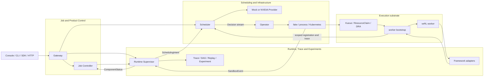
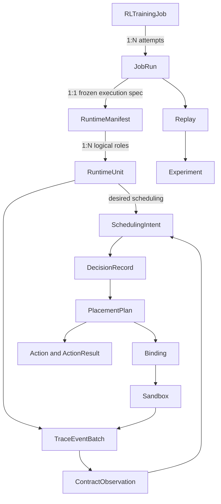
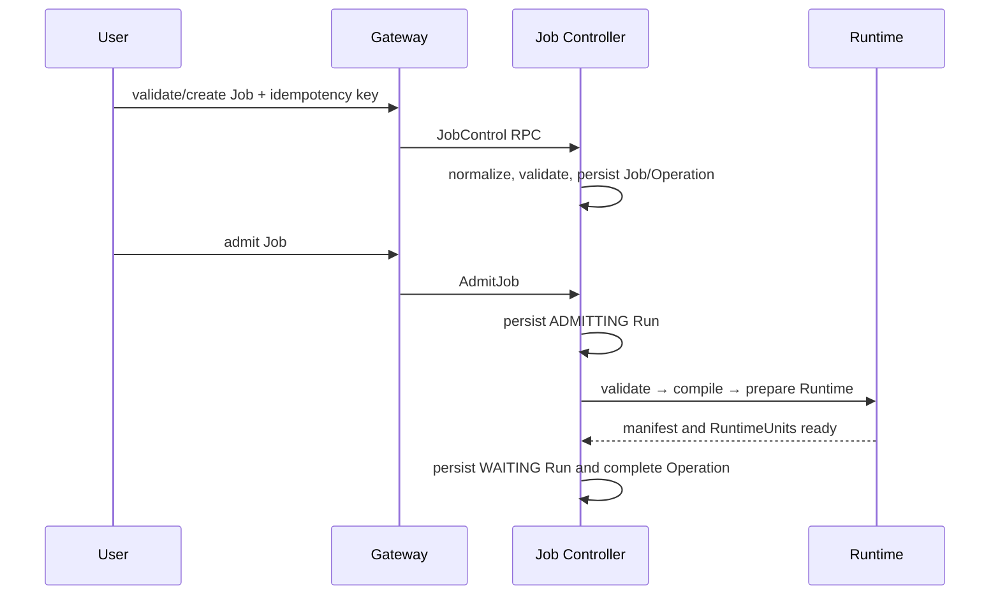
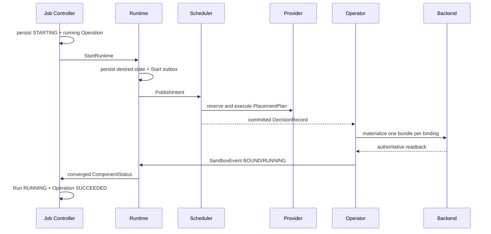
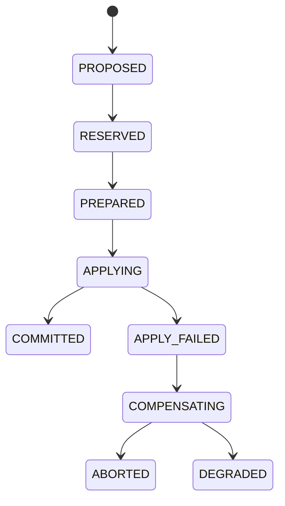

# TGS-RL 项目设计、代码导读与工程 Review

本文是 TGS-RL 的单文档全景说明，面向架构评审、代码接手、环境集成和发布验收。它回答：

1. 项目解决什么问题，明确不解决什么；
2. 各组件怎样协作，状态和资源身份由谁负责；
3. 一次 Job、调度动作和真实 worker 生命周期如何贯穿代码；
4. 崩溃、重试、重复消息和部分失败如何处理；
5. 当前哪些能力已经闭环，哪些仍需真实 GPU/Kubernetes/veRL 证据。

本文审查的代码基线是 `5bff4630e9dd1ec76c267004e6cb077621444952`。该基线的 GitHub
Actions run `33471081130` 共 10 个 job 全部成功，包括 Proto compatibility、Go race、
staticcheck、Python、Console、性能预算、部署镜像、Process E2E、Full-stack CPU Gate 和
Product E2E。这个结果证明代码回归通过，不等于真实 NVIDIA、Kubernetes 或训练效果已经验证。
后续文档提交只更新说明和索引；上述 SHA 仍是本次代码行为审查与测试证据的实现基线。

## 1. Review 结论

### 1.1 总体判断

TGS-RL 已经不是框架或演示原型。Job 控制面、Runtime/Trace、Scheduler、Provider、Operator、
managed-worker bootstrap、Gateway/SDK/CLI、Console、全栈部署工件和硬件验证 runner 均有可执行
实现。架构主线正确，不需要重写 Scheduler，也不需要重新划分服务边界。

当前最准确的状态是：

| 范围 | Review 判断 | 说明 |
|---|---|---|
| Proto 与领域契约 | 已闭环 | Go/Python 共用 `tgsrl.v1`，有 Buf breaking 和跨语言 round-trip |
| Job/Product 控制面 | 已闭环 | Job、Run、Operation、Timeline、CLI/SDK/HTTP/Console 和重启恢复完整 |
| Runtime/Trace/Replay | 已闭环于单机代码路径 | desired/observed 分离、typed observation、Replay 和 SQLite 恢复完整 |
| Scheduler 与事务 | 已闭环 | admission/adaptive planner、约束、预算、reservation、receipt、补偿和恢复完整 |
| CPU Mock / process E2E | 已验证 | 包括真实子进程、worker bootstrap、Unix socket 和服务重启 |
| NVIDIA Provider/helper | 代码完成，待硬件验证 | inventory、MPS/MIG/runtime/binding helper 与 worker registry 已实现 |
| Kubernetes/DRA | 主链完成，存在测试前 P0 | Full GPU/MIG typed inventory、UUID selector、allocation readback 已实现；cleanup RBAC 缺 delete |
| 硬件 Campaign | runner 和 driver 主体已实现 | 仍需环境输入 digest/集群 identity 加固、目标 workload、hook 和真实 E1–E8 证据 |
| 生产发布 | 尚未准入 | 无真实 GPU/MIG/veRL 证据；E3–E8 有 9 条阈值待标定 |

CPU/Mock 主链没有发现新的 P0 结构断点。Kubernetes 路径发现一项确定的 P0：backend cleanup
会删除 Workload、ResourceClaim 和 JobRunBundle，但 Helm 与原生 manifest 的 namespaced Role 没有
为这三类资源授予 `delete`。因此真实终态 cleanup 和 rebind 的旧 generation 清理可能被 RBAC
拒绝。硬件证据链还有一个 P0：environment config、Job template、action/fault hook 和最终渲染
workload 尚未进入锁定 digest；当前 `host_hash` 也是 runner 主机而不是目标集群 identity。缺少这些
字段时，报告不能证明复跑使用了同一集群和同一 workload。除此之外，发布层面的阻塞项是：

- 在目标集群提供真实 workload Job 模板和容器内 trace 导出器；
- 修复并验证 Operator 对 Workload、ResourceClaim、JobRunBundle 的最小 delete RBAC；
- 配置 E2 rebind 的 Scheduler-observation hook；
- 为 E4–E8 配置动作或故障 hook，并证明它们作用于真实 worker/环境；
- 依次执行 E1 Full GPU、E2 MIG，再运行 E3–E8；
- 使用真实数据评审并提交 E3–E8 的 9 条阈值；
- 为真实 veRL/Ray/PyTorch/vLLM、MPS 和多节点故障恢复形成证据。

### 1.2 Review 发现与优先级

| 级别 | 发现 | 影响与处置 |
|---|---|---|
| P0 验证阻塞 | 没有真实 E1–E8 运行；Hardware Validation workflow 当前运行记录为 0 | 代码不能被表述为硬件验证通过；先执行 E1/E2 |
| P0 验证阻塞 | 仓库不能提供目标 workload、E2 observation hook 和 E4–E8 action/fault hook | 这些是环境特定集成，不应写死在核心代码；受保护环境必须配置并审计 |
| P0 验证阻塞 | E3–E8 有 9 条阈值未标定 | 保持 `BLOCKED`；只读 calibration report 不自动修改策略 |
| P0 证据完整性 | hardware report 未锁定 environment config、Job template、hook 和 rendered workload digest，且 `host_hash` 不是集群身份 | 在正式 E1 前扩展 fingerprint/artifact；否则只能作为探索性 smoke |
| P0 代码/部署 | `KubernetesBackend.Cleanup` 删除 Workload、ResourceClaim、JobRunBundle，但 Role 不含对应 `delete` | 补最小 RBAC 和 Helm/native contract test；否则 rebind/终态 cleanup 会 forbidden |
| P1 生产阻塞 | 服务端点没有内建 TLS、用户认证、授权、租户隔离或限流 | 仅允许本机/隔离网络；生产前增加统一入口和服务间身份 |
| P1 生产阻塞 | Job 只提供字符串环境变量，没有通用 Secret/ConfigMap 引用模型 | 依赖凭据的真实训练必须由 namespace/service account 或平台注入；后续应设计显式 secret refs |
| P1 生产阻塞 | Helm 服务固定单副本且没有容器 CPU/memory requests/limits、PDB 或 HA | 当前 chart 是验证部署形态；容量规划和高可用需另行设计 |
| P1 清理安全 | hardware driver 删除前核对 name 和 ownership label，但 GET 与 DELETE 之间没有 UID/resourceVersion precondition | 受控 namespace 可验证；生产清理应使用 UID precondition 消除名称复用竞态 |
| P1 环境安全 | `kube_context` 可留空，此时 driver 使用 ambient kubectl context | 正式 hardware config 必须强制显式 context，并将 cluster UID/hash 写入 fingerprint |
| P1 可运维性 | 只有 Scheduler 暴露 Prometheus，跨服务日志字段和 lifecycle latency 未统一 | 补齐全栈 metrics、trace/span 或统一 correlation logging |
| P1 数据规模 | Runtime 只有 SQLite 热存储和 retention/delete audit，没有 Parquet/Arrow 冷存储 | 长期、大规模 Trace 需 schema/version/partition/archive/replay 方案 |
| P2 可维护性 | hardware environment driver 接近 2000 行 | 新增 E3–E8 平台实现前拆为 config/Gateway/Kubernetes/state/evidence/hook 模块 |
| P2 可读性 | `_placeholder_launch_spec` 只用于异常上下文，但名字像未完成启动实现 | 后续重命名为 `_failure_context_spec`，无需改变行为 |

外部 hook 是受信任的环境扩展点。driver 会校验其 authority receipt，并等待真正的 Scheduler
Decision 或 worker receipt，但无法静态证明 hook 内部没有执行额外集群操作。因此 hook 脚本本身必须
纳入版本、权限、代码审查和证据归档；其 ServiceAccount 不应拥有不必要的 ResourceClaim 写权限。

### 1.3 Review 证据入口

本次不是只审最近提交，而是沿主调用链检查了以下事实：

| Review 主题 | 主要源码证据 |
|---|---|
| Job 原子性和未知结果 | `job-controller-go/controller/command.go`、`reconcile.go`、`state/` |
| Runtime desired/observed 分离 | `runtime_lifecycle.py`、`supervisor.py`、`oracle.py` |
| Trace 身份和事务 | `supervisor.py::_ingest_authenticated_trace`、`storage/` |
| Scheduler 决策和恢复 | `scheduler-go/service/reconcile.go`、`planexecutor/`、`state/` |
| NVIDIA capability/readback | `scheduler-go/provider/nvidia/`、三个 helper command |
| DRA identity | `operator-go/compiler/`、`bundleadapter/`、`statuswatch/` |
| worker 进程闭环 | `cmd/tgsrl-worker-bootstrap/`、`internal/managedworker/` |
| Kubernetes cleanup RBAC | `operator-go/backend/kubernetes.go` 对比 `deploy/helm/operator/templates/rbac.yaml` |
| evidence provenance | `hardware-campaign-executor.py`、`hardware_environment_driver.py` |
| 测试和发布门禁 | `.github/workflows/ci.yaml`、`hardware-validation.yaml`、`Makefile` |

## 2. 项目目标与边界

TGS-RL 的目标是给大模型强化学习任务提供一个可观察、可恢复、可审计的资源控制闭环。它把
训练语义、调度决策和基础设施执行分离，使同一套 Job/Runtime/Scheduler 契约可以运行在 CPU
Mock、本机进程或 Kubernetes/NVIDIA 环境。

项目负责：

- 描述 PPO、GRPO 以及同步、部分异步、完全异步 rollout；
- 管理 Job、Run、Operation、RuntimeUnit、Sandbox、Trace、Replay、Experiment；
- 从 buffer、policy lag、staleness、ESS、safe point 等事实生成资源控制计划；
- 对 bind、share、priority、pause、offload、rebind 等动作执行幂等、generation fence 和补偿；
- 将 Scheduler 选择的具体 GPU/MIG UUID 兑现到 Kubernetes DRA；
- 启动和监管容器内训练进程，注册 PID/control endpoint，并回传观察；
- 生成可复核的 Gate evidence，而不是信任 workload 自报的汇总结论。

项目不负责：

- 替代 veRL、Ray、PyTorch、vLLM 或 SGLang 的训练实现；
- 自动安装 Kueue、NVIDIA DRA/Device Plugin/HAMi 或创建 MIG 拓扑；
- 在 Scheduler 中直接 fork 训练进程；
- 用 CPU/Mock/Synthetic 结果推断真实 GPU 性能或收敛质量；
- 提供跨服务分布式事务、自动 HA、灾备或公网多租户安全边界。

## 3. 核心设计原则

### 3.1 Proto-first

`proto/tgsrl/v1/` 是 Go、Python、gRPC 和 HTTP JSON 的唯一 wire contract。生成代码位于
`gen/go/tgsrl/v1/` 与 `gen/python/tgsrl/v1/`，不允许手改。契约变更必须同时通过：

- `buf lint`；
- generated-file diff；
- `buf breaking`；
- Go/Python deterministic protobuf round-trip；
- OpenAPI artifact 校验。

### 3.2 多权威而非一个“大脑”

系统故意不把所有状态塞进一个服务。每个领域只有一个写权威：

| 领域状态 | 权威组件 | 其他组件如何使用 |
|---|---|---|
| Job、Run、Operation、JobEvent | Job Controller | Gateway 查询，Runtime 回报 component status |
| Manifest、RuntimeUnit、Sandbox、Trace | Runtime | Scheduler 消费 Intent/observation，Job Controller消费聚合状态 |
| Snapshot、Intent、Decision、Plan、transaction | Scheduler | Operator 消费 Decision，Gateway 只读查询 |
| 资源动作和硬件回执 | ResourceProvider | Scheduler 事务执行器消费并持久化结果 |
| workload 对象和基础设施观察 | Operator backend | Runtime 接收 SandboxEvent |
| 训练进程状态 | managed worker / bootstrap | registry 验证后投影给 Runtime 和 Provider |

### 3.3 desired state 与 observed state 分离

用户命令成功投递只改变 desired state。Run 从 `STARTING` 进入 `RUNNING`、从 `PAUSING`
进入 `PAUSED`，必须等待 Operator/worker 的权威观察。任何 RPC accepted、Pod 创建成功或 helper
命令返回都不能单独冒充最终收敛。

### 3.4 Scheduler 持有设备身份

`Binding.device_ids` 是 GPU/MIG UUID 的唯一选择结果。Operator 只能兑现和验证，不能重新选卡。
Kubernetes DRA claim 使用 UUID CEL selector；allocation 后再通过 `driver/pool/device` 和最新
ResourceSlice 反查 UUID。三方集合不完全一致时不发布 `BOUND/RUNNING`。

### 3.5 Fail closed

未知 capability、过期 generation、缺少 safe point、缺少 control socket、身份冲突、未确认的
外部副作用、缺失 Gate evidence 和未标定阈值都显式拒绝或保持未完成，不回退为模拟成功。

### 3.6 确定性与幂等

Job/Run/Decision/Plan/Action 和 campaign Job identity 均使用稳定输入生成；写请求支持幂等键；
跨进程副作用前后都有 durable checkpoint/receipt。相同 key、不同请求内容会被拒绝。

## 4. 总体架构



三个系统边界对应三类变化速度：产品生命周期相对稳定，训练观察高频变化，资源事务需要强
一致性和故障补偿。把它们分开可以避免训练框架细节进入 Scheduler，也避免 Kubernetes 对象
成为产品状态权威。

### 4.1 运行进程

| 进程 | 语言 | 默认端口 | 持久状态 | 主要下游 |
|---|---|---:|---|---|
| Scheduler | Go | gRPC `50051`、metrics `9090`、可选 registry `50091` | checkpoint/journal、provider/helper/registry state | Provider、Runtime、Operator |
| Job Controller | Go | gRPC `50061` | snapshot/journal | Runtime |
| Runtime + Experiment | Python | gRPC `50071` | SQLite WAL | Scheduler、Operator、Job Controller |
| Operator | Go | gRPC control `50081` | cursor、delivery、backend control | Kubernetes/process/fake backend |
| Gateway | Python | HTTP `8080` | 无业务状态 | 四个逻辑 gRPC 服务 |
| Console | TypeScript/React | HTTP `4173` | 无业务状态 | Gateway |
| Worker bootstrap | Go | Pod 内 control `50092` | 进程内 receipt、可选私有文件 | worker、Scheduler registry |

端口只是默认值。Compose 绑定在 `127.0.0.1`；Helm 使用 namespace 内 Service。Runtime 与
Experiment 共用一个进程和端口，但仍是两个 Proto service。

## 5. 身份、版本与关联字段

排障时首先确认以下身份链。任一环断裂都不能继续推断状态：

| 字段 | 含义 | 生命周期 |
|---|---|---|
| `job_id` | 用户任务定义 | 跨 retry 保持 |
| `run_id` | 一次不可变执行规格 | retry 产生新 Run |
| `trace_id` | 一次 Run 的事件关联 | 随 Run 固定 |
| `execution_id/stage_id` | 调度语义中的执行和阶段 | 由 RuntimeUnit/Intent 确定 |
| `runtime_unit_id` | 逻辑训练角色实例 | 绑定前存在 |
| `sandbox_id` | Scheduler/Provider 可控实例 | 跨合法 rebind 保持 |
| `binding_id` | 一次具体资源绑定 | rebind/recreate 更换 |
| `generation` | 阻止旧消息覆盖新实例 | 每次替换递增 |
| `device_ids` | Scheduler 选择的具体设备 | GPU/MIG UUID |
| `decision_id/plan_id/action_id` | 调度与副作用审计链 | 每次决策/计划/动作唯一 |
| `operation_id/idempotency_key` | 用户生命周期操作 | 重试时复用 key |

`cursor` 负责有序消费位置，`generation` 负责实例新旧，`idempotency_key` 负责副作用去重，三者
不能互相替代。

### 5.1 核心对象关系



Job/Run 是产品对象；Manifest/Unit/Sandbox/Trace 是执行对象；Intent/Decision/Plan/Action 是调度
对象。它们通过稳定 ID 关联，但生命周期不相同，不能用其中一个对象是否存在推断另一个已经收敛。

## 6. 一次 Job 如何运行

### 6.1 创建与准入



主要代码：

- `gateway-python/tgsrl_gateway/app.py`：HTTP 请求大小、路由和 JSON 边界；
- `gateway-python/tgsrl_gateway/grpc_backend.py`：HTTP 到 gRPC 的转换与错误映射；
- `job-controller-go/compiler/compiler.go`：Job 规范化、校验、确定性 Job/Run ID；
- `job-controller-go/controller/catalog.go`：创建、查询和校验；
- `job-controller-go/controller/admission_prepare.go`：准入两阶段提交；
- `job-controller-go/state/`：Job/Run/Operation/Event 和幂等记录。

Job 是用户声明；Run 是从某一 Job 编译出的不可变执行规格。`retry` 不复用旧 Run，而是创建
attempt 递增的新 Run。`create-run` 只创建 `VALIDATING` 记录，必须经过 `admit-job` 后才能启动。

### 6.2 Start 到 RUNNING



`ApplyJobCommand` 先持久化 transitional state 和 running Operation，再调用 Runtime。网络超时、
取消或 unavailable 被视为“结果不确定”，Operation 保留为可恢复状态；不会因客户端没收到响应
就假定副作用失败。启动时 `ReconcileIncompleteOperations` 使用原 operation identity 和 Runtime
观察恢复未完成命令。

### 6.3 Pause、Resume、Stop 与 Terminate

北向命令只有 `start/pause/resume/stop/retry/terminate`。资源级 `set_share/rebind/offload` 不是
用户直接修改 Kubernetes 的命令，而是由 Runtime observation 和 Scheduler adaptive planner 产生。

生命周期命令的完成条件是 observed state 收敛：

| 命令 | transitional state | 终态依据 |
|---|---|---|
| start | `STARTING` | 所有目标被观察为 `RUNNING` |
| pause | `PAUSING` | 所有目标为 `PAUSED` |
| resume | `RESUMING` | 所有目标恢复 `RUNNING` |
| stop | `STOPPING` | workload 正常停止并观察为 `TERMINATED` |
| terminate | `TERMINATING` | 强制终止结果被观察并记录 |
| retry | `RETRYING` | 新 Run 完成 validate/compile/prepare，进入 `WAITING` |

## 7. Runtime、Trace 与训练适配

### 7.1 Runtime 的职责

`RuntimeSupervisor` 位于 `runtime-python/tgsrl_runtime/supervisor.py`，组合：

- `RuntimeAdapterRegistry`：选择 framework/execution/trainer/rollout adapter；
- `RuntimeExecutor`：执行组件 lifecycle protocol，维护 generation 和 command receipt；
- Manifest、RuntimeUnit、Sandbox 和 SandboxEvent stores；
- `TraceIngestor`、`TraceAggregator` 和增量 DAG；
- `IntentCoordinator`：从 unit 和 observation 生成 SchedulingIntent；
- `ExperimentCoordinator`：Replay 和 Experiment；
- `SQLitePersistenceHook`：事务持久化与启动 hydration。

Runtime 不是训练进程 launcher，也不是 Kubernetes 控制器。`StartRuntime` 负责生成 desired state
和 Intent；真实进程由 Operator backend 创建。`executor.py` 中 LAUNCH 不直接 fork 进程是刻意的
系统边界，不是当前执行断点。

### 7.2 Trace 到 Intent

```text
worker metrics/callback
→ TraceEvent / TraceEventBatch
→ identity + HMAC + idempotency validation
→ raw trace persistence
→ typed ContractObservation
→ aggregation and DAG/gap update
→ versioned SchedulingIntent
→ Scheduler
```

managed-worker trace 同时校验 run、trace、execution、stage、phase、runtime unit、sandbox、binding、
generation、device IDs 和 data kind。持久化 trace、派生 Intent 和 idempotent response 在同一 SQLite
事务中完成；重复 batch 可以重新发布未确认 Intent，但不会重复写入事件。

### 7.3 ExecutionContract

`proto/tgsrl/v1/execution.proto` 定义：

- PhaseGraph 与 phase kind；
- validity rule 和 typed condition；
- component version constraint；
- commit/backpressure/safe-point policy；
- sample freshness、policy lag、ESS、coverage 等观测；
- 每条 clause 的 evaluation、missing key 和建议动作。

Scheduler 使用这些 typed facts 做安全决策，不解析训练框架内部对象。旧字符串 expression 只作为
可移植描述，不会被当作任意代码执行。

### 7.4 veRL 0.9 接入

| 文件 | 作用 |
|---|---|
| `adapters/frameworks/verl.py` | 编译 veRL LaunchSpec 与 lifecycle command |
| `adapters/frameworks/verl_bridge.py` | Unix socket 协议、幂等日志、generation fence、Trace |
| `adapters/frameworks/verl_runtime.py` | 连接 trainer、worker group 和 checkpoint manager |
| `adapters/trace_transport.py` | 把 protobuf trace batch 发给 bootstrap/registry |

训练循环需要显式调用 `VerlControlHook.safe_point()`。pause/offload 先等待安全点；checkpoint、
actor/critic offload、reload、replica sleep/wake 和 policy update 都必须由真实 callback 返回后才能
确认。结构化 typing 使 CPU double 可测试同一协议，但不能证明真实 veRL package、collective 或
显存释放行为。

### 7.5 Replay 与 Experiment

Replay 输入是记录的 `TraceEvent + SchedulingIntent + ClusterSnapshot + EvaluationContext`，Scheduler
以无资源副作用的 preview 方式重算 Decision，再对比 semantic digest。Experiment 组合 simulation、
replay 和 live run，但不同 `DataKind` 不可混合冒充。当前持久化支持 SQLite retention 和 delete audit；
尚无大规模 Parquet 冷存储。

## 8. Scheduler：从 Intent 到事务提交

### 8.1 服务入口与事件循环

`scheduler-go/cmd/scheduler/main.go` 的启动顺序是：加载 compatibility 配置图、构造 Provider、
读取初始 Snapshot、恢复 checkpoint/journal、恢复未完成事务、启动 fast/medium/slow event loop，
最后开放 gRPC。恢复完成前不会接受新调度请求。

`SchedulerService` 提供 Intent publish、Snapshot 查询、同步 Schedule、Decision 查询与流式订阅；
`SchedulerObservationService` 接收 Sandbox observation。Intent 按 execution/stage keyed coalescing，
避免同一目标的旧版本排队覆盖新版本。tick 使用 captured evaluation time 和 sequence，使决策可重放。

### 8.2 Admission planner

```text
ClusterSnapshot + SchedulingIntent
→ 输入与版本验证
→ 展开 pending units
→ capability / health / capacity / topology 硬过滤
→ candidate scoring
→ 稳定排序与 Top-K evidence
→ PlacementPlan(bind/release)
```

核心目录：

- `scheduler-go/constraints/`：不可违反的放置约束；
- `scheduler-go/candidates/`：候选生成和 ledger adjustment；
- `scheduler-go/scoring/`：可解释分数；
- `scheduler-go/policy/`：选择策略和 fallback；
- `scheduler-go/scheduler/integration.go`：组装 admission plan。

同样的 Snapshot、Intent、配置、时间和 seed 必须给出相同 Plan/Action identity。candidate/rejection
evidence 有上限，但 totals 和 truncation flag 会说明是否被截断。

### 8.3 Adaptive planner

`adaptive_integration.go` 和 `adaptive_planners.go` 把 runtime observation 转为四类 proposal：

| Planner | 常见动作 | 典型信号 |
|---|---|---|
| Admission | bind/release | pending unit、capacity |
| Fast | set_share、set_priority、resize、scale-in | queue、pressure、短期利用率 |
| Medium | pause、resume、sleep、offload | safe point、staleness、backpressure |
| Slow | rebind、recreate | 故障、长期失衡、替代设备 |

proposal 进入统一仲裁，按安全优先级、冲突、hysteresis、cooldown、action budget、recovery cost 和
最大 L4 次数筛选。阻断性 pause 必须覆盖全部相关 active allocations；优化 target filter 不能缩小
安全动作。

兼容标签 `tgsrl.io/adaptive.*` 能表达少量目标，但生产接入应优先使用 typed observation 和
planner signal，而不是把标签发展成第二套控制协议。

### 8.4 事务执行

`scheduler-go/planexecutor/` 与 `scheduler-go/state/` 驱动：



关键不变量：

- reservation 和 transaction progress 由 `state.Store` 持久化；
- 在 Provider 外部副作用之前写 pending checkpoint，之后写 receipt/result；
- receipt 必须匹配 transaction、plan、action index、action ID、idempotency key 和 generation；
- 多动作计划稳定排序，失败后逆序补偿已成功动作；
- rollback 使用 field-scoped before-image，不覆盖并发更新的无关字段；
- `APPLYING` 崩溃恢复先读 Provider receipt/readback，再决定 commit、继续、补偿或 degraded；
- generation/snapshot/intent fence 任一不满足都拒绝提交。

## 9. ResourceProvider 与 NVIDIA 执行

### 9.1 统一 Provider 接口

`scheduler-go/provider/` 统一 Snapshot、watch、plan transaction、action、receipt 和 Sandbox observation。
Mock Provider 是完整语义实现，可注入失败、延迟和 rollback failure；它只修改逻辑资源状态。
NVIDIA Provider 复用同一事务接口，由 Driver 把厂商事实投影为标准 Device/Capability/ActionResult。

### 9.2 NVIDIA Driver v2

`scheduler-go/provider/nvidia/` 包含：

- `inventory_backend.go`：`nvidia-smi` GPU、拓扑、MIG 模式和容量发现；
- `driver_v2.go`：capability handshake、partition backend、审计与恢复；
- `binding_backend.go`：binding helper 和持久回执；
- `runtime_backend.go`：worker lifecycle；
- `mps_backend.go`：active thread percentage 设置与 readback；
- `mig_backend.go`：已存在 MIG UUID 之间的 rebind/recreate。

三个 helper 的边界：

| Helper | 做什么 | 不做什么 |
|---|---|---|
| `tgsrl-nvidia-binding` | 保存 binding、generation、receipt；发现可验证 MPS PID | 不改变容器 CUDA 可见设备 |
| `tgsrl-nvidia-runtime` | PID token、signal/cooperative lifecycle、readiness | 无 socket 时不声称 offload |
| `tgsrl-nvidia-mig` | safe-point/checkpoint/stop/reload/readback 事务 | 不创建、销毁或重排 MIG 拓扑 |

MPS 需要可见且身份匹配的 server PID 和共享状态目录。`SIGSTOP/SIGCONT` 只冻结 CPU 调度，
不会释放 CUDA context 或显存；真实资源腾挪必须由 cooperative socket callback 确认 offload。

## 10. Operator 与 Kubernetes/DRA

### 10.1 Decision 消费

`operator-go/worker/Worker` 从 `WatchDecisions` 恢复 cursor 后持续消费 Decision。处理一次 Decision：

1. 校验非 fallback、action result 已成功且 plan/run identity 完整；
2. 从 Job Controller 读取 JobRun，从 Runtime 读取 RuntimeManifest；
3. `compiler.Compiler` 按每个 concrete binding 生成独立 Bundle；
4. backend apply，持久化 delivery 和 observation registration；
5. 只有上述步骤完成才推进 decision cursor；
6. ObservationManager 独立 watch backend，发布 SandboxEvent。

一个 binding 对应一个 generation-scoped workload bundle。这保证 rebind/recreate 时可以先创建新
generation、再清理旧 generation，而不会把多个 unit 的身份混入一个 Job。

### 10.2 三种 backend

| Backend | 用途 | 状态来源 | 限制 |
|---|---|---|---|
| fake | 单元和产品闭环 | 内存对象 | 进程退出即丢失，不是基础设施证据 |
| process | CPU full-stack Gate | 真实 bootstrap 子进程和 registry | 不模拟 Kubernetes/GPU |
| Kubernetes | 目标环境 | API Server、Job/Pod/Kueue/DRA readback | 依赖真实集群和外部控制器 |

Kubernetes backend 的 completion marker 是 `JobRunBundle`。更新时先准备新 generation 对象，旧
对象清理成功后才更新 marker；同 generation fingerprint 变化会拒绝。lifecycle control 对每个目标
保存 pending/in-flight/ambiguous/completed progress，重启后根据 Job readback 决定是否安全重试。
当前部署 RBAC 与这条 cleanup 路径不完全一致：Job 有 `delete`，Workload、ResourceClaim 和
JobRunBundle 没有。正式 Kubernetes 测试前必须修复，并用 ServiceAccount impersonation 或真实
namespace smoke 验证，而不能只依赖内存 Client 测试。

### 10.3 DRA 精确设备兑现

```text
Scheduler Binding.device_ids
→ Operator typed DRA inventory lookup
→ ResourceClaim UUID CEL selector
→ Kueue Workload and Job reference the same claim
→ allocation driver/pool/device
→ latest ResourceSlice UUID/class lookup
→ exact-set comparison
→ BOUND/RUNNING or fail closed
```

Full GPU 使用 DeviceClass `gpu.nvidia.com`；MIG 使用 `mig.nvidia.com`，但两者 driver domain 都是
`gpu.nvidia.com`。MIG inventory 还必须有 profile 和 parent UUID。一个 binding 不能混合两个
DeviceClass。Device Plugin/HAMi 只能表达数量，因此目前不开放精确身份执行。

### 10.4 Managed-worker bootstrap

`cmd/tgsrl-worker-bootstrap/main.go` 被 Operator 包装到主容器命令外层：

1. 从环境读取 job/run/unit/sandbox/binding/generation/device identity；
2. DRA 路径用 `nvidia-smi -L` 验证可见 UUID；
3. 启动独立进程组，记录 PID 和防复用 process token；
4. 启动 HTTP control/readiness endpoint；
5. 等待 cooperative socket 或 signal-mode readiness；
6. 用 scoped HMAC token 向 Scheduler registry 注册；
7. 注册成功后 `/readyz` 才成功；
8. 转发 worker trace，执行 generation-fenced lifecycle；
9. 转发 SIGTERM/SIGINT，超时升级 SIGKILL，并上报终态。

Operator 和 Scheduler 持有同一个主签名 key，Pod 只拿到绑定范围内的 token。worker 进程本身只
拿 loopback trace URL 和独立随机 trace token，不拿 registry credential。registry 再次核对 Provider
binding、Runtime BOUND generation、source IP 和 worker identity。

## 11. Gateway、CLI、SDK 与 Console

Gateway 是无状态 northbound adapter。`GatewayApplication` 负责路由、请求大小、参数和错误输出；
`GrpcGatewayBackend` 调用四个逻辑后端：Job Control、Scheduler、Runtime、Experiment。Runtime
和 Experiment 当前由同一个 Python 进程提供。

对外能力包括：

- Job 校验、创建、准入和 Run 创建；
- start/pause/resume/stop/retry/terminate；
- Job、Run、Operation、Timeline、DAG、Topology、Sandbox 和 Decision 查询；
- Replay、Experiment；
- OpenAPI 3.1、CLI 和 dependency-free Python `GatewayClient`。

HTTP JSON 中 protobuf 字段使用 lowerCamelCase；Gateway 自身 envelope 和 pagination 字段使用
snake_case。分页 token 是带 scope/filter 的 opaque token，不能跨资源或跨 filter 复用。gRPC 的
invalid argument、not found、conflict、permission、rate limit、unimplemented、timeout 等状态映射为
对应 HTTP 语义。

Console 位于 `console/src/`，八个主要页面是运行总览、任务详情、链路追踪、事件时间线、资源拓扑、
运行沙箱、调度决策和实验对比。`HttpApiClient` 通过 Gateway 获取真实数据，`MockApiClient`
只用于静态预览和浏览器 fixture。Console 没有独立业务状态权威。

## 12. 存储、恢复与一致性

### 12.1 持久化矩阵

| 组件 | 持久化 | 关键恢复行为 |
|---|---|---|
| Scheduler | checkpoint + journal | 恢复 Snapshot/Intent/Decision/transaction/protection，调和 in-flight，并以 live provider Sandbox 列表修复遗留终态 allocation |
| Job Controller | snapshot + journal | 恢复 Job/Run/Operation/Event/idempotency，调和中间态 Operation |
| Runtime/Experiment | SQLite WAL | 恢复 manifest/unit/sandbox/trace/intent/checkpoint/replay/experiment/outbox |
| Operator | cursor、delivery、backend-control ledger | 恢复 Decision 消费、delivery、watch registration 和 control progress；从未完成 delivery 的 sequence 精确恢复，过期孤儿按明确 `NOT_FOUND` 收敛 |
| NVIDIA helper/registry | 原子 JSON state | 恢复 worker、binding、receipt 和 generation head |
| Kubernetes | API Server | 保存 workload 实际对象，供 Operator 重建 watch |
| Gateway/Console | 无业务状态 | 重启后从后端查询 |

所有本地文件状态目录使用限制性权限；SQLite 使用 WAL、`synchronous=FULL`、foreign keys 和
busy timeout。文件状态普遍采用 lock、临时文件、fsync、rename。

### 12.2 没有分布式事务时如何安全

系统依赖以下组合，而不是假设 RPC 一次成功：

- 副作用前持久化 pending intent/operation/transaction；
- 稳定 idempotency key 和请求 digest；
- provider/backend receipt；
- generation 和 snapshot revision fence；
- cursor 在 durable handoff 之后推进；
- 重启时 readback/reconcile；
- 结果不确定时保持 running/ambiguous/degraded，而不是伪造 success。

备份必须同时覆盖各有状态组件，单独备份一个数据库不能形成全局一致快照。恢复后应核对
Job/Operation、Runtime Sandbox、Scheduler Decision/transaction、Operator bundle 和实际 workload。

## 13. 配置与部署

### 13.1 配置图

`compatibility/manifests/` 引用 BOM、profile、capability、policy 和 scenario。Scheduler 与 Runtime
启动时读取同一配置图；未知引用、版本冲突和缺失能力会拒绝启动。配置当前不支持热更新。

### 13.2 本地模式

`compose.yaml` 启动六个服务：Scheduler、Runtime/Experiment、Job Controller、Operator、Gateway、
Console。默认是 CPU Mock Provider + fake Operator backend，并用四个 named volumes 保存状态。
Console 默认使用中文。链路追踪通过 `/v1/jobs/{job_id}/traces` 读取 Runtime 持久化的
`TraceEvent`，按训练阶段、请求处理、推理调度和工作进程分轨展示；持续时间仅来自事件的
`duration_ms`、`duration_us` 或 `duration_ns` 属性，没有时长时显示为瞬时事件。
页面采用统一时间标尺，并把 `request_id` 相同的请求、执行器和工作进程片段联动高亮；
`executor_id`、`worker_id`、`span_id`、`parent_span_id`、`batch_size` 和 `device_id` 用于
还原请求到推理执行的因果链。`display_name` 提供面向人的片段名称，`component`/`track`
决定分轨。Console 不根据相邻事件时间推测持续时间，也不会把普通 JobEvent 伪装成 Trace。
veRL adapter 会把真实训练指标中的 duration、batch size、GPU active time 和上述关联身份
保留到 protobuf `TraceEvent.attributes`，因此接入真实 worker 后可直接形成多轨瀑布图。
`make compose-smoke` 通过 Console 同源代理执行 Job 创建、准入、`start/pause/resume/stop`，并
断言 Decision、两个 Sandbox 终态和 Scheduler allocation 回收；它还使用真实 managed-worker Trace
RPC、HMAC、Runtime 身份校验和 SQLite 持久化写入一组明确标记为 Synthetic 的多轨 span，供本机
验证请求—执行器—工作进程关联，但不构成真实 GPU 性能证据。该命令可在保留 named volumes 的
整栈重启后重复执行，用于验证跨组件恢复不会阻塞后续任务。

本地进程模式由 `scripts/gate-full-stack.sh` 使用 process backend 和真实 bootstrap 子进程，覆盖
跨服务调用、Unix socket、trace、pause/resume、重启和恢复，但仍不创建 Kubernetes/GPU 资源。

### 13.3 Kubernetes 模式

`deploy/helm/tgsrl/` 是全栈 umbrella chart，部署六个服务，并通过 operator subchart 引入
JobRunBundle CRD、RBAC、PVC、probe、Service 和 NetworkPolicy。`deploy/helm/operator/` 与
`deploy/kubernetes/operator.yaml` 用于只接入 Operator 的环境。

平台必须额外提供：

- Kueue 和所选版本的 Workload API；
- NVIDIA DRA Driver、DeviceClass 和 ResourceSlice；
- StorageClass、镜像 registry 和不可变 image digest；
- worker registry signing-key Secret；
- workload 可访问的 registry URL；
- 真实 workload Job 模板和 trace exporter；
- 如需跨信任域，提供 TLS/mTLS、认证、NetworkPolicy 和审计。

### 13.4 Hardware environment driver

`scripts/tgsrl-hardware-environment-driver` 实现 campaign 的原子环境接口。配置示例位于
`configs/hardware/environment.example.json`。它负责：

- preflight Gateway、kubectl context/namespace、DeviceClass 和 typed DRA inventory；
- 通过 Gateway 创建、准入、启动和停止 Job；
- 按 campaign/experiment/run 持久化 request receipt；
- 使用确定性 Job ID，在 create 响应丢失后仍可恢复；
- 读取最新 generation bundle、Pod、claim 和 ResourceSlice；
- 核验 Scheduler/allocation/worker UUID；
- 调用显式 action/fault hook；
- cleanup 前重新读取对象并核对 job/run ownership label。

它不会 patch Binding、ResourceClaim 或 Pod 来制造动作。形成 Scheduler Action 的 hook 必须返回
`scheduler-observation` authority；checkpoint/reload/rollback 这类 worker 操作返回
`managed-worker-control` receipt；故障 hook 返回 `target-environment`。hook 必须自行按 request ID
幂等。

当前 evidence provenance 还有一项必须补齐：orchestrator 已锁定 gate-tools、executor、driver、
campaign、gate manifest 和 scenario，但尚未锁定 environment config、Job template、hook 文件和每轮
rendered Job；environment fingerprint 也没有目标 cluster UID/version。因此在补齐前，driver 适合
E1/E2 探索性 smoke，不能单独形成最终 release evidence。

## 14. 测试与证据模型

### 14.1 测试分层

| 层级 | 主要命令 | 证明什么 |
|---|---|---|
| Go 单元/集成 | `make test-go`、`make race` | Scheduler、Provider、Controller、Operator 状态与并发正确性 |
| Python/Storage/Governance | `make test-python` | Runtime、Adapter、SQLite、Gate 和 driver contract |
| API | `make test-api` | HTTP/gRPC/SDK/OpenAPI 行为 |
| Console | `make test-console`、`make test-console-browser` | 类型、lint、组件与七页 browser smoke |
| 性能 | `make test-performance` | 固定 CPU fixture 的 P95 和 allocation 回归预算 |
| Process/Product E2E | `make demo`、`make product-e2e` | 真实服务进程、重启、幂等和状态恢复 |
| CPU full-stack Gate | `make gate-cpu-integration` | 实际服务链 + bootstrap + worker callback |
| Hardware campaign | `make gate-campaign-run` | 目标 GPU/Kubernetes/训练环境事实 |

CI 的 performance budget 是代码回归门禁，不是生产 SLA。CPU full-stack report 即使内部规则都
满足，最终 evidence 仍是 `CPU_INTEGRATION/NOT_RUN`，不能被升级为 GPU PASS。

### 14.2 Gate G/I 与 E1–E8

`scripts/gate-tools.py` 从原始 event 重新计算 21 类指标，校验 trace digest、执行次数、service
identity、Scheduler plan、worker identity、动作、故障和节点集合。

| Experiment | 目标 | 当前阈值状态 |
|---|---|---|
| E1 | Full GPU exact identity | `action_success_rate >= 1` 已锁定 |
| E2 | MIG exact identity + rebind | `action_success_rate >= 1` 已锁定 |
| E3 | throughput / VUG | throughput ratio 已锁定，VUG 待标定 |
| E4 | staleness / ESS | 2 条待标定 |
| E5 | co-location interference | 1 条待标定 |
| E6 | pause/checkpoint/reload cost | 3 条待标定 |
| E7 | transactional recovery | action success 已锁定，recovery time 待标定 |
| E8 | multi-node convergence | throughput ratio 已锁定，quality 待标定 |

目前 9 条规则仍是 `threshold: null`、`calibration_required: true`。`make gate-campaign-calibrate`
只输出 observed value 和 report digest，不写配置；阈值必须经过多轮真实 baseline/variant 评审后
提交。

### 14.3 当前验证证据

基线 `5bff463` 已验证：

- GitHub CI 10/10 success，run `33471081130`；
- Go race、staticcheck、Proto breaking、Python、API、Console、部署镜像和性能门禁；
- 本地 Python/Storage/Governance 440 项、API 38 项、Console 63 项、浏览器 7 页；
- Product E2E 和 Full-stack CPU Gate；
- hardware driver 的 fake Gateway/kubectl 原子合约。

尚未验证：真实 CUDA、Full GPU DRA、MIG DRA、MPS、真实 veRL 训练、跨节点 E8。

## 15. 源码地图

### 15.1 顶层目录

| 路径 | 内容 | 修改时首先保护的契约 |
|---|---|---|
| `proto/tgsrl/v1/` | 所有跨语言领域对象和 RPC | wire compatibility、枚举值、reserved 字段 |
| `job-controller-go/` | Job/Run/Operation 生命周期 | 状态转换、幂等、原子写、恢复 |
| `runtime-python/tgsrl_runtime/` | Runtime/Trace/Replay/Experiment | desired/observed 分离、trace identity、SQLite 事务 |
| `scheduler-go/scheduler/` | admission/adaptive planner | 确定性、约束、安全动作完整性 |
| `scheduler-go/state/` | Snapshot/reservation/transaction | revision/generation fence、before-image |
| `scheduler-go/planexecutor/` | Provider 事务驱动 | pending checkpoint、receipt、逆序补偿 |
| `scheduler-go/provider/` | Provider 抽象和 Mock | capability-gated 行为 |
| `scheduler-go/provider/nvidia/` | NVIDIA Driver v1/v2 | inventory、helper handshake、readback |
| `operator-go/compiler/` | Decision → Bundle | 每 binding 一 bundle、DRA UUID selector |
| `operator-go/backend/` | fake/process/Kubernetes 副作用 | marker commit、control progress、readback |
| `operator-go/worker/` | Decision 消费和观察恢复 | durable handoff before cursor |
| `internal/managedworker/` | registry/controller/store | scoped auth、PID/generation/idempotency |
| `cmd/tgsrl-worker-bootstrap/` | 子进程监管 | signal、socket、device verification、exit cleanup |
| `adapters/` | 框架/执行/训练/rollout 适配 | LaunchSpec 和 lifecycle protocol |
| `gateway-python/tgsrl_gateway/` | HTTP、CLI、SDK | Proto JSON、分页、错误映射 |
| `console/src/` | 八个产品页面 | API mapping、run scope、错误展示 |
| `storage/` | Go 共享日志/快照存储 | checksum、atomic replace、recovery |
| `scripts/` | Gate、部署、生成、兼容性工具 | 证据不可伪造、输入锁定 |
| `deploy/` | Helm、CRD、原生 manifest | RBAC、PVC、probe、immutable image |
| `compatibility/`、`configs/` | 版本与策略配置图 | 引用闭包、能力真实性、未标定门禁 |

### 15.2 推荐阅读顺序

1. `proto/tgsrl/v1/job.proto`、`control.proto`、`runtime.proto`；
2. `job-controller-go/controller/command.go`；
3. `runtime-python/tgsrl_runtime/supervisor.py` 与 `runtime_lifecycle.py`；
4. `proto/tgsrl/v1/scheduling.proto` 与 `scheduler-go/service/reconcile.go`；
5. `scheduler-go/scheduler/integration.go`、`adaptive_integration.go`；
6. `scheduler-go/planexecutor/executor.go` 和 `scheduler-go/state/`；
7. `operator-go/worker/worker.go`、`compiler/`、`backend/`；
8. `cmd/tgsrl-worker-bootstrap/main.go` 和 `scheduler-go/cmd/scheduler/worker_registry.go`；
9. `adapters/frameworks/verl_bridge.py`、`verl_runtime.py`；
10. `scripts/gate-tools.py`、`hardware-campaign-executor.py`、
    `hardware_environment_driver.py`。

## 16. 维护与扩展指南

### 16.1 新增字段或 RPC

先改 Proto，再生成 Go/Python，更新 Runtime/Gateway/OpenAPI/Console 映射，并运行 breaking check。
不要在 Go/Python 中手写一个平行 DTO。删除字段时 reserve number 和 name；枚举必须保留
`UNKNOWN = 0`。

### 16.2 新增 Scheduler 策略

优先复用 typed fact、candidate、planner proposal 和统一 arbitration。新增动作必须同步定义：

- capability name；
- ActionLevel、tick kind 和安全前置条件；
- Provider apply/readback；
- rollback/before-image；
- generation 和 snapshot fence；
- Decision/Planner evidence；
- recovery test 和性能预算。

不要让 Scheduler 调用训练框架或 Kubernetes API。

### 16.3 新增 Provider 或 DRA driver

Provider 必须只声明已经探测且能验证的能力。新增 DRA driver 需要自己的 identity adapter、typed
inventory 和 allocation readback；不能复用 NVIDIA 属性名假装通用。数量型资源插件不能填写
具体 UUID，除非有可验证的反向观察。

### 16.4 新增训练框架

实现 framework adapter 和显式 worker callback，至少覆盖 safe point、checkpoint、offload/reload、
resume、stop、observation。只有实际 callback 成功才能推进 observed state。worker trace 必须经过
相同的 identity 和 data-kind 校验。

### 16.5 新增硬件实验

同时更新 campaign、独立 scenario、required evidence、metric schema、driver hook 和 governance test。
未测得的阈值必须保持 null/calibration-required；不能根据 CPU fixture 或单次 GPU 结果直接固化。

## 17. 排障路径

遇到“命令成功但任务没运行”，按权威链逐级检查：

1. Job Controller：Operation 是否仍 RUNNING，Run 是否处于 transitional state；
2. Runtime：manifest/unit 是否存在，Start Intent 是否持久化并发布；
3. Scheduler：是否有 non-fallback Decision，action result 是否成功；
4. Provider：reservation/receipt/generation 是否匹配；
5. Operator：decision cursor、delivery ledger、Bundle generation；
6. Kubernetes：Workload admission、ResourceClaim allocation、Job、Pod；
7. bootstrap：设备核验、registry 注册、`/readyz`；
8. worker：Unix socket、safe point、trace batch、exit code；
9. Runtime 回流：SandboxEvent 和 ComponentStatus 是否收敛。

常见症状：

| 症状 | 优先检查 |
|---|---|
| Operation 长期 RUNNING | Runtime dispatch/outbox、Sandbox observation、reconcile 日志 |
| Decision fallback | capability、硬约束、observation freshness、action budget |
| Pod Pending | Kueue admission、DeviceClass、ResourceClaim selector/allocation |
| Pod Active 但 Runtime 非 RUNNING | bootstrap readiness、registry token、Runtime BOUND generation |
| offload unavailable | cooperative socket、safe point、worker callback |
| MPS set_share unavailable | MPS PID 可见性、共享目录、readback capability |
| MIG rebind 不发生 | typed MIG inventory、第二个可行 MIG、slow tick、observation hook |
| Gate INVALID | trace/report digest、identity、节点、动作/fault evidence |
| Gate BLOCKED | `calibration_required` 阈值仍为空 |

## 18. 发布与真实测试准入

进入真实环境前应满足：

- 当前 commit 的普通 CI 全绿，Proto breaking 实际执行；
- Operator Role 已补齐 Workload、ResourceClaim、JobRunBundle 的最小 delete 权限，并有 RBAC
  contract/smoke；
- `make gate-cpu-integration` 和 Product E2E 通过；
- Helm 使用不可变镜像 digest，签名 key、PVC、NetworkPolicy 配置完成；
- 目标集群 Kueue、DRA API、DeviceClass、ResourceSlice 和 RBAC preflight 通过；
- workload template 是真实 veRL/Ray/PyTorch/vLLM 入口，并输出合规 worker trace；
- evidence 固化 environment config、Job template、hook、rendered Job 和 image digest，并记录目标
  cluster identity；
- hardware config 强制使用显式 kube context；cleanup 使用 UID/resourceVersion precondition；
- E2 rebind hook 只提交 observation，等待 Scheduler authority，不修改 ResourceClaim；
- fault hook 有作用范围、恢复步骤和人工停止开关；
- 先执行 E1 Full GPU，再执行 E2 MIG；身份分叉时立即停止；
- E1/E2 通过后再标定 E3–E6；E7 做故障恢复，E8 最后做多节点；
- 所有证据绑定 clean commit、镜像 digest、环境 fingerprint 和原始日志。

发布完成标准不是“CI 全绿”或“driver 能运行”，而是 E1–E8 在目标环境形成可复核证据，所有
规则通过，且真实运行不再要求修改 Scheduler 核心协议。

### 18.1 建议执行顺序

```text
修复 cleanup RBAC 与 evidence provenance
→ 冻结 commit 与镜像 digest
→ 部署全栈控制面
→ preflight Kueue/DRA/DeviceClass/ResourceSlice
→ E1 Full GPU identity
→ E2 MIG identity + rebind
→ E3 throughput/VUG baseline
→ E4–E6 safety/interference/lifecycle calibration
→ 人工评审并提交 9 条阈值
→ E7 fault recovery
→ E8 multi-node convergence
→ campaign-evaluate --require-pass
```

### 18.2 生产化建议顺序

真实验证之外，生产化建议按以下顺序推进：

1. 增加统一 northbound 与 service-to-service 身份、TLS 和审计；
2. 为 Job/Runtime 设计显式 Secret/ConfigMap reference，禁止明文 secret environment；
3. 给 Helm 增加资源 requests/limits、容量建议、PDB、备份和滚动/恢复演练；
4. 扩展全栈指标和 correlation logging，再建立告警与 dashboard；
5. 在 Trace 规模超过单机 SQLite 边界前实现 Parquet/对象存储归档；
6. 根据 E1–E8 结果决定是否调整策略参数，保持 Scheduler wire protocol 稳定。

## 19. 最终评价

项目最强的部分是边界纪律：Proto 是契约权威，Runtime 不取代 Operator，Operator 不重新选卡，
Scheduler 不启动训练进程，Mock 不冒充硬件，desired state 不冒充 observed state。围绕这些原则，
幂等、generation、cursor、receipt 和 readback 已形成一致的恢复模型。

当前工程风险已从“核心控制链缺失”转为“部署权限和真实环境证据不足”。下一阶段不应继续扩大
Scheduler 策略或产品页面，而应先修复 cleanup RBAC 和 evidence provenance，再冻结核心协议，
完成目标环境配置、真实 workload/hook、E1–E8 执行与阈值标定。只有这部分完成，项目才从
“实现基本完成”进入“经过硬件证据支持的发布候选”。

## 20. 相关文档

- [系统架构](design/system-design.md)
- [Managed-worker bootstrap](design/managed-worker-bootstrap.md)
- [E1–E8 硬件验证 Campaign](design/gate-e1-e8.md)
- [源码导读与维护边界](maintainers/code-walkthrough.md)
- [配置、持久化与恢复](guides/configuration-and-recovery.md)
- [Scheduler 指南](guides/scheduler-service.md)
- [Python Runtime 指南](guides/python-runtime.md)
- [Operator 指南](guides/operator.md)
- [API、CLI 与 Console](guides/api-and-console.md)
- [当前能力与限制](reference/current-capabilities.md)
- [架构决策记录](adr/README.md)
