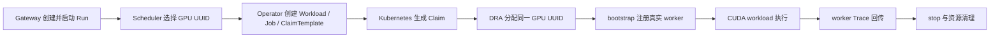

# E1 单节点 Full GPU 验证记录

## 结论

2026-09-12，TGS-RL 在一台 NVIDIA A10 ECS 上完成 E1 全链路验证，结果为
`PASSED`。该结论只覆盖单节点、单 worker、单张 Full GPU，不覆盖 MIG、MPS、多节点或
完整模型训练收益。



## 验证环境

| 项目 | 实际值 |
|---|---|
| 验证基线 | `d033566e89d248e1a86de571b0c83aa05d1dda2a` |
| 证据级别 | `GPU_SINGLE_NODE` |
| 模拟标记 | `false` |
| GPU | NVIDIA A10，1 张 Full GPU |
| NVIDIA 驱动 | `580.178.04` |
| Kubernetes | `v1.35.1` |
| Kueue | `v0.19.2` |
| NVIDIA DRA | `0.5.0` |
| 执行模式 | `kubernetes-dra` |
| Python | `3.12.14` |
| workload | veRL `0.9.0`、Ray `2.58.0`、PyTorch `2.13.0+cu130`、vLLM `0.28.0` |

## 核心证据

| 核验项 | 结果 |
|---|---|
| E1 Gate | `PASSED`，无 blocker |
| 执行次数 | 8/8 成功：baseline/variant 各 1 次 warmup + 3 次 measurement |
| 动作成功率 | baseline `1.0`，variant `1.0` |
| Scheduler / DRA / worker UUID | 三方均为 `GPU-f1d9ddc3-d9c1-8b8c-b50a-195afa72bcf2` |
| DeviceClass | `gpu.nvidia.com` |
| CUDA | worker 事件标记 `device=cuda`，真实 matmul 完成 |
| GPU active time | baseline `306.387207 ms`，variant `297.981975 ms` |
| worker 完成事件 | baseline/variant 均产生 `workload_completed` |
| Trace 来源 | variant：Scheduler 4、Operator 8、Worker 204 条 |
| 资源回收 | 最终无 Workload、ClaimTemplate、Claim、Job、Pod 或 JobRunBundle 残留 |

variant Trace 的主要事件计数：

| 事件 | 数量 |
|---|---:|
| `decision_applied` | 4 |
| `device_identity_verified` | 4 |
| `worker_registered` | 4 |
| `sample_consumed` | 80 |
| `safe_point_reached` | 112 |
| `workload_completed` | 4 |
| `control_started` / `control_completed` | 4 / 4 |

## 证据位置与完整性

测试机上的原始证据位于 `.cache/tgsrl/gpu-smoke/`，由仓库规则保持 ignored，不提交到
Git。这避免上传主机路径、运行标识或潜在敏感日志。关键文件及本次 SHA-256 为：

| 文件 | SHA-256 |
|---|---|
| `e1-full-gpu/report.json` | `3ec5f4afbc902629b9473163e90149c3de0bdec89f9b5fda0a8d02ec7eef0995` |
| `e1-full-gpu/artifacts/raw/archive.tar.gz` | `3f66aa373e49c6affc996763ac948c2ff7052edf9aa775270fc841510307fc89` |
| `e1-full-gpu/artifacts/traces/variant-trace.json` | `0fd1ced882a9964915860b625610aa70ed5a995711f3e83abb50668d83ce3e82` |

复核命令：

```bash
jq -e '.status == "PASSED" and .evidence == "GPU_SINGLE_NODE" and .simulated == false' \
  .cache/tgsrl/gpu-smoke/e1-full-gpu/report.json
jq -e '.experiments[] | select(.experiment_id == "E1") | .status == "PASSED"' \
  .cache/tgsrl/gpu-smoke/campaign-report.json
kubectl -n tgsrl-system get workload,resourceclaimtemplate,resourceclaim,job,pod,jobrunbundle
```

## 验证过程中关闭的真实集群缺陷

- NVIDIA A10 的 MIG mode `[N/A]` 解析。
- NVIDIA capability evidence source 与 hardware-backed attributes。
- Scheduler revision 与 Provider revision 的域隔离。
- Kueue DRA 从固定 ResourceClaim 迁移到 ResourceClaimTemplate。
- JobRunBundle marker 的 `apiVersion/kind` 保留。
- Operator 幂等 replay 不覆盖 API Server/Kueue 管理字段。
- Workload/Job 容器默认值和 CPU quantity canonical form 对齐。
- Kueue admission suspend 与用户 pause 的状态语义分离。
- hardware driver 并发运行 fail-fast 与验证后 marker cleanup。

## 尚未验证

- E2 MIG exact identity/rebind。
- MPS share、PID 可见性和显存释放。
- E3–E8 的性能、staleness、干扰、生命周期、恢复与多节点场景。
- 完整模型、数据集和分布式 veRL 训练；E1 使用最小 `SmokeTrainer` 验证集成，不代表训练收益。
