# H1 单节点 HAMi 分数 GPU 验证记录

## 结论

2026-09-12，TGS-RL 在一台 NVIDIA A10 ECS 上完成 H1 全链路验证，结果为
`PASSED`。该结论覆盖单节点、单 worker、单张物理 GPU 的 `0.4` 分数份额兑现，证明
Scheduler、HAMi 和 worker 对设备身份与请求份额达成一致。

```mermaid
flowchart LR
  G[Gateway 创建并启动 Run] --> S[Scheduler 选择 GPU UUID 和 0.4 份额]
  S --> O[Operator 读取 HAMi typed inventory]
  O --> P[Pod 使用 hami-scheduler 与 UUID/份额约束]
  P --> H[HAMi 分配 40% core 和 9211 MiB]
  H --> B[bootstrap 核对 worker 可见 UUID]
  B --> C[真实 CUDA workload]
  C --> T[Scheduler / Operator / worker Trace]
  T --> X[stop、cleanup 与 DRA 恢复]
```



H1 是独立 realization smoke，不属于正式 E1–E8 发布矩阵。H1 本身不证明两个 workload
同时共享一张卡；后续 H2 已单独证明双 worker 同卡并发，但隔离、公平性、干扰上界和训练
收益仍未由 H1/H2 证明。

## 验证环境

| 项目 | 实际值 |
|---|---|
| 验证基线 | `9c65d466831e15143b946bd7728a39736bb19ac7` |
| 证据级别 | `GPU_SINGLE_NODE` |
| 模拟标记 | `false` |
| GPU | NVIDIA A10，23028 MiB |
| GPU UUID | `GPU-f1d9ddc3-d9c1-8b8c-b50a-195afa72bcf2` |
| NVIDIA 驱动 | `580.178.04` |
| Kubernetes | `v1.35.1` |
| Minikube | `v1.38.1` |
| Helm | `v4.2.4` |
| HAMi | chart `2.10.0` |
| HAMi chart SHA-256 | `e1d8429b2270da1a5c26343d6d6fd2a0099ba7b944cf0f52eb20d6b9f14e5099` |
| 执行模式 | `hami-vgpu` |
| 物理设备 profile | `full-gpu` |
| 请求份额 | `acceleratorUnits=0.4` |
| workload image | `sha256:8238fe1ce23cd52a83d9c1b79cea3b6b3c2172be9ac54fd85f49d556bccf3091` |
| bootstrap image | `sha256:09b38c15416c5a65088bc05ee5c9e8330c6aa2921cc212e0d17323690546991c` |

## 核心证据

| 核验项 | 结果 |
|---|---|
| H1 Gate | `PASSED`，无 blocker |
| 执行次数 | 8/8 成功：baseline/variant 各 1 次 warmup + 3 次 measurement |
| 动作成功率 | baseline `1.0`，variant `1.0` |
| Scheduler / HAMi / worker UUID | 三方均为 `GPU-f1d9ddc3-d9c1-8b8c-b50a-195afa72bcf2` |
| 请求 / 实际 core | `40% / 40%` |
| 请求 / 实际显存 | `9211 MiB / 9211 MiB` |
| CUDA | worker 事件标记 `device=cuda`，真实 matmul 完成 |
| GPU active time | baseline `267.831257 ms`，variant `280.274646 ms` |
| 吞吐 | baseline `129.2075627 items/s`，variant `123.9644652 items/s` |
| Trace 来源 | baseline/variant 均包含 Scheduler、Operator 和 worker |
| 资源回收 | 每轮结束后无 Workload、Job、Pod 或 JobRunBundle 残留 |

Trace 事件统计：

| Trace | 总事件 | `decision_applied` | `device_identity_verified` | `worker_registered` | `sample_consumed` | `workload_completed` |
|---|---:|---:|---:|---:|---:|---:|
| baseline | 151 | 4 | 4 | 4 | 80 | 4 |
| variant | 155 | 4 | 4 | 4 | 80 | 4 |

## 重跑与恢复验证

验证过程中同时关闭了两个只会在真实重复执行中出现的问题：

1. 完成 cleanup 后，相同 deterministic request ID 原先会命中旧 receipt，导致第二次
   campaign 可能回放第一次结果。现在新 attempt 在 receipt lookup 前建立，Job ID 与所有
   lifecycle idempotency key 都包含 attempt。
2. HAMi teardown 原先可能在 NVIDIA Device Plugin 尚未重新创建时吞掉错误并删除恢复状态。
   现在脚本会记录切换前的节点标签、HAMi 注解和 GPU capacity；只有原插件 Ready、capacity
   恢复且新增 HAMi 注解清理完成，才报告成功并删除状态。

修复后，同一 H1 campaign 在新 attempt 上再次真实执行并通过。随后执行：

```text
停止 H1 控制面
→ 卸载 HAMi
→ 恢复 NVIDIA Device Plugin
→ 确认 DaemonSet 1/1
→ 确认 nvidia.com/gpu=1
→ 确认 hami.io/* 注解为空
→ 重新执行 E1 DRA smoke
```

恢复后的 E1 在同一 `9c65d46` 提交上再次 `PASSED`，说明 H1 切换与恢复没有破坏原 Full GPU
DRA 主链。最终控制面已停止，HAMi release 已卸载，测试 namespace 无 workload 残留。

## 证据位置与完整性

原始证据保留在 GPU 测试机 `.cache/tgsrl/hami-smoke/`，不提交到 Git。关键文件 SHA-256：

| 文件 | SHA-256 |
|---|---|
| `campaign-report.json` | `ba835eabb49e964eb7deac4dc6027f874eb852ddf96cb5cfaaa6e64468d6d919` |
| `campaign-execution.json` | `7ce3fc055bbdaf2d6ff56185892db694fce143a07ff5b0caf613486deb9bf408` |
| `h1-hami-vgpu/report.json` | `c9506a4b71d3dac7c1c7a15ae3bd89c5a9db9c6ecc0bab0ed49eeac1ca5c3af6` |
| `h1-hami-vgpu/artifacts/raw/archive.tar.gz` | `0c6ebf51d5c9613e5c386e52b334dcb63421c6c0948cb222571277bfba1a03c6` |
| `h1-hami-vgpu/artifacts/traces/baseline-trace.json` | `ae086825ef63e97194c839807af5321278335dacd89f87e25fd9d29413e7dfc5` |
| `h1-hami-vgpu/artifacts/traces/variant-trace.json` | `af64097ddac6e0c1ad9b05b0c289a5175aab529b735a6fda79e962f83e7716ae` |

复核命令：

```bash
jq -e '.status == "PASSED"
  and .evidence == "GPU_SINGLE_NODE"
  and .simulated == false
  and .environment_fingerprint.execution_mode == "hami-vgpu"' \
  .cache/tgsrl/hami-smoke/h1-hami-vgpu/report.json

jq -e '.experiments[] | select(.experiment_id == "H1") | .status == "PASSED"' \
  .cache/tgsrl/hami-smoke/campaign-report.json
```

## 后续状态与尚未验证

后续 [H2 双 worker 并发验证](h2-hami-concurrency-2026-09-13.md) 已证明两个真实 CUDA
worker 可在同一物理 UUID 上各获得 `40%` core、`9211 MiB`，且执行区间存在重叠。仍未验证：

- 两个或更多 workload 在同一物理 UUID 上的硬隔离、OOM 行为和公平性；
- 动态改变 HAMi core/memory 份额；
- MPS share、PID 可见性与显存释放；
- MIG、跨节点和完整模型训练；
- HAMi 相对 Full GPU baseline 的统计性能收益。
