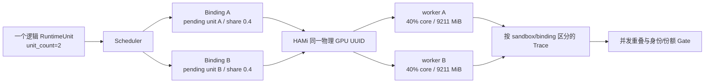

# H2 单节点 HAMi 双 worker 并发验证记录

## 结论

TGS-RL 已在一台 NVIDIA A10 ECS 上完成 H2 全链路验证，结果为 `PASSED`。该实验验证：

- Scheduler 为同一个逻辑 RuntimeUnit 生成两个独立 pending unit 与 Binding；
- 两个 managed worker 被 HAMi 同时放置到同一物理 GPU UUID；
- 每个 worker 的请求和实际分配均为 `40%` core、`9211 MiB` 显存；
- 两个 worker 都完成注册、真实 CUDA matmul、Trace 上报和退出清理；
- baseline 与 variant 的三轮 measurement 均存在正的执行时间重叠；
- H2 的 4 条规则全部通过。



H2 证明的是**同卡双 worker 可验证并发共置**。它不证明：

- HAMi 在显存压力、OOM 或异常退出下的强隔离；
- 两个 workload 的长期公平性或干扰上界；
- 动态修改 core/memory 份额；
- 相对 Full GPU baseline 的性能收益；
- 完整模型训练、收敛质量、MPS、MIG 或多节点能力。

## 验证环境

| 项目 | 实际值 |
|---|---|
| 验证基线 | `a45a432cfb546ee4cc0b7754fd4950fc8a367489` |
| 证据级别 | `GPU_SINGLE_NODE` |
| 模拟标记 | `false` |
| GPU | NVIDIA A10，23028 MiB |
| GPU UUID | `GPU-f1d9ddc3-d9c1-8b8c-b50a-195afa72bcf2` |
| NVIDIA 驱动 | `580.178.04` |
| Kubernetes | `v1.35.1` |
| Minikube | `v1.38.1` |
| Helm | `v4.2.4` |
| HAMi | chart `2.10.0` |
| 执行模式 | `hami-vgpu` |
| worker 数 | 每次执行 2 个 |
| 单 worker 请求 | `acceleratorUnits=0.4` |
| 单 worker 实际分配 | `40%` core、`9211 MiB` |
| 聚合份额 | `80%` |
| workload image | `sha256:0ef2570aba8dfc25c465cc76c0bae607c71380df01921e608e0b657920938889` |
| bootstrap image | `sha256:2beffa1fd7b0dc1564f8e089ec93b9a8f01f7b4b16da49cef7dfc9936893b2d6` |

## Gate 结果

H2 共执行 8 次：

```text
baseline: 1 warmup + 3 measurement
variant:  1 warmup + 3 measurement
```

| 规则 | 实际值 | 阈值 | 结果 |
|---|---:|---:|---|
| `h2-actions-succeed` | `1.0` | `>= 1.0` | `PASSED` |
| `h2-workers-concurrent` | `2` | `>= 2` | `PASSED` |
| `h2-execution-overlap` | `5855.929 ms` | `>= 1 ms` | `PASSED` |
| `h2-shared-core-budget` | `0.8` | `>= 0.8` | `PASSED` |

三轮 measurement 的并发重叠：

| Trace | 第 1 轮 | 第 2 轮 | 第 3 轮 |
|---|---:|---:|---:|
| baseline | `4584.223 ms` | `4568.305 ms` | `4568.324 ms` |
| variant | `5154.197 ms` | `4921.070 ms` | `5855.929 ms` |

每轮均满足：

```text
worker A sandbox != worker B sandbox
worker A pending unit != worker B pending unit
worker A runtime unit == worker B runtime unit
worker A GPU UUID == worker B GPU UUID
worker A requested/allocated core == 40/40
worker B requested/allocated core == 40/40
aggregate allocated core == 80
execution overlap > 0
```

报告中的吞吐为 baseline `15.289584 items/s`、variant `13.916157 items/s`。H2 没有设置
吞吐比较门槛，因此这些值只作为本次 smoke 的观测，不构成性能优劣结论。

## 实机发现并关闭的问题

H2 在真实双 worker 路径中暴露并关闭了四个此前单 worker 无法发现的问题：

1. **ExecutionContract ID 未随 quorum 更新。**
   `minimumSuccessfulUnits` 从 1 改为 2 后仍复用了 H1 的 canonical ID，Runtime 正确拒绝
   Start。H2 模板现在使用与完整 wire content 匹配的 ID，并由治理测试校验全部 GPU job 模板。
2. **Runtime 把一个逻辑单元误当成只能拥有一个 sandbox。**
   `RuntimeUnit.sandbox_id` 是代表性投影，不是副本唯一性约束。Trace ingestion 现在按请求中的
   具体 sandbox、binding、generation 和 device 校验，同时允许一个 logical RuntimeUnit 的多个
   replica 分别上报。
3. **失败 Run 的 cleanup 不够幂等。**
   Start 在 materialize 前失败时没有 sandbox；Run 已进入终态时也不能再次 terminate。cleanup
   现在仅在没有 Kubernetes Bundle 时容忍“无 materialized sandbox”，并接受已终态错误，再继续
   严格清理已存在的测试资源。
4. **hardware driver state 重复保存完整 Trace。**
   多轮双 worker measurement 曾将 `state.json` 扩大到 `4.58 MiB`，超过通用 JSON 上限。
   driver 现在使用独立迁移上限读取旧 state，并在 cleanup 后只保留最小 attempt/identity 与
   cleanup receipt。H2 和后续 E1 完成后，state 为约 `15 KiB`。

## 证据位置与完整性

原始证据保留在 GPU 测试机 `.cache/tgsrl/hami-concurrency-smoke/`，不提交到 Git。关键文件：

| 文件 | SHA-256 |
|---|---|
| `campaign-report.json` | `c4070e9d9994e5e508b960ec3882245bee95c58da4ef151fb7aa84ca569eb98f` |
| `campaign-execution.json` | `2d59f613ad4e98b95e9e1ab9bfe7e9adc9880d2c4064c3034caf4b1f8927940b` |
| `h2-hami-concurrency/report.json` | `531d6da62013806cc2662928258121406ac99482538f6f97f4d130e8df7dfab5` |
| `h2-hami-concurrency/artifacts/raw/archive.tar.gz` | `1fe31f8608be9581b82135de1e677d75784a55715ada0638735cc89feabf667b` |
| `h2-hami-concurrency/artifacts/traces/baseline-trace.json` | `c0b05df5f27d8c4303f1386a243034d228a6625c8fad7537782fdf98ea857602` |
| `h2-hami-concurrency/artifacts/traces/variant-trace.json` | `3d66fcb47b3649e8518056f59fe0802c58689a3ed928448670a2a5641bfc2aee` |

复核命令：

```bash
jq -e '.status == "PASSED"
  and .evidence == "GPU_SINGLE_NODE"
  and .simulated == false
  and .experiment_id == "H2"
  and .environment_fingerprint.execution_mode == "hami-vgpu"
  and .metrics.variant.concurrent_worker_count == 2
  and .metrics.variant.aggregate_accelerator_share == 0.8
  and .metrics.variant.worker_overlap_ms > 0' \
  .cache/tgsrl/hami-concurrency-smoke/h2-hami-concurrency/report.json

jq -e '.experiments[] | select(.experiment_id == "H2")
  | .status == "PASSED"
  and ([.rules[].status] | all(. == "PASSED"))' \
  .cache/tgsrl/hami-concurrency-smoke/campaign-report.json
```

## 恢复验证

H2 完成后执行了：

```text
停止 H2 控制面
→ 卸载 HAMi
→ 恢复 NVIDIA Device Plugin
→ 确认 DaemonSet 1/1
→ 确认 nvidia.com/gpu=1
→ 确认 hami.io/* 注解为空
→ 在同一 a45a432 基线上执行 E1 DRA 回归
```

E1 回归结果为 `PASSED`，8/8 次执行成功。最终 GPU 测试机上 HAMi release 已卸载，
TGS-RL 控制面已停止，测试 namespace 中无 JobRunBundle、Workload、Job 或 Pod 残留。
